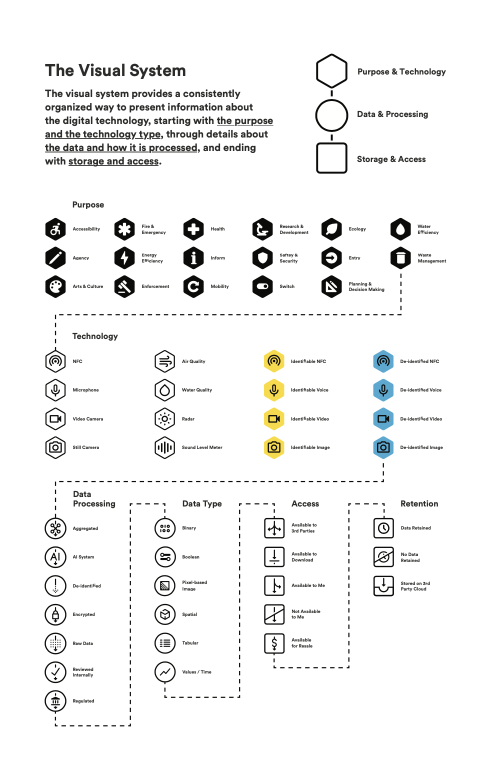

# Readme

## Table of Contents

[Introduction to Digital Trust for Places and Routines (DTPR)](#introduction-to-digital-trust-for-places-and-routines-dtpr)

[The Design System](#the-design-system)

[Taxonomy](#taxonomy)

[Visual Language](#visual-language)

[Data Chain](#data-chain)

[How to Use DTPR](#how-to-use-dtpr)

[Original Co-Design Session Materials](#original-co-design-session-materials)

[Governance](#governance)

[History](#history)

[License](#license)

# Introduction to Digital Trust for Places and Routines (DTPR)

[Digital Trust for Places and Routines (DTPR)](https://dtpr.io/) is an open-source communication standard designed to increase the legibility and transparency of data, sensors and AI in the built environment.

We believe that by first enabling transparency and understanding, we can increase accountability and human agency so that there can be community trust in digital technology.

DTPR is a design system that reveals key elements of the technologies of our public spaces and our built environment, including who manages them, what their purpose is and what kind of data is collected or processed through them. Communities use DTPR to provide visibility and legibility for what are often invisible technologies, enabling a communication and feedback pathway between someone moving through a physical space that has technologies that collect data, use sensors and AI, and the technology’s manager. 

DTPR originated as a collaborative design initiative and is an open-source project, available to all under the Creative Commons license CC BY 4.0.

## The Design System

The DTPR design system consists of a standardized data dictionary and structure that describe digital technology and data governance practices, and an associated set of icons and usage patterns designed to quickly and clearly communicate those concepts. 

### Taxonomy

The core component of the DTPR open-source communication standard is the taxonomy, a structured way to organise and standardise the definition of key concepts and terms related to digital technology and data governance. These concepts include the type of technology, its purpose, the accountable entity, and data collected. The categories of information were identified as essential by the privacy and responsible technology experts who were part of DTPR’s original development process in 2019.

### Visual Language

A visual language of icons, associated shapes & colours, and accompanying text & QR codes form the "alphabet" of the system that is DTPR.

The latest version of the taxonomy and its corresponding icons can be directly downloaded from [dtpr.io/taxonomy](https://dtpr.io/taxonomy). Simply right-click on the icons and choose to save them on your computer to access them.

### Data Chain

The Data Chain is a hierarchical information model that uses the taxonomy to present detailed information about a technology in a consistently structured way; one could consider this the “nutrition label” component of the DTPR design system. 

## How to Use DTPR

To accompany the downloadable assets in this GitHub repository, the [**DTPR Standard Guide**](https://helpful-places.gitbook.io/a-guide-to-dtpr) was created to assist those looking to deploy this open-source standard in public spaces by explaining how the standard works, and the underlying research and rationale for its design.

## Original Co-Design Session Materials

The DTPR standard was created through an open development process, including co-design and consultation sessions with global experts and with the general public. The materials and facilitation guide created to run those co-design sessions can be found [here](https://github.com/Helpful-Places/dtpr/tree/main/resources/codesignkit).

## Governance

The standard is currently stewarded by [Helpful Places](https://helpfulplaces.com/), a social impact enterprise based in Toronto, Canada. 

As an open-source standard, the goal is for DTPR to be governed through an inclusive approach to ensure the standard evolves and changes in a manner that accommodates diverse perspectives, contemporary technologies, and practitioners around the world, yet maintains its principles, structure and practical application within the built environment. Proposed permanent changes to the standard are validated by user research with the public, through consultation with the DTPR Community of Practice Council as well the Helpful Places team working day-to-day on the ground with the standard.

## History

DTPR began as a co-design project that was originally called Digital Transparency in the Public Realm. The project was organised by Jacqueline Lu, Patrick Keenan and Chelsey Colbert, all Toronto-based employees of Sidewalk Labs, which was an Alphabet-funded urban innovation company. Sidewalk Labs was developing a master plan for the Quayside development in Toronto, after responding to Waterfront Toronto’s Request for Proposals for an Innovation and Funding Partner.

The co-design project involved more than 150 people who were all invited to attend “design charrettes” where they contributed ideas to inform the development of DTPR. Every contributor that attended the sessions in 2019 signed a “Contributor’s License Agreement” that licensed their contributions to the “Designing for Digital Transparency in the Public Realm” workshops organised by Sidewalk Labs. The list of signatories can be viewed [here](https://github.com/Helpful-Places/dtpr/blob/main/contributors.md).

In October 2020, Sidewalk Labs publicly announced that stewardship of the DTPR project was independent of Sidewalk Labs and Alphabet, and was being stewarded by Helpful Places and an emerging coalition of collaborators. Today, under the stewardship of Helpful Places—the standard was renamed to Digital Trust for Places and Routines (DTPR).

## License

The Icons, Design Guide and Taxonomy for DTPR are licensed by the Digital Transparency in the Public Realm contributors under the [Creative Commons Attribution 4.0 International (CC BY 4.0)](https://creativecommons.org/licenses/by/4.0/).

Portions of the DTPR Icons incorporate elements of, or are derived from, the [Material Symbols and Icons](https://material.io/tools/icons/). The Material Symbols and Icons are available under the [Apache License 2.0](https://www.apache.org/licenses/LICENSE-2.0.html).

Sidewalk Labs trademarks and other brand features within these works are not included in this license.

