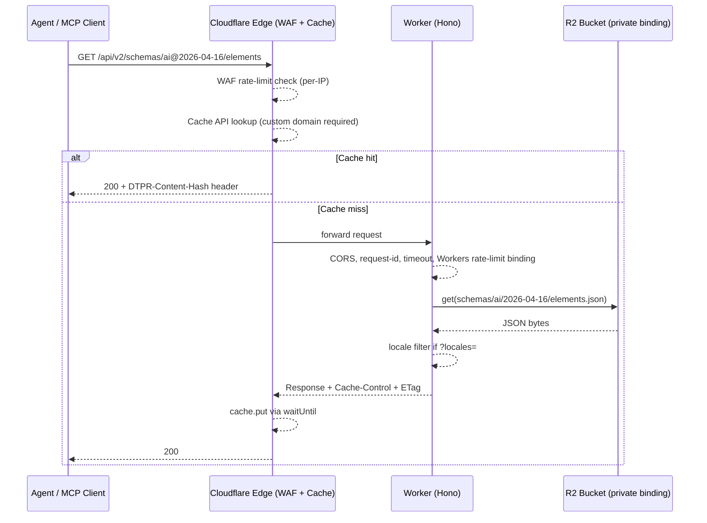
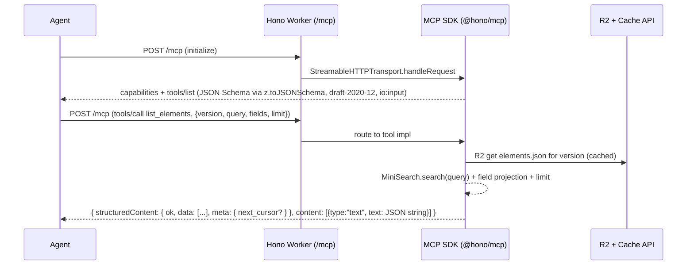

# feat: DTPR standalone API with REST + MCP on Cloudflare Workers

## Overview

Build a new standalone Cloudflare Workers application (`api/` pnpm workspace) that serves the DTPR schema over REST and MCP at `api.dtpr.io`. The AI datachain is migrated from the current markdown-per-locale tree (`app/content/dtpr.v1/`) to YAML-with-embedded-locales under a versioned schema directory (`api/schemas/ai/YYYY-MM-DD/`), with Zod as the structural source of truth and JSON Schema emitted for MCP tool descriptors. The existing `dtpr.io/api/dtpr/v0|v1` endpoints continue serving unchanged. North-star success: an AI agent builds a validated datachain from a natural-language description via MCP tools.

(see origin: `docs/brainstorms/2026-04-16-dtpr-schema-api-mcp-brainstorm.md`)

## Problem Frame

DTPR for AI is a moving target — category shape, element taxonomy, and context dimensions all need to iterate quickly as the spec evolves. Today:

- Schema *structure* is implicit in TypeScript route code (`app/server/api/dtpr/v1/`) and hard-coded version strings like `0.1`/`0.2`. Cutting a new structural revision requires editing shared routes.
- Content lives as one markdown file per element per locale (894 files across 6 locales: en/es/fr/km/pt/tl). Element-level edits fan out.
- The API is coupled to Nuxt Content's `queryCollection`, can't be deployed separately, and has no MCP surface for AI agents.

The brainstorm committed to a parallel, standalone API on `api.dtpr.io` with zero cutover pressure on `dtpr.io`. This plan turns that brainstorm into an implementation-ready plan.

## Requirements Trace

All requirement IDs are from `docs/brainstorms/2026-04-16-dtpr-schema-api-mcp-brainstorm.md`.

**Packaging & Deployment**
- R1 — new `api/` pnpm workspace, rigorously self-contained → **Unit 1**
- R2 — Cloudflare Workers deploy, custom domain `api.dtpr.io` → **Units 1, 7, 15**
- R3 — existing `dtpr.io/api/dtpr/v0|v1` unchanged → unaffected (no code touched in `app/`)
- R4 — single Worker, REST + MCP, MCP first-class → **Units 8, 11**

**Schema Versioning**
- R5 — `{type}@YYYY-MM-DD[-beta]` version form → **Unit 4**
- R6 — beta mutable, stable immutable → **Units 4, 15**
- R7 — full snapshot per version directory → **Units 4, 5**
- R8 — no per-element content timestamps → **Unit 2**

**Content Storage**
- R9, R9a — YAML per element/category/datachain-type with locales embedded → **Units 2, 4, 5**
- R10, R10a, R10b, R10c — `schema:build` validation, R2 per-version JSON, inline fallback ≤512 KB, atomic CI upload → **Units 4, 6, 9**
- R11 — markdown-in-YAML prose → **Unit 2**

**Schema Definition**
- R12 — Zod as source of truth → **Unit 2**
- R13 — JSON Schema emitted at build time via `z.toJSONSchema` → **Unit 2**
- R14 — syntactic (Zod) + semantic validator layer → **Unit 3**

**REST Surface**
- R15 — version-pinned paths with `@`/`%40` normalization → **Unit 10**
- R16 — no `/latest` routes → **Unit 10**
- R17, R18 — read endpoints + locale filtering → **Unit 10**

**MCP Server**
- R19 — 6 read-side tools + `get_elements` bulk tool (7 total), projection, query, pagination → **Unit 10**
- R20 — tool schemas emitted from same Zod source → **Units 2, 10**
- R20a — typed error envelopes, locale fallback, search semantics → **Unit 10**

**Schema Drafting Workflow**
- R21 — `schema:new` CLI → **Unit 14**
- R22 — `schema:validate` CLI in P1 → **Unit 4**
- R23 — `schema:promote` + GitHub PR merge gate → **Unit 14**
- R24 — preview deployments at `api-preview.dtpr.io` → **Unit 15**

**Migration**
- R25, R25a, R25b — AI-only port, category-based element selection, `context_type_id` instance-only → **Unit 5**
- R26 — first version tagged `ai@2026-04-16-beta` (port-as-beta). Promotion to stable is a separate decision gated on the wow-factor demo succeeding. → **Unit 5** (port), **Unit 13** (`schema:promote` when ready)
- R27 — YAML canonical for AI, drift acceptable → documented via migration script, noted in `app/content/dtpr.v1/README.md`

**Non-Functional Baseline**
- R28 — public, unauthenticated → **Unit 8**
- R29 — Cloudflare WAF rate limits (revised action: typed 429, not challenge) → **Unit 11**
- R30 — payload caps (64 KB, depth 32, array 1000) → **Unit 8**
- R31 — CPU via `limits.cpu_ms` + wall-clock via AbortController → **Units 1, 8**
- R32 — restrictive CORS allow-list → **Unit 8**
- R33 — scoped Wrangler tokens → **Unit 6**
- R34 — **per-tier latency NFRs and traffic baseline** (added during deepening) → **Units 7, 8, 12**

**Success Criteria**
- Wow-factor demo (AI agent → validated datachain) → **Unit 15**

## Scope Boundaries

- **Not touching** `app/server/api/dtpr/v0|v1` or `app/content/dtpr.v1/` content tree (except a one-time read by the migration script in Unit 5 and an informational README note added in the same commit).
- **Not migrating** the `device` datachain. Only AI content ships in this scope.
- **Not shipping** agent write tools (`suggest_new_element`, GitHub PR automation). Future scope.
- **Not shipping** a web UI for drafting schemas. Git + CLI only.
- **Not shipping** element-level content versioning. Git is provenance.
- **Not building** cross-version compatibility reasoning. Full snapshots sidestep this.
- **Not extracting** the workspace to its own repo. Trigger-gated in a later phase.
- **Not implementing** D1, Parquet, or public R2. R2 private service binding + Cache API is the committed runtime path.
- **Not implementing** a `describe_datachain` MCP tool. Agents narrate from `get_element` data.

### Deferred to Separate Tasks

- **Repo extraction** (brainstorm P4): move `api/` + `schemas/` to dedicated `dtpr-api` repo — triggered by a concrete condition (second non-Worcester consumer, or schema cadence > monthly). Separate plan when the trigger lands.
- **Agent write path** (brainstorm P5): `suggest_new_element`, GitHub PR automation — future scope.
- **Device migration**: no plan yet; separate brainstorm when it's prioritized.

## Context & Research

### Relevant Code and Patterns

- **Existing DTPR types and helpers** — `app/server/api/dtpr/v1/types.ts`, `app/server/api/dtpr/v1/utils.ts`. Mirror the shapes (`LocaleValue`, `Variable`, `Context`, `SchemaMetadata`) in Zod for R12; port `filterLocaleValues`-style helpers if needed.
- **Existing REST handlers** — `app/server/api/dtpr/v1/categories/[datachain_type].ts`, `app/server/api/dtpr/v1/elements/{index,[datachain_type]}.ts`. These show the response envelope shape (`{ schema, category|element }[]`), locale filtering via `?locales=en,fr`, and accumulator-based locale merging. The new API inherits the envelope shape for parity ease; the locale-merge accumulator becomes unnecessary since YAML has all locales in one file.
- **Existing test patterns** — `app/test/api/schemas.ts` (Zod response schemas), `app/test/api/helpers.ts` (structural fingerprint helpers that ignore content text so translation changes don't break snapshots), `app/test/api/categories.test.ts`, `app/test/api/elements.test.ts`, `app/test/api/locale-filtering.test.ts`. The new API's test suite follows the same pattern but runs under `@cloudflare/vitest-pool-workers` against Miniflare.
- **Content file conventions** — `app/content/dtpr.v1/categories/en/ai__decision.md` (canonical example with `context:` block); `app/content/dtpr.v1/elements/en/access__available_for_resale.md` (shared ai+device element); `app/content/dtpr.v1/elements/en/list-ai__decision__accept_deny.md` (element carrying `context_type_id` in frontmatter — discarded on migration per R25b).
- **Existing Workers deploy** — `docs-site/wrangler.toml` has the Cloudflare `account_id = f978769622a3e15ad770688a80811aa8` and `{ pattern = "docs.dtpr.io", custom_domain = true }` route shape — reusable for the new Worker. Note that `docs-site` is Nuxt-on-Workers; the new `api/` is a bare Worker, so it does not need `preset: 'cloudflare-module'`.
- **Workspace config** — `pnpm-workspace.yaml` lists `app`, `docs-site`, `studio` today; add `api`.
- **Empty/broken source file to audit** — `app/content/dtpr.v1/elements/en/tech__facial_recognition.md` is 0 bytes. Migration script must handle.
- **Trailing whitespace in source** — `app/content/dtpr.v1/elements/en/data__personal.md` has `name: 'Personal  '`. Migration trims.

### Institutional Learnings

No relevant entries in `docs/solutions/` — directory does not exist in this repo. This work creates first-of-kind patterns for Cloudflare Workers + MCP + content migration here. Consider seeding `docs/solutions/` with captured lessons during implementation via `ce:compound`.

### External References

Current stable versions verified April 2026 from npm:

- **Hono** `4.12.14` ([hono.dev](https://hono.dev/docs/getting-started/cloudflare-workers)) — routing + middleware on Workers
- **`@hono/mcp`** `0.2.5` ([npm](https://www.npmjs.com/package/@hono/mcp)) — streamable-HTTP MCP transport on Workers, no Durable Objects
- **`@modelcontextprotocol/sdk`** `1.29.0` — stay on v1.x; v2 is pre-alpha
- **`@hono/zod-validator`** `0.7.6` — middleware validator accepting Zod 3 or 4
- **Zod** `4.3.6` — `z.toJSONSchema({io: 'input', target: 'draft-2020-12'})` is built-in; replaces archived `zod-to-json-schema`
- **Wrangler** `4.83.0` — prefers `wrangler.jsonc`
- **`@cloudflare/vitest-pool-workers`** — tests inside workerd isolates with real bindings
- **MiniSearch** (`lucaong/minisearch`) — in-memory BM25, zero runtime cost after index load

Key docs consulted during planning:
- [MCP transport on Cloudflare](https://developers.cloudflare.com/agents/model-context-protocol/transport/) — confirms streamable-HTTP is current standard
- [Cloudflare Rate limiting rules](https://developers.cloudflare.com/waf/rate-limiting-rules/) — per-path per-IP at WAF layer; Enterprise adds per-ASN
- [Cloudflare Workers Rate Limiting API binding](https://developers.cloudflare.com/workers/runtime-apis/bindings/rate-limit/) — per-endpoint quotas in Worker code
- [Zod 4 JSON Schema](https://zod.dev/json-schema) — confirms native `z.toJSONSchema()` coverage; `io: 'input'` flag critical for tool inputs
- [MCP pagination spec](https://modelcontextprotocol.io/specification/2025-03-26/server/utilities/pagination) — opaque cursor convention, not page numbers
- [MCP structured content](https://modelcontextprotocol.io/specification/draft/server/tools) — `structuredContent` + backwards-compatible text block

Known gotchas to avoid during implementation:
- **`zod-to-json-schema` is archived** (Nov 2025). Do not install it. Use Zod 4's built-in.
- **`z.toJSONSchema` without `io: 'input'`** silently emits the output shape (post-transform), producing misleading tool descriptors.
- **MCP client JSON Schema dialect** — spec historically pins draft-07, modern clients (Claude) expect draft-2020-12. Emit 2020-12; works for both in practice.
- **MCP SDK issue #1143** — Zod 4 `.describe()` text doesn't always propagate into tool descriptors. Workaround: pass descriptions explicitly at tool registration time.
- **Cache API requires custom domain** — doesn't work on `*.workers.dev` or the dashboard playground. Test caching against a preview custom domain.
- **Wrangler `env` overrides are full replacements, not merges** — redeclare the full `routes` and `r2_buckets` per env.
- **`nodejs_compat` (v1)** is what the Cloudflare MCP demo uses and is battle-tested. `nodejs_compat_v2` is newer but not yet proven for the MCP SDK path.

## Key Technical Decisions

Key Decisions are split into three categories so architectural forks stay visible. Each decision is listed once in the category it best fits.

### Architectural Decisions (stable, multi-unit, hard to reverse)

- **Hono + `@hono/mcp` + MCP SDK v1** (not Cloudflare `agents` SDK + Durable Objects): the DOs-based path (McpAgent) is designed for per-session persistence. Our MCP is stateless and read-only; streamable-HTTP through `@hono/mcp` is simpler and has no DO class to manage. **Revisit trigger**: move to DOs + McpAgent if we add MCP write tooling (`suggest_new_element`, PR automation), server-initiated progress notifications during long validations, or per-session OAuth. The migration path is documented alongside `api/docs/mcp-fallback.md`.
- **Zod 4 native `z.toJSONSchema()` for schema emission** (not archived `zod-to-json-schema`): package was archived Nov 2025; Zod 4's built-in supersedes it. Emit with `{io: 'input', target: 'draft-2020-12', unrepresentable: 'any'}` — this is the specific invocation that produces correct tool descriptors for MCP clients.
- **Zod as source of truth for schema structure** (authors in TS, JSON Schema is emitted). Elevated during brainstorm from "JSON-Schema-first" after research found it matches how MCP ecosystem tools actually emit and consume schemas.
- **`wrangler.jsonc`** over `wrangler.toml`: current Cloudflare default; some newer wrangler features are JSON-only.
- **`@cloudflare/vitest-pool-workers` for the test suite**: tests run inside workerd isolates with real R2 and rate-limit bindings. Rejected alternative: the existing `app/test/api/` harness that polls a dev server (Nuxt-specific).
- **Two-tier rate limiting**: WAF rate-limit rules (absolute IP limits, run before the Worker) + Workers Rate Limiting API binding (per-endpoint per-tuple quotas in handler code). Cloudflare's own recommendation when you need both DDoS-scale and per-path semantics.
- **BM25 in-memory search for `list_elements(query)`**: MiniSearch index built at `schema:build` time, shipped with the JSON bundle, loaded once per Worker isolate. Substring match (brainstorm default) is too weak for agent queries; BM25 adds tokenization + field weighting at effectively zero runtime cost.
- **Variables authored on categories, materialized onto elements at build time**: DRY source, agent-friendly output. A shared element inherits variables from each of its categories; divergent definitions across categories fail the build (semantic rule 16). Element-level variable authoring is not permitted at P1.
- **Single Worker hosting REST + MCP — split trigger**: split into sibling `api-rest` and `api-mcp` Workers if MCP grows write paths, MCP request volume diverges from REST by >3×, or per-surface CPU budgets need to diverge. For now one Worker with AbortController-driven wall-clock guards is sufficient (`limits.cpu_ms` is per-invocation, not per-route).
- **Port first as beta, not stable**: the initial migration (Unit 5) tags `ai@2026-04-16-beta`, not stable. Promotion to stable (`ai@2026-04-16`) is gated on the wow-factor demo (Unit 15) succeeding end-to-end. Costs nothing (directory rename via `schema:promote` from Unit 13) and defers the immutability commitment until real validation. Decision changed during review.
- **Content delivery path at P1 is inline-only** (simplified during review): with one schema version in scope, `schema:build` logs the emitted bundle size. If it fits the Worker bundle, ship inline. If not, switch to R2. No per-version manifest flag, no `allow-mode-flip` CI gate — those reintroduce complexity when a second version ships. R10a (R2 with Cache API) remains the committed destination for multi-version scale; it's just deferred.

### Operational Parameters (tunable; not architectural forks)

- **Per-tier latency targets**:
  - Warm cache (cf-cache-status HIT): `tools/list`, `list_schema_versions`, `get_schema(manifest)`, `list_categories` → target < 50 ms server-side. `get_element`, `list_elements`, `get_elements` (bulk) → target < 30 ms.
  - Cold cache: same endpoints → target < 300 ms.
  - `validate_datachain`: target < 500 ms.
  - Full demo session aggregate (excluding model/network): target < 2 s warm, < 8 s cold.
  - These are **targets, not SLOs** for this MVP. Unit 12 tests assert the warm targets in-harness as a regression canary. Post-deploy smoke test confirms Cache API is reachable. Continuous production latency monitoring is deferred until real usage demands it.
- **Traffic baseline**: Worcester ~2 k/day + agent demos ~1.25 k/day + exploration ~5 k/day ≈ 10 k req/day (~300 k/month, well within Workers Paid tier). Cloudflare billing alert at ~$50/month. Revisit quarterly.
- **WAF thresholds**: GET 1000/min/IP, `/mcp` 300/min/IP, validate 30/min/IP — all `block` (typed 429). Tunable as real traffic is observed.
- **CPU budget**: `limits.cpu_ms: 500` Worker-wide; per-route wall-clock via AbortController (50 ms reads, 500 ms validate).
- **`fix_hint` locale scope**: English-only at P1. Localization deferred.

### Wire Contracts (public API shape, breaking changes require version bump)

- **Canonical version string**: `{datachain_type}@{YYYY-MM-DD}[-beta]` (from brainstorm R5). Route matchers normalize `@` and `%40`.
- **No `/latest` or `/latest-stable` convenience routes**: every consumer pins a version explicitly. List via `list_schema_versions`.
- **Error envelope**: `{ok, errors: [{code, message, path?, fix_hint?}]}`. Stability contract — adding new `code` values is additive; renaming/removing is breaking. Fixture snapshots in `api/test/fixtures/error-envelopes/` catch regressions.
- **MCP response envelope**: `structuredContent` + backwards-compatible JSON text block (2025-06-18 MCP spec). Every tool declares an `outputSchema`.
- **No `$ref` in emitted JSON Schema tool descriptors**: inline nested types to keep MCP-client tool-calling reliable. Fixture snapshots guard this.
- **Opaque cursor pagination**: base64-encoded `{offset}`, scoped to a single schema version. Clients MUST NOT decode; MUST discard when pinned version changes.
- **`DTPR-Client: name/version` request header**: identification for rate-limit bucketing; no auth semantics. Spoofable by design — a client claiming another's name simply shares that bucket.
- **`DTPR-Content-Hash: sha256-...` response header**: consumers who want absolute immutability can pin to `version + hash`.
- **Cache-Control**: stable → `public, max-age=86400, immutable`. Beta → `no-store`.
- **Cache API key = full URL** (path + query string). Rate-limit tuple keying is independent of cache keying.
- **Provenance-tagged element content** in agent-facing responses: `description` and `citation` wrapped in `<dtpr_element id=… locale=… version=…>…</dtpr_element>` tags so LLMs treat content as data, not instruction.
- **`fix_hint` prompt-injection safety**: static server-authored templates; caller-supplied values (element ids, category ids) are whitelisted to `[a-zA-Z0-9_-]` and wrapped in delimiters before interpolation.
- **Element-level `context_type_id` is dropped during migration** (per R25b). `context_type_id` is instance-only in the new schema.
- **`symbol` field dropped**; **`citation` added** as optional authored field (seeded empty during migration).

### DTPR Semantic Validation Rules (enumerated, answering R14)

The `schema:validate` CLI and the Worker-side validator enforce these.

  1. **Category reference integrity** — every element's `category_ids` must reference a category defined in the schema version.
  2. **Datachain-type coherence** — a category's `datachain_type` matches the top-level datachain type of its version.
  3. **Context value uniqueness** — within a category's `context.values`, all `id`s are unique.
  4. **Context type integrity (instance)** — a datachain instance's `context_type_id` for an element must match a value defined in the element's category's `context.values`.
  5. **Category uniqueness** — category IDs are unique within a schema version.
  6. **Element uniqueness** — element IDs are unique within a schema version.
  7. **Required categories populated (instance)** — a datachain instance has at least one element in every category marked `required: true`.
  8. **Variable reference resolution** — every `{{variable_name}}` in an element description references a variable defined on the element or its category.
  9. **Instance variable id matches** — every variable provided in an instance element matches a variable id defined on the element's category.
  10. **Required variables populated (instance)** — variables marked `required: true` have values in every instance using the element.
  11. **Locale code allow-list** — all `locale` fields are from the schema version's supported locales (initially en/es/fr/km/pt/tl).
  12. **At least one locale per localized field** — `title`, `description`, etc., each have at least one entry (English is the canonical source).
  13. **Hex color format** — `context.values[].color` matches `/^#[0-9A-Fa-f]{6}$/`.
  14. **Non-empty icon** — element `icon.url` and `icon.format` are non-empty.
  15. **Non-negative priority (instance)** — instance `priority` is a non-negative integer.
  16. **Variable-id uniqueness across an element's categories** — when a shared element belongs to multiple categories, each declared variable `id` must have an identical definition across all those categories. Divergent definitions fail the build.
  17. **Category-order list integrity** — `datachain-type.yaml` lists categories in display order. Every id in the list must reference a defined category in the version; no duplicates.
  18. **Locale-consistent variable references** — if `{{variable_name}}` appears in the `en` description, it must also appear in every non-English locale's description for the same element. Emits as a **warning, not an error** at P1 — logged for reviewer attention but does not block the build. Promotion to hard error deferred to a P2 authoring-tooling decision once a real translation workflow exists.

## Open Questions

### Resolved During Planning

- **Semantic rules enumeration (R14 blocker)** → 18 rules above; validator layer in Unit 3 implements them. No longer a pre-planning blocker.
- **Zod → JSON Schema toolchain (R13 deferred)** → `z.toJSONSchema` built into Zod 4; `zod-to-json-schema` archived. Decision: use Zod 4 native.
- **MCP framework on Workers (R4/R19 deferred)** → `@hono/mcp` + `@modelcontextprotocol/sdk@^1` via Hono; no Durable Objects.
- **Wrangler config format** → `wrangler.jsonc` (modern default).
- **Variables shape (brainstorm Dependencies caveat)** → authored on categories (DRY source), materialized onto elements in the emitted JSON (agent-friendly output).
- **`symbol` field** → drop; it was never in the served API.
- **`citation`** → add as optional authored field; seed empty during migration.
- **`context_type_id` placement** → instance-only in the new schema; element-level values in existing source are discarded (per R25b).

### Deferred to Implementation

- **Exact Cache API TTLs for stable vs beta reads** — stable gets `public, max-age=86400, immutable`; beta gets `no-store`. Fine-tune once we see real request volumes post-launch.
- **Inline vs R2 decision for the first port** — measure uncompressed JSON size post-migration. If the single `ai@2026-04-16-beta` bundle fits comfortably in the Worker bundle (likely at P1 scale: ~25 AI-exclusive + 50 shared × 6 locales), ship inline. Otherwise switch to R2. No per-version manifest tracking at P1 — we revisit that when a second version ships.
- **WAF rate-limit thresholds** — baseline values (120/min GET, 20/min validate) are starting points; tune after P2 observes real traffic for a week.
- **Preview deployment hostname** — `api-preview.dtpr.io` (custom domain) is the committed path. Wrangler-generated preview URLs are a fallback only if custom domain routing is unavailable for preview environments.
- **Demo harness runtime** — Claude Agent SDK vs raw Anthropic SDK + MCP client. Decided during Unit 16 based on what ergonomic API is available at implementation time.
- **CI pattern for booting a Worker for API tests** — `@cloudflare/vitest-pool-workers` runs tests in-process, so no background Worker boot is needed. The current `.github/workflows/test.yaml` pattern (polling `pnpm dev`) does not apply to the `api/` workspace.

## Output Structure

```
api/
  package.json
  tsconfig.json
  wrangler.jsonc
  worker-configuration.d.ts               # generated by `wrangler types`
  src/
    index.ts                              # Hono app entry + fetch handler export
    app.ts                                # Hono app factory (routes, middleware)
    middleware/
      cors.ts
      payload-limits.ts
      rate-limit.ts
      timeout.ts
      error.ts
      request-id.ts
    schema/
      index.ts                            # Zod schemas (element, category, datachain-type, datachain-instance)
      locale.ts
      context.ts
      index.json-schema.ts                # emits JSON Schema via z.toJSONSchema at build time
    validator/
      semantic.ts                         # the 18 semantic rules (entry + per-rule modules below)
      index.ts                            # combined Zod + semantic validation entry
    store/
      r2-loader.ts                        # private R2 getter with Cache API wrapper
      inline-bundles.ts                   # optional inline fallback (R10b)
      search-index.ts                     # MiniSearch loader
    rest/
      routes.ts                           # Hono routes for /api/v2/...
      responses.ts                        # shared response envelopes, locale filtering
    mcp/
      server.ts                           # @hono/mcp transport binding
      tools.ts                            # 6 tool definitions with Zod inputs + z.toJSONSchema emit
      envelope.ts                         # structured content + text fallback, provenance tags
  cli/
    bin.ts                                # single entry: `api schema:build|validate|new|promote`
    commands/
      build.ts
      validate.ts
      new.ts
      promote.ts
    lib/
      yaml-reader.ts
      json-emitter.ts
      search-index-builder.ts
      content-hash.ts
  schemas/
    ai/
      2026-04-16-beta/                    # first beta version from port; promoted to stable (2026-04-16/) after Unit 15 demo
        meta.yaml                         # { version, status: beta, created_at, notes }
        datachain-type.yaml               # categories list + order + context definitions
        categories/
          ai__access.yaml
          ai__accountable.yaml
          ai__decision.yaml               # only one with context: block
          ai__input_dataset.yaml
          ai__output_dataset.yaml
          ai__processing.yaml
          ai__purpose.yaml
          ai__retention.yaml
          ai__rights.yaml
          ai__risks_mitigation.yaml
          ai__storage.yaml
        elements/
          # 75 AI-touching elements (25 AI-only + 50 shared)
          # shared elements have device__* refs stripped
  migrations/
    port-ai-v1-to-2026-04-16.ts           # one-shot migration script
  test/
    unit/
      schema.test.ts
      semantic.test.ts
      r2-loader.test.ts
      search.test.ts
    api/
      setup.ts
      schemas.ts                           # Zod response schemas for tests
      helpers.ts                           # fingerprint helpers (port from app/test/api/helpers.ts)
      rest.test.ts
      mcp.test.ts
      locale-filtering.test.ts
      rate-limit.test.ts
    fixtures/
      valid-datachain.json
      invalid-datachain-missing-category.json
      # ...
  demo/
    README.md
    run.ts                                # the wow-factor demo (Unit 16)

.github/workflows/
  api-test.yaml                           # vitest under @cloudflare/vitest-pool-workers
  api-deploy.yaml                         # wrangler deploy + R2 staged upload on merge to main
```

Tree is a scope declaration — implementer may adjust if implementation reveals a better layout. Per-unit file lists are authoritative.

## High-Level Technical Design

> *This illustrates the intended approach and is directional guidance for review, not implementation specification. The implementing agent should treat it as context, not code to reproduce.*

### Request flow (read path, cache-hit)



### MCP tool call flow



### Validation pipeline

```
YAML source (api/schemas/ai/<version>/)
  │
  ├─► js-yaml parse
  │
  ├─► Zod schema validation (Unit 2) ──► structural errors (missing fields, wrong types)
  │
  ├─► Semantic rule runner (Unit 3, 15 rules) ──► cross-ref errors (unknown category_ids, etc.)
  │
  ├─► Build artifacts (Unit 4):
  │     - manifest.json
  │     - categories.json
  │     - elements.json (with variables flattened from categories)
  │     - elements/<id>.json (point-read optimization)
  │     - schema.json (emitted via z.toJSONSchema, draft-2020-12, io:input)
  │     - search-index.json (MiniSearch serialized)
  │
  └─► sha256 hash of entire bundle → DTPR-Content-Hash
```

### Version string normalization (R15)

```
/api/v2/schemas/ai@2026-04-16-beta/elements       → normalize('ai@2026-04-16-beta')
/api/v2/schemas/ai%402026-04-16-beta/elements     → normalize('ai@2026-04-16-beta')  # percent-decoded first
/api/v2/schemas/ai@/elements                      → 400 (malformed version)
/api/v2/schemas/ai@2026-04-16-alpha/elements      → 400 (unknown suffix; parser rejects non-`-beta` suffixes)
```

## Implementation Units

### Implementation Status

_Last updated: 2026-04-17._

**Complete:** Units 1–6 (all of Phase P1). Branch `feat/dtpr-schema-mcp`.

| Unit | Status | Notes |
|------|--------|-------|
| 1: Workspace scaffold | ✅ Done | Hono skeleton boots, smoke test green. Cloudflare infrastructure spike (6 checks) still **pending** — requires a real Cloudflare account + preview custom domain and so was documented as a checklist in `api/README.md` rather than run locally. Gates Units 7/9/10/11 committing to the Cache API / R2 / rate-limit / `@hono/mcp` patterns. |
| 2: Zod schemas + JSON Schema emission | ✅ Done | All content schemas + `z.toJSONSchema` helper (draft-2020-12, `io: 'input'`). 23 passing schema tests. |
| 3: Semantic validator (18 rules) | ✅ Done | All rules implemented; rule 18 as warning-only per plan. Errors collect without short-circuit. Every error carries `fix_hint`. 24 passing tests. |
| 4: `schema:build` + `schema:validate` CLI | ✅ Done | Pure-function libs (version parser, content hash, MiniSearch builder, JSON emitter) + fs wrapper (yaml-reader) + Node-bin entry. End-to-end tested against a committed 2-cat / 2-el fixture. |
| 5: AI migration | ✅ Done | **11 categories + 75 elements × 6 locales** ported from `app/content/dtpr.v1/` to `api/schemas/ai/2026-04-16-beta/`. Validation clean (0 errors, 0 warnings). Idempotent. ~441 KB bundle (well under R10b's 512 KB inline threshold). `app/content/dtpr.v1/README.md` documents the freeze. |
| 6: CI deploy workflow | ✅ Done | Workers `dtpr-api` (`api.dtpr.io`) + `dtpr-api-preview` (`api-preview.dtpr.io`) deployed manually on 2026-04-17 against R2 buckets `dtpr-api` / `dtpr-api-preview` (renamed from plan's `dtpr-content-{prod,preview}` to match user's existing bucket). `.github/workflows/api-{test,deploy}.yaml` + `api/scripts/r2-upload.ts` + `api/docs/deploy-tokens.md` landed. CI itself runs once GitHub Actions secrets are populated (see deploy-tokens.md). Account upgraded to Workers Paid 2026-04-17; `limits.cpu_ms: 500` re-enabled in `wrangler.jsonc` (next deploy after CF plan-flag propagation will accept it). |

**Test totals:** 94 passing (79 workers-pool + 15 Node-pool for fs-touching CLI / migration tests). Typecheck clean.

**Commits on branch (main → HEAD):** see `git log main..HEAD`. Unit 6 lands as a single commit.

**Deviations from plan worth knowing:**

- **Test pool split.** `@cloudflare/vitest-pool-workers` (workerd) cannot load `node:os` via its module fallback, so CLI end-to-end tests and the migration characterization test run under a second `vitest.cli.config.ts` on the plain Node pool. Plan's `test/unit/*` vs `test/api/*` split is preserved for Worker-pool tests; added `test/cli/*` for Node-pool tests.
- **Installed workerd lags the targeted compat date.** `wrangler.jsonc` pins `compatibility_date: "2026-04-16"`; the vitest-pool-workers shim installed here maxes out at `2025-09-06` and falls back with a warning (not an error). Will clear when `@cloudflare/vitest-pool-workers` ships a newer workerd.
- **`list_elements` fixture-expectation adjustment.** Plan said the first port would contain an empty `tech__facial_recognition.md`; the actual source has **no such file** (closest name is `tech__facial_characterization.md`, which ports cleanly). No warnings were emitted by the migration. If the plan's author wants the missing tile re-added, that's a separate authoring task.

**Next up — Phase P2 (REST + MCP read path):**

- **Unit 7: R2 loader + Cache API wrapper** — gated on the Cloudflare infrastructure spike from Unit 1. Once verified, implements `src/store/*` with R2 binding + `caches.default` per-version cache.
- **Units 8–12:** Hono middleware stack, REST `/api/v2/*`, MCP server + 7 tools, two-tier rate limiting, E2E test harness.

**Next up — Phase P3 (Drafting + demo):**

- **Units 13–15:** `schema:new` / `schema:promote` CLI, preview deployments, wow-factor agent demo.

### Phase P1 — Foundation

- [x] **Unit 1: Workspace scaffold + core tooling**

**Goal:** Add the `api/` workspace with full toolchain (TypeScript, Wrangler, Hono, Zod 4, MCP SDK, testing) ready for feature work. No business logic yet.

**Requirements:** R1, R2, R31 (partial — `limits.cpu_ms` in wrangler)

**Dependencies:** none

**Files:**
- Modify: `pnpm-workspace.yaml` (add `'api'`)
- Modify: `package.json` (root) — add `dev:api`, `build:api`, `deploy:api`, `test:api`, `types:api` scripts delegating to `--filter ./api`
- Create: `api/package.json` — private, type: module. deps: `hono@^4`, `@hono/mcp@^0.2`, `@hono/zod-validator@^0.7`, `@modelcontextprotocol/sdk@^1.29`, `zod@^4`, `js-yaml`, `minisearch`, `hono-rate-limiter@^0.4` (peer dep of `@hono/mcp`; ship it to silence pnpm peer warnings and future-proof the preview OAuth path). devDeps: `wrangler@^4`, `typescript@^5`, `vitest@^4`, `@cloudflare/vitest-pool-workers`, `@types/js-yaml`, `@types/node`, `@aws-sdk/client-s3` (used only by `api/scripts/r2-upload.ts` in CI for R2 server-side copy via the S3-compatible CopyObject API).
- Create: `api/wrangler.jsonc` — name `dtpr-api`, main `src/index.ts`, `compatibility_date "2026-04-16"`, `compatibility_flags ["nodejs_compat"]`, `limits.cpu_ms: 500` (Worker-wide — `limits.cpu_ms` is per-invocation, not per-route; this ceiling accommodates `validate_datachain`'s 500 ms CPU budget. Reads are fast-path and rarely consume their share; per-route tightening is enforced by AbortController wall-clock, not CPU.), `observability.enabled: true`, `account_id: "f978769622a3e15ad770688a80811aa8"`, route `{ pattern: "api.dtpr.io", custom_domain: true }`, `r2_buckets: [{ binding: "CONTENT", bucket_name: "dtpr-content-prod" }]`, `env.preview` block for `api-preview.dtpr.io` + `dtpr-content-preview` bucket
- Create: `api/src/index.ts` — minimal Hono app skeleton exporting `{ fetch }`
- Create: `api/src/app.ts` — `createApp()` factory returning configured Hono instance
- Create: `api/vitest.config.ts` — `@cloudflare/vitest-pool-workers` pool, pointing at `./wrangler.jsonc`
- Create: `api/tsconfig.json` — target ES2022, module ESNext, moduleResolution Bundler, strict, **`types: ["./worker-configuration.d.ts"]`** (wrangler-generated types only; no `@cloudflare/workers-types` package needed or installed)
- Create: `api/README.md` — quickstart (dev, test, deploy)
- Create: `api/.gitignore` — `node_modules`, `.wrangler`, `dist`
- Test: `api/test/unit/smoke.test.ts` — app boots, `GET /healthz` returns 200

**Approach:**
- **Self-containment rule** (R1): no imports from `../app`, `../docs-site`, `../studio`. Duplicate the 5-item type set from `app/server/api/dtpr/v1/types.ts` into `api/src/schema/` as Zod schemas (Unit 2). No shared package.
- Run `pnpm --filter ./api exec wrangler types` after scaffolding to generate `worker-configuration.d.ts` pinned to the compat date.
- Do not yet add the production R2 bucket — stub the binding; provisioning happens in Unit 6.
- Do not yet pin `zod-to-json-schema` or `@cloudflare/workers-types` directly — Zod 4 ships its own schema emission and wrangler-generated types supersede the manual types package.
- **Cloudflare-specific infrastructure spike** (added during review, blocks exit from Unit 1): before Units 7/9/10/11 commit to Cache API + R2 + rate-limit-binding + MCP transport patterns, verify each load-bearing capability works as documented. The spike may run against a preview custom domain (`api-preview.dtpr.io`) attached to a scratch Worker, since Cache API does not work on `*.workers.dev`. Specifically confirm:
  1. `wrangler.jsonc` parses and deploys with the declared `compatibility_flags: ["nodejs_compat"]` and `limits.cpu_ms: 500`.
  2. The Workers Rate Limiting API binding syntax in wrangler 4.x is either `[[ratelimit]]` or `[[unsafe.bindings]]` — determine which is current and update the real `wrangler.jsonc` before Unit 11.
  3. Cache API `caches.default.put`/`match` succeeds against a response served over `api-preview.dtpr.io` (second request returns `cf-cache-status: HIT`).
  4. An R2 binding serves `get()`/`head()` calls from Worker code against a test bucket.
  5. `@hono/mcp` + `@modelcontextprotocol/sdk@^1.29` initialize/tools-list handshake works over `app.all('/mcp', ...)` without Durable Objects (this is the published pattern, but we verify before building 7 tools on top).
  6. Bundle size of a minimal hello-world + MCP SDK deps stays comfortably under 1 MB gzipped (guards against the transitive-dep risk flagged in the Risks table).
  If any of these fails, halt here and decide: adjust approach, escalate to a fallback (`mcp-fallback.md`), or update the plan. This turns the Cloudflare-stack assumption cluster into a verified baseline rather than a cross-fingers commitment.

**Patterns to follow:**
- `docs-site/wrangler.toml` for `account_id` and custom-domain route shape; translate to jsonc.
- `app/tsconfig.json` is Nuxt-delegated; the new tsconfig is standalone.

**Test scenarios:**
- Happy path: `pnpm test:api` runs `vitest` under vitest-pool-workers; smoke test hits `GET /healthz` and asserts 200.
- Integration: `wrangler dev` boots the worker locally without errors (manual verification; not part of automated tests).

**Verification:**
- `pnpm install` at repo root succeeds; `api/` is listed by `pnpm -r list`.
- `pnpm --filter ./api typecheck` passes.
- `pnpm test:api` runs green (only smoke test at this stage).

---

- [x] **Unit 2: Zod schemas + JSON Schema emission**

**Goal:** Define the structural Zod schemas for DTPR content (element, category, datachain-type, datachain-instance, schema manifest), produce a build-time emitter that outputs draft-2020-12 JSON Schema via `z.toJSONSchema` for MCP tool descriptors and external consumption.

**Requirements:** R8 (no per-element timestamps), R9 (YAML per entity), R11 (markdown in multiline strings), R12 (Zod source of truth), R13 (JSON Schema emission), R20 (shared source for MCP descriptors)

**Dependencies:** Unit 1

**Files:**
- Create: `api/src/schema/locale.ts` — `LocaleCode`, `LocaleValue`, `LocalizedStringArraySchema`
- Create: `api/src/schema/context.ts` — `ContextValue`, `Context`
- Create: `api/src/schema/element.ts` — `Element` (id, category_ids, title, description, citation?, icon, variables)
- Create: `api/src/schema/category.ts` — `Category` (id, name, description, prompt?, required?, order?, datachain_type, element_variables?, context?)
- Create: `api/src/schema/datachain-type.ts` — `DatachainType` (id, name, description, categories: ref list + order, locales: allow-list)
- Create: `api/src/schema/datachain-instance.ts` — `DatachainInstance` (id, schema_version, created_at, elements[] with priority/context_type_id/variable-values)
- Create: `api/src/schema/manifest.ts` — `SchemaManifest` (version: `ai@YYYY-MM-DD[-beta]`, status, created_at, notes, content_hash, locales)
- Create: `api/src/schema/index.ts` — barrel re-export
- Create: `api/src/schema/emit-json-schema.ts` — emits each schema via `z.toJSONSchema(…, { target: 'draft-2020-12', io: 'input', unrepresentable: 'any' })`; used by `schema:build` and MCP tool registration
- Test: `api/test/unit/schema.test.ts`
- Test: `api/test/unit/json-schema-emit.test.ts`

**Approach:**
- **Field decisions**:
  - Drop `updated_at` from element and category (R8).
  - Rename element `name` → `title` (align with API envelope already in v1 response).
  - `citation` becomes optional authored field (was hardcoded `[]` before).
  - Drop `symbol` field (authoring artifact).
  - `context_type_id` only on `DatachainInstance` elements, never on `Element` definitions (R25b).
  - `element_variables` stays on category as source-of-truth; build step (Unit 4) also materializes them onto each element for emitted `elements.json`. Element schema therefore has `variables` as a computed field — Zod schema permits presence at emit time only.
- **Markdown-in-YAML**: `description` and `citation` are string types; the Zod schema does not parse markdown. Rendering is consumer responsibility.
- **Locale schema**: `LocaleValue` is `{ locale: LocaleCode, value: string }`; every user-facing string field is `LocaleValue[]` with at least one entry (enforced by semantic rule #12, not by Zod — Zod allows empty arrays so the CLI's semantic checker catches this with a better error).
- **`z.toJSONSchema` invocation** — `{ io: 'input', target: 'draft-2020-12', unrepresentable: 'any' }` is the only invocation used. Wrap in a helper so test fixtures can compare emitted JSON Schema snapshot byte-for-byte.
- **`.describe()` texts** — add human-readable descriptions to every Zod field. Given MCP SDK issue #1143, also pass descriptions explicitly at MCP tool registration time (Unit 11) as a belt-and-suspenders measure.
- **No `$ref` collapsing** — for MCP output, inline types rather than deep `$ref` chains (Zod 4 allows both; default inlines which is the LLM-friendly shape).

**Patterns to follow:**
- Field names match `app/server/api/dtpr/v1/types.ts` where possible to minimize rename churn.
- Use `z.enum(['en', 'es', 'fr', 'km', 'pt', 'tl'])` for `LocaleCode` (initial port); revisit when locales expand.

**Test scenarios:**
- Happy path: valid element/category/datachain-type/instance fixtures parse without errors.
- Edge case: element with 0 `category_ids` fails Zod.
- Edge case: element with only locale `en` passes Zod (minimum enforced by semantic rule, not Zod).
- Error path: element missing `title` fails with helpful error.
- Error path: `locale: 'xx'` fails with enum violation.
- Happy path (emission): `emit-json-schema.ts` produces draft-2020-12 JSON Schema for each tool input. Compare against committed fixture in `api/test/fixtures/json-schema-emit/*.json`.
- Happy path (emission): emitted schemas contain `.describe()` texts in `description` fields.
- Integration: importing the emitted JSON Schema into an Ajv validator (test-only) parses without errors.

**Verification:**
- All schema tests pass.
- `z.toJSONSchema(ElementSchema, { io: 'input', target: 'draft-2020-12' })` emits stable JSON (committed fixture snapshot).

---

- [x] **Unit 3: Semantic rule validator**

**Goal:** Implement the 15 DTPR-specific semantic rules as a validator layer operating on Zod-parsed content. Return structured errors with paths, codes, and `fix_hint` strings ready for REST/MCP error envelopes.

**Requirements:** R14

**Dependencies:** Unit 2

**Files:**
- Create: `api/src/validator/semantic.ts` — one exported `validateSemantics(parsed): Result<void, SemanticError[]>` that runs all 18 rules
- Create: `api/src/validator/rules/` — one file per rule (or logically grouped) for readability: `category-refs.ts`, `datachain-coherence.ts`, `uniqueness.ts`, `required-populated.ts`, `variables.ts`, `locales.ts`, `colors.ts`, `icons.ts`
- Create: `api/src/validator/index.ts` — combined entry: `validate(raw): Result<Parsed, ValidationError[]>` running Zod + semantic in sequence
- Create: `api/src/validator/types.ts` — `SemanticError`, `ValidationError`, `ValidationResult`
- Test: `api/test/unit/semantic.test.ts` — one test per rule (happy + error path)
- Test: `api/test/fixtures/semantic/` — per-rule invalid fixtures

**Approach:**
- **Error shape**: each error includes `code` (e.g. `CATEGORY_REF_MISSING`), `path` (JSON path like `elements[3].category_ids[1]`), `message` (human summary), `fix_hint` (actionable instruction: "remove category_id 'ai__xyz' or define the category in datachain-type.yaml"). All 15 rules emit this shape.
- **Rule runner** iterates all rules even when earlier ones fail — never short-circuit. Returns flat array of errors. The CLI and MCP consumers get the full picture.
- **Cross-file rules** (category-refs, datachain-coherence) operate on the full schema version (a set of categories + elements + datachain-type) rather than one file at a time. The CLI builds this set from YAML before calling `validate`.
- **Instance rules** (required populated, instance variables, context_type_id integrity, priority non-negative) operate on a `DatachainInstance` passed to `validate_datachain`; they share the same error shape.
- **No exceptions thrown** — return `Result` tuples. Callers (CLI and Worker) format output for their medium.

**Patterns to follow:**
- Error shape aligned with MCP tool envelope (Unit 11) so validate_datachain returns them nearly verbatim.

**Test scenarios:**
- Rule 1 (category ref integrity): happy — element referencing defined category validates; error — element referencing `ai__phantom` produces `CATEGORY_REF_MISSING` with fix_hint.
- Rule 2 (datachain-type coherence): category with `datachain_type: 'ai'` but ID `device__access` fails with `DATACHAIN_TYPE_MISMATCH`.
- Rule 3 (context value uniqueness): two `context.values` with same `id` fails.
- Rule 4 (context_type_id instance integrity): instance element with `context_type_id: 'nonexistent'` fails.
- Rule 5, 6 (uniqueness): duplicate category id, duplicate element id each fail.
- Rule 7 (required populated): datachain instance missing element for required category fails with fix_hint naming the required category.
- Rule 8 (variable reference resolution): description with `{{undef_var}}` fails.
- Rule 9 (instance variable id match): instance variable `foo` not defined on element fails.
- Rule 10 (required variables populated): instance missing a required variable fails.
- Rule 11 (locale code allow-list): `locale: 'xx'` fails (redundant with Zod enum but tested at semantic layer for consistent error shape).
- Rule 12 (at least one locale): empty `title: []` fails.
- Rule 13 (hex color format): `color: 'red'` fails; `color: '#FF0000'` passes.
- Rule 14 (non-empty icon): element with `icon.url: ''` fails.
- Rule 15 (non-negative priority): instance with `priority: -1` fails.
- Rule 16 (variable-id conflict across categories): two `ai__*` categories both declaring variable `additional_description` with different `required` flags, both referenced by a shared element → build fails with `VARIABLE_CONFLICT` listing the conflicting category ids.
- Rule 17 (category-order list integrity): `datachain-type.yaml` `categories` array references a category id not defined in the version → `CATEGORY_ORDER_REF_MISSING`. Duplicate ids in the same array → `CATEGORY_ORDER_DUPLICATE`.
- Rule 18 (locale-consistent variable references): `{{duration}}` appears in `en` description but missing from `fr` description (and element has no opt-out) → `LOCALE_VARIABLE_DRIFT`. Note: rule 18 emits as a **warning, not an error**, at P1 — the build logs it for reviewer attention but does not block the build. Promotion to hard error is deferred to a P2 authoring-tooling decision once a real translation workflow exists.
- Integration: running `validate` on a schema version with 3 mixed errors returns all 3 in one pass.

**Verification:**
- All 18 rules have happy-path + error-path tests.
- Each rule emits a `fix_hint` string non-empty for every error case.
- `validate_datachain(invalid_fixture)` produces errors that would make an agent's next call correct.

---

- [x] **Unit 4: `schema:build` + `schema:validate` CLI**

**Goal:** Ship the core CLI that reads YAML, runs Zod + semantic validation, emits versioned JSON bundles with search index and content hash. `schema:validate` is a thin wrapper that runs validation without emitting.

**Requirements:** R5 (version naming parser), R6, R7, R9, R9a, R10 (build step), R22 (CLI in P1), implicit support for R10b (size threshold check)

**Dependencies:** Units 2, 3

**Files:**
- Create: `api/cli/bin.ts` — single entry with subcommands `build`, `validate`, `new`, `promote` (new/promote are Unit 14; stub until then)
- Create: `api/cli/commands/build.ts` — orchestrates read → validate → emit
- Create: `api/cli/commands/validate.ts` — read → validate, no emit
- Create: `api/cli/lib/yaml-reader.ts` — globs `api/schemas/<type>/<version>/**/*.yaml`, parses with `js-yaml`, returns typed `SchemaVersionSource`
- Create: `api/cli/lib/json-emitter.ts` — emits `manifest.json`, `categories.json`, `elements.json`, per-element `elements/<id>.json`, `schema.json` (via Unit 2 emitter), `search-index.json`
- Create: `api/cli/lib/search-index-builder.ts` — builds MiniSearch index over elements' title+description in each locale
- Create: `api/cli/lib/content-hash.ts` — sha256 of canonicalized bundle (stable JSON stringify)
- Create: `api/cli/lib/version-parser.ts` — parses `ai@2026-04-16-beta` → `{ type: 'ai', date: '2026-04-16', beta: true }`; validates format
- Create: `api/package.json` `bin` entry: `"api": "cli/bin.ts"` (tsx for dev; bundled for distribution)
- Test: `api/test/unit/version-parser.test.ts`
- Test: `api/test/unit/json-emitter.test.ts`
- Test: `api/test/unit/search-index-builder.test.ts`
- Test: `api/test/unit/content-hash.test.ts`
- Test: `api/test/unit/cli-build.test.ts` — end-to-end: fixture YAML → emitted bundle contents

**Approach:**
- **CLI invocation**: `pnpm --filter ./api schema:build ai@2026-04-16` → looks up `api/schemas/ai/2026-04-16-beta/` → runs pipeline → writes to `api/dist/schemas/ai/2026-04-16/`. `schema:validate` skips the write.
- **Version string**: accept either canonical form `ai@2026-04-16-beta` or path form `ai/2026-04-16-beta`.
- **Variables materialization**: when emitting elements, iterate each element's `category_ids`, resolve the referenced category's `element_variables`, and flatten onto the element's `variables` array. Deduplicate by id (if two categories both declare a variable with the same id, the first wins deterministically).
- **Content hash**: compute over a stable canonical JSON of the full bundle (categories + elements + datachain-type + manifest + search index, all keys sorted). Emit into `manifest.json` under `content_hash`.
- **Inline-or-R2 decision** (R10b, simplified during review): P1 ships with a single schema version. `schema:build` logs the emitted bundle size (JSON + MiniSearch index) and writes an inline import module `api/dist/schemas/ai/<version>/inline.ts`. If the bundle fits the Worker bundle at deploy time, the Worker loads from inline; if not, it falls back to R2. No per-version manifest flag, no `allow-mode-flip` CI gate — those were rejected as premature for an MVP. R10a (R2 + Cache API) remains the committed destination for multi-version scale; per-version mode tracking will be reintroduced when a second version ships.
- **Search index**: one MiniSearch index per locale. Fields: `title` (boost 3), `description` (boost 1). Serialized via `MiniSearch.toJSON()` and written to `search-index.<locale>.json`.
- **Empty source file audit**: `app/content/dtpr.v1/elements/en/tech__facial_recognition.md` is empty — the YAML migration (Unit 5) must either author real content or drop the element. CLI build fails if an element file is empty or missing required fields (Zod catches this).

**Patterns to follow:**
- Version filename convention (`YYYY-MM-DD` directory) parallels the existing `content/dtpr.v0/` + `content/dtpr.v1/` convention.
- Error output uses the same `ValidationError[]` shape as the Worker's validator (Unit 3) with a pretty-printer for console.

**Test scenarios:**
- Happy path: fixture `schemas/ai/2026-04-16-test/` with 2 categories + 3 elements produces valid emitted JSON bundles.
- Happy path: content hash is deterministic — same input twice yields same hash.
- Happy path (version parser): `ai@2026-04-16` parses to `{ type: 'ai', date: '2026-04-16', beta: false }`; `ai@2026-04-16-beta` parses with `beta: true`; `ai/2026-04-16-beta` also works.
- Edge case (version parser): `ai@` fails; `ai@2026-04` fails (not full date); `ai@2026-04-16-alpha` fails (unknown suffix).
- Edge case: category_ids field references undefined category → validate fails with rule 1 error, surfaced in CLI output.
- Error path: YAML syntax error in a file — CLI reports file path + line number.
- Error path: directory doesn't exist — CLI exits non-zero with "schema version not found".
- Happy path (variables materialization): element in category `ai__access` that has `element_variables: [{id: additional_description}]` gets `variables: [{id: additional_description, ...}]` in emitted elements.json.
- Happy path (search index): element with title "Facial recognition" is findable via `MiniSearch.search('facial')`.
- Integration: `schema:validate` output is a strict subset of `schema:build` output (no emit).
- Integration (inline threshold): tiny fixture emits `inline.ts`; a larger-than-threshold fixture does not.

**Verification:**
- Running `pnpm --filter ./api schema:build ai@2026-04-16-test` on the test fixture produces the expected file tree.
- Running `schema:validate` on an invalid fixture reports all validation errors with fix_hints (not just the first).
- Content hash changes when any authored string changes; does not change on whitespace-only edits to YAML source (the canonical JSON stringify handles this).

---

- [x] **Unit 5: AI migration script (one-shot)**

**Goal:** Port AI-touching content from `app/content/dtpr.v1/` (markdown-per-locale) to `api/schemas/ai/2026-04-16-beta/` (YAML per entity with locales embedded). Validate the result via Unit 4's CLI. Tag as the first **beta** schema version; promotion to stable happens separately via `schema:promote` (Unit 13) after the wow-factor demo (Unit 15) succeeds.

**Requirements:** R25, R25a, R25b, R26, R27

**Dependencies:** Units 2, 3, 4

**Files:**
- Create: `api/migrations/port-ai-v1-to-2026-04-16.ts` — one-shot Node script (tsx)
- Create: `api/schemas/ai/2026-04-16-beta/**` — the emitted YAML tree (checked into git)
- Create: `api/schemas/ai/2026-04-16-beta/meta.yaml`
- Create: `api/schemas/ai/2026-04-16-beta/datachain-type.yaml`
- Create: `api/schemas/ai/2026-04-16-beta/categories/*.yaml` (11 files: all `ai__*`)
- Create: `api/schemas/ai/2026-04-16-beta/elements/*.yaml` (~75 files: 25 AI-only + 50 shared, with `device__*` category refs stripped)
- Modify: `app/content/dtpr.v1/README.md` (create if absent) — note that the AI tree is frozen and canonical AI content is now in `api/schemas/ai/`.
- Test: `api/test/unit/migration.test.ts` — small fixture input → expected YAML output
- (Dropped during review as redundant with `schema:validate` on every CI run — the CLI validation already asserts structural/semantic correctness on the committed YAML.)

**Approach:**
- **Element selection** (R25a): for every filename in `app/content/dtpr.v1/elements/en/`, parse frontmatter, include if `category` array has any `ai__*` entry. Strip `device__*` from category_ids on inclusion. Result: 75 elements (25 AI-only + 50 shared).
- **Locale merge**: for each included element, read its 6 locale files (en/es/fr/km/pt/tl) from `app/content/dtpr.v1/elements/<locale>/<filename>.md` and emit a single YAML with `title`, `description` as `LocaleValue[]`.
- **Field transformations**:
  - `name` → `title`
  - Trim leading/trailing whitespace on `name`/`title` (handles `'Personal  '` case).
  - Drop `updated_at` (R8).
  - Drop `symbol` (decision in Key Technical Decisions).
  - Drop element-level `context_type_id` (R25b).
  - Add `citation: []` to every element (placeholder for the optional authored field).
  - `icon: /dtpr-icons/foo.svg` → `icon: { url: '/dtpr-icons/foo.svg', format: 'svg', alt_text: LocaleValue[] }` (alt text copied from the element's `title` per locale with " icon" suffix, matching current v1 behavior).
- **Empty file handling**: `tech__facial_recognition.md` (0 bytes) — the migration script logs a warning; keep the element out of the port (document in script output). A follow-up authoring task re-adds it when content is ready.
- **Category port**: 11 AI categories → 11 YAML files. Fields: id, name (loc'd), description (loc'd), prompt (loc'd), required, order, datachain_type, element_variables, context (for `ai__decision` only).
- **Datachain-type port**: emit `datachain-type.yaml` with `id: ai`, name (loc'd), description (loc'd), `categories: [...ordered list of the 11 IDs]`, `locales: [en, es, fr, km, pt, tl]`.
- **Meta**: `version: ai@2026-04-16-beta`, `status: beta`, `created_at: 2026-04-16T…Z`, `notes: "Initial port of AI datachain from app/content/dtpr.v1"`.
- **Validation**: after emit, the script runs `schema:validate ai@2026-04-16-beta` and exits non-zero if anything fails.
- **Idempotency**: the script wipes `api/schemas/ai/2026-04-16-beta/` before writing, so re-running from HEAD produces identical output.
- **README note** in `app/content/dtpr.v1/`: "AI content here is frozen as of 2026-04-16. Canonical AI content now lives in `api/schemas/ai/2026-04-16-beta/`; edits there do not propagate here."

**Execution note:** Write a characterization test first (Unit 5's test) against a 3-element fixture before running the script on real content. The migration is a one-shot transform but small bugs (wrong locale mapping, stripped field) silently corrupt ~75 files; characterization coverage catches it before commit.

**Patterns to follow:**
- Read `app/content/dtpr.v1/elements/en/access__available_for_resale.md` as the canonical shared-element example.
- Read `app/content/dtpr.v1/categories/en/ai__decision.md` as the canonical category-with-context example.

**Test scenarios:**
- Happy path: 3-element fixture (1 AI-only, 1 shared, 1 device-only) produces 2 ported elements (AI-only + shared-with-device-stripped), 0 device-only carried over.
- Happy path: `list-ai__decision__accept_deny.md` ports with `context_type_id` removed.
- Happy path: element `name: 'Personal  '` (trailing whitespace in source) ports to `title: [{ locale: 'en', value: 'Personal' }]` (trimmed).
- Edge case: element with 0 bytes is skipped with a warning logged.
- Edge case: element present in `en/` but missing in `fr/` — `title` has only the `en` entry; semantic rule 12 passes (at least one locale present).
- Error path: category_ids references a category not present in the port scope (e.g. a `device__access` reference that wasn't stripped) → validation fails, script exits non-zero.
- Integration: the real migration output passes `schema:validate ai@2026-04-16-beta` with zero errors.
- Integration: committed YAML tree has exactly 11 categories + 75 elements (deterministic count).

**Verification:**
- Re-running the script from HEAD produces no git diff.
- `pnpm --filter ./api schema:validate ai@2026-04-16-beta` exits 0.
- Spot-check: three randomly-selected elements in the emitted YAML contain all 6 locales' titles and descriptions, verbatim (modulo whitespace trims).

---

- [x] **Unit 6: CI deploy workflow**

**Goal:** GitHub Actions workflow that builds schema bundles, deploys the Worker to Cloudflare, and atomically updates R2 content on merge to `main`. Separate token scoping for production vs preview.

**Requirements:** R2 (deploy to `api.dtpr.io`), R10a (R2 committed destination), R10c (atomic R2 upload via staging prefix + rename), R33 (scoped Wrangler tokens)

**Dependencies:** Units 1, 4, 5

**Files:**
- Create: `.github/workflows/api-test.yaml` — runs on PR to `main` and on push: lint, typecheck, vitest. No deploy.
- Create: `.github/workflows/api-deploy.yaml` — runs on push to `main` after `api-test` succeeds: wrangler deploy + R2 atomic upload + schemas/index.json update.
- Create: `api/scripts/r2-upload.ts` — CI helper: stages JSON bundles under `staging/<version>/`, verifies all files present, copies to final `schemas/<type>/<version>/`, updates `schemas/index.json`.
- Modify: Cloudflare account must have two R2 buckets created (manual one-time step, documented in `api/README.md`): `dtpr-content-prod` and `dtpr-content-preview`.

**Approach:**
- **Two tokens, two envs**: GitHub repo secrets `CLOUDFLARE_API_TOKEN_PROD` and `CLOUDFLARE_API_TOKEN_PREVIEW`. Cloudflare API token scope (exact permissions, documented in `api/docs/deploy-tokens.md`):
  - `Account > Workers Scripts: Edit` — scoped to a resource group containing only the `dtpr-api` / `dtpr-api-preview` Worker.
  - `Account > Workers R2 Storage: Edit` — scoped to the matching bucket (`dtpr-content-prod` or `dtpr-content-preview`) only.
  - Additionally, the R2 **S3-compatible** access-key-id + secret (used by `@aws-sdk/client-s3` in `api/scripts/r2-upload.ts`) is a separate credential type from the Cloudflare API token. Two R2 access keys (prod + preview) are provisioned with `Object Read & Write` scope limited to the matching bucket; stored as `R2_ACCESS_KEY_ID_PROD` / `R2_SECRET_ACCESS_KEY_PROD` and preview equivalents in GitHub Actions secrets.
  - Rotation policy is in the team runbook.
- **Atomic R2 upload** (R10c): directly upload every asset for a given version under `schemas/<type>/<version>/`, then update `schemas/index.json` **last** — the Worker reads `schemas/index.json` to enumerate versions (via `list_schema_versions`), so partially-uploaded bundles are unreachable until the index flip commits. This removes the need for server-side copy entirely. The `@aws-sdk/client-s3` dependency handles multipart uploads for larger bundles; R2 binding in the Worker stays read-only.
- **Stable immutability + redeploy idempotency**: before uploading any version's assets, the script compares the local bundle's `content_hash` against the existing `manifest.json`'s `content_hash` in R2 (if present). If identical, the upload is skipped entirely (idempotent — every merge to `main` is safe, not every merge needs a schema re-upload). If different and the target version is `stable`, the job fails loudly (immutability breach). Only new versions or mutable beta versions may have differing hashes.
- **Stable immutability** is enforced at this layer and reiterates the contract from R6: never overwrite a stable version directly. Promotion (Unit 13's `schema:promote`) creates a new directory and a new version entry in `schemas/index.json`.
- **`schemas/index.json`**: top-level R2 object listing `{ versions: [{ id: "ai@2026-04-16-beta", status: "beta", created_at, content_hash }, ...] }`. The Worker reads this for `list_schema_versions` (Unit 11). (Once `schema:promote` flips the version to stable, the entry's id changes to `ai@2026-04-16` and status to `stable`.)
- **Preview deploys**: on PR branches, a different workflow (optional, Unit 15) pushes beta content to `dtpr-content-preview` and deploys the Worker under the preview env.
- **Post-deploy smoke tests** (added during deepening): after a successful deploy, the CI job runs:
  1. `GET https://api.dtpr.io/api/v2/schemas` twice — asserts the second response has `cf-cache-status: HIT`. Catches Cache API misconfiguration.
  2. `GET https://<r2-public-url>/schemas/ai/2026-04-16/manifest.json` directly (bypassing the Worker) — asserts `403` or `404`. Catches accidentally-public R2 bucket that would bypass CORS, rate limits, and error handling.
  3. `GET https://api-preview.dtpr.io/` (after preview deploys only) — asserts the response carries `X-Robots-Tag: noindex, nofollow` so preview beta content is not indexed by search engines.

  Failures do not rollback the deploy but surface alerts for manual remediation.
- **Branch protection note**: the `enforce_admins: true` setting on `main` must be enabled manually before the first stable promotion (per R23 note in the brainstorm).

**Patterns to follow:**
- `.github/workflows/test.yaml` (existing) for the ubuntu/node-20/pnpm setup. The new api-test.yaml reuses the same boilerplate but replaces the `pnpm dev` polling pattern with direct `pnpm --filter ./api test` (since vitest-pool-workers runs the Worker in-process).

**Test scenarios:**
- Happy path (test workflow): PR opens → `api-test` runs → all green.
- Happy path (deploy workflow): merge to `main` → wrangler deploys → R2 upload succeeds → `schemas/index.json` updated → next GET for `list_schema_versions` shows the new version.
- Error path (R2 upload): one file fails to upload to `staging/` → copy step skipped → `schemas/<version>/` is not touched → workflow fails with clear error.
- Error path (stable immutability): deploy job tries to upload to `schemas/ai/2026-04-16/` when it already exists as stable → job fails.
- Integration (manual): a test run on a fork with a separate Cloudflare account validates end-to-end.

**Verification:**
- First `main` merge after Unit 1-5 lands successfully deploys to `api.dtpr.io`.
- `GET https://api.dtpr.io/api/v2/schemas` returns a `versions` array including `ai@2026-04-16-beta` with `status: beta` (before promotion) or `ai@2026-04-16` with `status: stable` (after promotion).

---

### Phase P2 — REST v2 + MCP read

- [ ] **Unit 7: R2 loader + Cache API wrapper**

**Goal:** A typed loader that reads schema version bundles from R2 with Cloudflare Cache API in front for hot reads. Transparent to callers; returns decoded objects.

**Requirements:** R10a, R10b (inline fallback routing)

**Dependencies:** Units 1, 2, 4

**Files:**
- Create: `api/src/store/r2-loader.ts` — `loadManifest`, `loadCategories`, `loadElements`, `loadElement`, `loadSearchIndex`, `loadSchemaJson`
- Create: `api/src/store/cache-wrapper.ts` — generic `cached<T>(cacheKey, loader, ttl)` using `caches.default`
- Create: `api/src/store/inline-bundles.ts` — reads inline-bundled JSON when `INLINE_BUNDLES=true` env var set (R10b)
- Create: `api/src/store/index-loader.ts` — loads `schemas/index.json` for `list_schema_versions`
- Test: `api/test/unit/r2-loader.test.ts` — with Miniflare-provided R2
- Test: `api/test/unit/cache-wrapper.test.ts`

**Approach:**
- **R2 binding**: `c.env.CONTENT` (bound to `dtpr-content-prod` in prod, `dtpr-content-preview` in preview env).
- **Key layout** matches Unit 6's upload scheme:
  - `schemas/<type>/<version>/manifest.json`
  - `schemas/<type>/<version>/categories.json`
  - `schemas/<type>/<version>/elements.json`
  - `schemas/<type>/<version>/elements/<element_id>.json`
  - `schemas/<type>/<version>/schema.json`
  - `schemas/<type>/<version>/search-index.<locale>.json`
  - `schemas/index.json`
- **Cache strategy**:
  - Stable versions: `Cache-Control: public, max-age=86400, immutable`. Cache key includes the version string.
  - Beta versions: `Cache-Control: no-store`. Never cached. `list_schema_versions` for beta entries also not cached.
  - `schemas/index.json`: short TTL (60s with SWR 600s) — it changes on promotions, so don't cache too aggressively.
- **Inline fallback** (R10b, MVP-simple): if an inline import exists for the requested version, the loader short-circuits to the inlined data. Otherwise it falls through to R2. No per-version manifest flag at P1.
- **Cache API caveat**: only works on custom domains. Local dev with `wrangler dev` + `--local` still skips cache; production hits cache reliably.

**Patterns to follow:**
- Cloudflare's documented pattern for R2 + Cache API ([cache-api example](https://developers.cloudflare.com/r2/examples/cache-api/)) — use `caches.default`, `c.executionCtx.waitUntil(cache.put(...))`, include version in cache key.

**Test scenarios:**
- Happy path: first `loadElements('ai@2026-04-16')` hits R2, second hit is served from cache.
- Happy path: `loadElement('ai@2026-04-16', 'identifiable_video')` returns the emitted element JSON.
- Edge case: version not in R2 → `loadManifest` returns `null`; caller returns 404.
- Edge case: beta version — two calls with the same key return fresh (not-cached) data both times.
- Error path: R2 returns 5xx → loader throws typed error; Hono middleware maps to 502.
- Integration: with `INLINE_BUNDLES=true` and an inline bundle for `ai@2026-04-16`, loader skips R2 entirely.

**Verification:**
- Cache hit ratio observable via `c.executionCtx.waitUntil` logs; in Miniflare tests, the second call is instantaneous.

---

- [ ] **Unit 8: Hono app skeleton (middleware stack)**

**Goal:** Mount the Hono app with cross-cutting middleware: CORS, request-id, error envelope, payload caps, wall-clock timeout (AbortController), and structured logging.

**Requirements:** R28, R29 (partial — Worker-side rate-limit binding in Unit 12), R30, R31, R32

**Dependencies:** Unit 1

**Files:**
- Create: `api/src/middleware/cors.ts` — wraps `hono/cors` with the allow-list from R32
- Create: `api/src/middleware/request-id.ts` — emits `X-Request-Id` header; propagates to logs
- Create: `api/src/middleware/payload-limits.ts` — rejects requests > 64 KB (non-validate) or > 64 KB (validate; same cap per R30); depth 32 and array length 1000 are enforced by Zod at parse time, not here
- Create: `api/src/middleware/timeout.ts` — wraps handler in AbortController with 50 ms read / 500 ms validate (detected by route)
- Create: `api/src/middleware/error.ts` — catches thrown errors, returns `{ok: false, errors: [...]}` envelope with appropriate status
- Create: `api/src/middleware/logging.ts` — structured request log (method, path, status, duration, request_id)
- Modify: `api/src/app.ts` — apply middleware stack in order
- Test: `api/test/unit/middleware/*.test.ts` — one per middleware

**Approach:**
- **Middleware order**: cors → request-id → logging → payload-limits → timeout → route handlers → error (caught by onError). `c.executionCtx.waitUntil` used for async logging to avoid blocking response.
- **CORS** (R32): concrete allow-list `['https://dtpr.io', '<worcester-app-origin>', 'https://studio.nuxt.com']` + preview pattern `/^https:\/\/.+-preview\.api\.dtpr\.io$/`. `allowMethods: ['GET', 'POST', 'OPTIONS']`. No credentials; no wildcards. A CI lint step (Unit 4's validate step) scans wrangler.jsonc and middleware for wildcard origin strings and fails if present (per R32 spec).
- **Payload limits** (R30): middleware inspects `content-length` before body read; rejects > 64 KB with a typed envelope + 413 status.
- **Timeout** (R31): per-route wall-clock budget via AbortController + `setTimeout`. CPU budget is enforced by Wrangler `limits.cpu_ms` in the config (Unit 1). Both limits produce the same typed timeout error envelope.
- **Error envelope**: `{ ok: false, errors: [{ code, message, path?, fix_hint? }] }` matches the shape from Unit 3 and Unit 11. Status codes: 400 (client errors, validation), 404 (unknown version/element), 413 (payload too large), 429 (rate limit, from Unit 12 binding), 500 (unexpected), 502 (R2 upstream).
- **Request ID**: generated via `crypto.randomUUID()`; echoed in `X-Request-Id` response header; included in all log lines for that request.

**Patterns to follow:**
- Hono's `app.onError` + `app.notFound` for centralized response shaping.
- `hono/cors`, `hono/logger` as starting points; wrap for our specific envelope.

**Test scenarios:**
- Happy path: `GET /healthz` returns 200 with `X-Request-Id` header set.
- Edge case (CORS): origin `https://dtpr.io` → preflight returns matching `Access-Control-Allow-Origin`.
- Edge case (CORS): origin `https://evil.com` → preflight returns 403 or no CORS headers (Hono default); browser blocks.
- Error path (payload): POST 100 KB body → 413 with typed envelope.
- Error path (timeout): route that deliberately awaits 200ms on the 50ms read budget → timeout envelope.
- Edge case (validate timeout): POST to `/api/v2/.../validate` with a 400ms validation workload on the 500ms validate budget → succeeds (within budget).
- Integration: thrown error inside a route bubbles to `onError`, producing the `{ok: false, errors: [...]}` envelope.

**Verification:**
- Every response carries `X-Request-Id`.
- Every error response matches the typed envelope shape (no raw stack traces leak).

---

- [ ] **Unit 9: REST v2 endpoints**

**Goal:** REST routes at `/api/v2/...` serving schema version list, manifest, categories, elements, single element, validate. Version-pinned paths; `@` / `%40` normalization; locale filtering; content hash headers.

**Requirements:** R15, R16 (no /latest), R17, R18

**Dependencies:** Units 2, 3, 7, 8

**Files:**
- Create: `api/src/rest/routes.ts` — mounts Hono sub-app at `/api/v2`
- Create: `api/src/rest/responses.ts` — envelope helpers, locale filtering, content hash headers
- Create: `api/src/rest/version-resolver.ts` — normalizes `@` / `%40`, validates version exists in `schemas/index.json`
- Test: `api/test/api/rest.test.ts`
- Test: `api/test/api/locale-filtering.test.ts`

**Approach:**
- **Routes**:
  - `GET /api/v2/schemas` → list from `schemas/index.json`
  - `GET /api/v2/schemas/:version/manifest`
  - `GET /api/v2/schemas/:version/categories`
  - `GET /api/v2/schemas/:version/elements` (supports `?category_id=...&locales=en,fr&query=...&fields=...&limit=...&cursor=...`)
  - `GET /api/v2/schemas/:version/elements/:element_id`
  - `POST /api/v2/schemas/:version/validate` (body: datachain instance JSON)
- **Version resolver**: normalize `ai@2026-04-16` and `ai%402026-04-16` both to the canonical form; fail with 400 on malformed; fail with 404 on unknown.
- **Locale filtering**: `?locales=en,fr` — filter all `LocaleValue[]` arrays in the response. Unchanged behavior from v1.
- **Content hash header**: every successful response carries `DTPR-Content-Hash: sha256-<hex>` from the version's manifest. Gives consumers a pin signal.
- **`Cache-Control`**: stable version responses: `public, max-age=86400, immutable`. Beta: `no-store`.
- **Search + projection** on `/elements` (mirrors MCP's `list_elements`): `query` uses MiniSearch; `fields` param defaults to `['id', 'title', 'category_ids']`, explicit `fields=all` returns full elements; `limit` default 50, max 200; opaque cursor pagination.

**Patterns to follow:**
- Envelope shape mirrors `app/server/api/dtpr/v1/elements/[datachain_type].ts`'s `{ schema, element }[]` where reasonable — adapted to include a top-level `versions` list envelope for `list_schemas`.
- Locale filter helper (`app/server/api/dtpr/v1/utils.ts:filterLocaleValues`) logic can be re-written in `api/src/rest/responses.ts` without import (self-containment per R1).

**Test scenarios:**
- Happy path: `GET /api/v2/schemas/ai@2026-04-16/categories` returns 11 categories with all 6 locales.
- Happy path: `?locales=en,fr` filters to those 2 locales.
- Happy path: `%40` URL-encoded version → same response as `@`.
- Happy path: search — `GET /elements?query=video` returns elements matching "video" in title/description.
- Happy path: projection — `?fields=id,title` returns minimal shape.
- Happy path: pagination — `?limit=10` returns first 10 + `next_cursor`; following cursor returns next page.
- Edge case: unknown version → 404 with typed envelope.
- Edge case: malformed version `ai@` → 400.
- Edge case: valid structure but `category_id` filter matches nothing → 200 with empty array (not 404).
- Error path: `POST .../validate` with invalid body shape (not a datachain instance) → 400 with Zod errors.
- Happy path: `POST .../validate` with a valid datachain instance → 200 with `{ ok: true }`.
- Happy path: `POST .../validate` with an instance missing a required category element → 200 with `{ ok: false, errors: [...with fix_hint] }`.
- Integration: response for a stable version carries `Cache-Control: public, max-age=86400, immutable` and `DTPR-Content-Hash`.
- Integration: response for a beta version carries `Cache-Control: no-store`.

**Verification:**
- All REST scenarios pass under `@cloudflare/vitest-pool-workers`.
- Content hash in response matches hash computed by the CLI at build time.
- Fingerprint snapshot (title+id+locale-keys only) of the AI categories and elements responses committed to `api/test/api/__snapshots__/`; snapshot is translation-change-resistant (mirrors `app/test/api/helpers.ts`).

---

- [ ] **Unit 10: MCP server + 7 tools**

**Goal:** MCP server mounted at `/mcp` via `@hono/mcp`. Seven tools: `list_schema_versions`, `get_schema`, `list_categories`, `list_elements`, `get_element`, **`get_elements` (bulk)**, `validate_datachain`. Structured content + text fallback, opaque cursor pagination, fix_hint error envelopes, provenance-tagged element content.

**Requirements:** R4 (MCP first-class), R19, R20, R20a

**Dependencies:** Units 2, 3, 7, 8

**Files:**
- Create: `api/src/mcp/server.ts` — `@hono/mcp` `StreamableHTTPTransport` + `McpServer` setup
- Create: `api/src/mcp/tools.ts` — 7 tool implementations
- Create: `api/src/mcp/envelope.ts` — `{structuredContent, content: [{type: 'text', text}]}` + `isError` shaping
- Create: `api/src/mcp/delimiters.ts` — `wrapElementContent(el): string` producing `<dtpr_element id="..." locale="..." version="...">…</dtpr_element>` for content included in tool responses
- Create: `api/src/mcp/pagination.ts` — opaque cursor encoder/decoder (base64 of a deterministic offset)
- Modify: `api/src/app.ts` — mount MCP at `/mcp` (POST + GET for SSE if needed; `@hono/mcp` handles)
- Test: `api/test/api/mcp.test.ts` — all 7 tools + error paths

**Approach:**
- **Transport**: `StreamableHTTPTransport` from `@hono/mcp`. `app.all('/mcp', ...)` handles initialize, tools/list, tools/call. The Cloudflare `agents` SDK is explicitly not used (no DOs, stateless).
- **Tool shapes**:
  - `list_schema_versions(datachain_type?: string)` → `{ versions: [{id, status, created_at, content_hash}] }`
  - `get_schema(version: string, include?: 'manifest' | 'full')` → default manifest-only (categories + context defs + schema.json ref); `include='full'` inlines elements.
  - `list_categories(version, locale?)` → compact list.
  - `list_elements(version, category_id?, locale?, query?, fields?, limit?, cursor?)` — defaults per the brainstorm (R19): fields=`['id','title','category_ids']`, limit=50, max=200. Search via MiniSearch.
  - `get_element(version, element_id, locale?, fields?)` — default all fields.
  - `get_elements(version, element_ids[], locale?, fields?)` — **bulk point read**; up to 100 elements per call (raised from 50 during review — the full AI corpus is 75 elements, so an agent wanting a global view can fit everything in one call). Server-side deduplicates repeated ids (each unique id is read once regardless of duplicates in the request). Individual element_id strings are capped at 128 characters. Collapses the sequence of 10–30 per-element MCP round-trips that a typical agent session generates into one request. **MVP scope note**: this tool ships at P1 as the pragmatic latency lever for the demo; future MCP iterations may revisit whether `get_schema(include='full')` or `list_elements(fields=all)` covers the same ground and `get_elements` can be deprecated. For now, the goal is basic functional coverage.
  - `validate_datachain(version, datachain_json)` → `{ ok, errors?: [{code, path, message, fix_hint}] }`.
- **Input schemas**: each tool's `inputSchema` is a Zod schema converted via `z.toJSONSchema(…, { io: 'input', target: 'draft-2020-12', unrepresentable: 'any' })` at registration time.
- **Output schemas**: every tool declares an `outputSchema` (2025-06-18 spec) so clients can validate results.
- **Response envelope**: every tool returns `{ structuredContent: {ok, data?, errors?, meta: {content_hash, next_cursor?}}, content: [{type: 'text', text: JSON.stringify(structuredContent)}], isError: boolean }`. The text block is for older MCP clients that don't consume structuredContent.
- **Provenance tagging** (prompt-injection mitigation): element `description` and `citation` fields are wrapped via `wrapElementContent` before being placed into any human-readable string output. Structured content is not tagged (it's data, not prose). Only the `text` content block or free-form fields that could end up in an LLM system prompt get tags.
- **Opaque cursor**: base64-encoded `{offset: number}`. Client must pass back verbatim. `offset` is resolved server-side against the current sorted element list for the schema version. Cursor validity is bounded by the schema version (cursors don't survive version changes).
- **Locale fallback** (R20a): `list_categories`, `list_elements`, `get_element` — if the requested locale isn't present for a given string, fall back to `en` and include a `warning: 'locale_fallback_en'` field. Search (`query`) runs against the requested locale only; no cross-locale fallback for search.
- **Error envelope** (R20a):
  - Unknown version: `isError: true`, `errors: [{code: 'unknown_version', message, fix_hint: "Use list_schema_versions to see available versions."}]`.
  - Malformed `datachain_json`: `errors[].code = 'parse_error'` or `'empty_input'`.
  - Semantic validation failure in `validate_datachain`: `isError: false` (validation ran successfully, result is "invalid") with `ok: false` and full error list.
- **`.describe()` duplication** (mitigates MCP SDK issue #1143): pass tool and parameter descriptions explicitly at registration as a fallback in case Zod-4 descriptions don't propagate into emitted schemas.

**Patterns to follow:**
- Cloudflare authless MCP demo (`github.com/cloudflare/ai/tree/main/demos/remote-mcp-authless`) for the MCP initialize/tools-list flow, but **not** its DO-based persistence model.
- `@hono/mcp` README example for StreamableHTTPTransport wiring.

**Test scenarios:**
- Happy path: `tools/list` returns 7 tools with draft-2020-12 JSON Schema inputs.
- Happy path (tools/list): each tool's schema contains its `.describe()` text.
- Happy path: `list_schema_versions` returns `ai@2026-04-16` with status `stable`.
- Happy path: `get_schema('ai@2026-04-16')` returns manifest (no elements inlined).
- Happy path: `get_schema('ai@2026-04-16', 'full')` returns manifest + inlined elements.
- Happy path: `list_elements('ai@2026-04-16')` returns 75 elements with default projection.
- Happy path: `list_elements('ai@2026-04-16', { fields: ['id', 'title', 'description'] })` returns richer rows.
- Happy path: `list_elements('ai@2026-04-16', { query: 'decision', limit: 5 })` returns top-5 search hits.
- Happy path: pagination — cursor from first call brings next page; final page has no cursor.
- Happy path: `get_element('ai@2026-04-16', 'accept_deny')` returns full element with provenance-tagged description in the text block.
- Happy path: `get_elements('ai@2026-04-16', ['accept_deny', 'identifiable_video', 'de_identified'])` returns all three in a single response; structured content keyed by id.
- Edge case: `get_elements` with > 100 ids → 400 with typed error `element_ids_too_many`, fix_hint: "Split into batches of ≤100 or use list_elements."
- Edge case: `get_elements` with 50 duplicates of the same id → single R2 read is issued; response contains the element keyed by id (deduplicated on the way in).
- Edge case: `get_elements` with an element_id string longer than 128 chars → 400 with typed error `element_id_too_long`.
- Edge case: `get_elements` with an unknown id among known ids → per-id result includes `null` with an `errors[]` entry for that id only; other ids return normally.
- Happy path: `validate_datachain` with a valid instance → `ok: true`.
- Happy path: `validate_datachain` with an instance missing a required category → `ok: false`, errors include fix_hint.
- Edge case: `list_elements` with unsupported locale `de` → falls back to `en` with warning field.
- Edge case: `list_elements` with `query: 'decision'` and `locale: 'fr'` — searches French fields only; returns French matches.
- Error path: `get_element('ai@unknown-version', 'foo')` → `isError: true`, `errors[].code: 'unknown_version'`.
- Error path: `get_element('ai@2026-04-16', 'nonexistent')` → `isError: true`, `errors[].code: 'element_not_found'`, `fix_hint: "Use list_elements to enumerate available elements."`.
- Error path: `validate_datachain` with malformed JSON body → `errors[].code: 'parse_error'`.
- Integration: MCP `initialize` handshake completes successfully against the real endpoint.
- Integration: emitted JSON Schema for each tool's `inputSchema` passes committed fixture snapshot in `api/test/fixtures/mcp-tool-schemas/*.json` byte-for-byte.

**Verification:**
- `pnpm --filter ./api test` passes all MCP tests.
- Manual check: `npx @modelcontextprotocol/inspector` (or Claude Desktop) can connect to `http://localhost:8787/mcp` and call every tool successfully.

---

- [ ] **Unit 11: Rate limiting + client-identification header**

**Goal:** Two-tier rate limiting — WAF rules (absolute, per-IP) + Workers Rate Limit API binding (per-endpoint quotas, keyed on `(IP, DTPR-Client)` tuple). Document `DTPR-Client` header convention.

**Requirements:** R29

**Dependencies:** Units 1, 8

**Files:**
- Modify: `api/wrangler.jsonc` — add `[[unsafe.bindings]]` entries (or `ratelimit` binding syntax for wrangler 4.x) for two rate-limit buckets: `RL_READ` (limit 300/min) and `RL_VALIDATE` (limit 30/min), keyed on a custom identifier composed in middleware
- Create: `api/src/middleware/rate-limit.ts` — composes `(ip + dtpr-client-header)` as the key, consumes from the appropriate binding per route
- Create: `api/docs/waf-rules.md` — documents the WAF rate-limit rules to configure in the Cloudflare dashboard (out-of-band from Wrangler since WAF rate-limit rules aren't managed via Wrangler)
- Modify: `api/src/app.ts` — mount rate-limit middleware on appropriate routes
- Test: `api/test/api/rate-limit.test.ts` — vitest-pool-workers with mocked rate-limit binding

**Approach:**
- **Tier 1 — WAF** (Cloudflare dashboard, documented in `api/docs/waf-rules.md`). **All actions are `block` (typed 429), not `managed_challenge`** — agents cannot solve browser challenges, so silent lock-out is worse than a clear rate-limit error. Thresholds raised during deepening to accommodate NAT/CGNAT and Worcester-app traffic:
  - Rule 1: `(http.request.method eq "GET" and starts_with(http.request.uri.path, "/api/v2/"))` → 1000 req/60s per `ip.src`, action `block`.
  - Rule 2: `(http.request.method eq "POST" and ends_with(http.request.uri.path, "/validate"))` → 30 req/60s per `ip.src`, action `block`.
  - Rule 3: `(http.request.uri.path eq "/mcp")` → 300 req/60s per `ip.src`, action `block`. (MCP sessions can burst; Workers Rate Limit API binding at tier 2 does the fine-grained per-`(IP, DTPR-Client)` tuple limiting.)
- **Tier 2 — Workers Rate Limit API binding** (in `wrangler.jsonc`):
  - `RL_READ`: 300 req/60s per custom key.
  - `RL_VALIDATE`: 30 req/60s per custom key.
  - Key composition: `{ip}:{dtpr-client-header || 'anonymous'}`. Anonymous clients share one bucket; identified clients get their own bucket. This defeats shared-egress LLM IP pools.
- **`DTPR-Client` header contract** (documented in `api/docs/api-usage.md`):
  - Format: `DTPR-Client: name/version` (e.g. `Claude-Desktop/1.2.3`, `worcester-app/0.1.0`).
  - Not authentication. Sent voluntarily by clients that want a better rate-limit bucket.
  - Convention, not enforcement. Absence = shared anonymous bucket.
- **Route routing**: `/api/v2/**` GET routes use `RL_READ`; `/api/v2/**/validate` POST + MCP `validate_datachain` tool call use `RL_VALIDATE`; `/mcp` non-validate uses `RL_READ`.
- **429 response shape**: `{ok: false, errors: [{code: 'rate_limited', message, fix_hint: 'Wait N seconds or set DTPR-Client header for a dedicated bucket.'}]}` + `Retry-After` header.

**Patterns to follow:**
- Cloudflare's [Workers Rate Limiting API binding docs](https://developers.cloudflare.com/workers/runtime-apis/bindings/rate-limit/).
- Two-tier pattern from [Cloudflare WAF best practices](https://developers.cloudflare.com/waf/rate-limiting-rules/best-practices/).

**Test scenarios:**
- Happy path: 10 consecutive GETs from the same IP succeed (well under 300/min Workers-tier limit).
- Edge case: 301st GET in a minute from the same IP+client tuple → 429 with typed envelope.
- Edge case: two clients from the same IP, one sending `DTPR-Client: A/1.0`, other sending nothing → identified client gets their own bucket; anonymous client uses shared.
- Error path: `validate_datachain` 31 times in a minute from one IP+client tuple → 429.
- Integration: 429 response includes `Retry-After` header and fix_hint referencing `DTPR-Client`.
- Integration (realistic load simulation): 5 concurrent synthetic Worcester-app-shaped sessions from one IP (matching traffic baseline of ~10 req/session) all complete without being rate-limited.

**Verification:**
- Rate-limit middleware applied to the correct routes (verified via unit test asserting binding consumption).
- WAF rules documented in `api/docs/waf-rules.md` with a manual-setup checklist.

---

- [ ] **Unit 12: E2E test suite + API harness parity**

**Goal:** Vitest-pool-workers-based test suite mirroring the existing `app/test/api/` patterns — schema conformance, structural fingerprint snapshots, locale filtering, rate-limit, error envelopes. Binds a Miniflare R2 with seeded bundles.

**Requirements:** none directly; backs all feature requirements with coverage

**Dependencies:** Units 7, 8, 9, 10, 11

**Files:**
- Create: `api/test/api/setup.ts` — seeds Miniflare R2 with emitted JSON bundles from `api/schemas/ai/2026-04-16-beta/` (or small test fixture)
- Create: `api/test/api/schemas.ts` — Zod response schemas for REST and MCP responses (ports and adapts `app/test/api/schemas.ts`)
- Create: `api/test/api/helpers.ts` — fingerprint helpers (ports `app/test/api/helpers.ts`; content-agnostic so translation edits don't break)
- Create: `api/test/api/rest.test.ts` — REST endpoint coverage (may already exist from Unit 9; merge)
- Create: `api/test/api/mcp.test.ts` — MCP tool coverage (may exist from Unit 10)
- Create: `api/test/api/locale-filtering.test.ts`
- Create: `api/test/api/rate-limit.test.ts`
- Create: `api/test/fixtures/schemas/ai/2026-04-16-test/` — small seed for tests that don't need the real 75-element bundle
- Create: `api/test/api/__snapshots__/*.snap` — fingerprint snapshots

**Approach:**
- **Fixture seeding**: for each test suite, the `setup.ts` `beforeAll` seeds Miniflare's R2 via the binding. Uses real emitted JSON from `api/schemas/ai/2026-04-16-beta/` (built by Unit 4's CLI in a test hook) for integration tests; smaller synthetic fixtures for unit-scoped tests.
- **Fingerprint pattern** (port from `app/test/api/helpers.ts`): the fingerprint captures structural shape (IDs, schema metadata, locale set, variable IDs, context value IDs) but omits content text and icon URLs. Translation edits don't break snapshots; structural regressions do.
- **MCP flow coverage**: a high-level integration test does the full demo flow — `initialize` → `tools/list` → `list_schema_versions` → `get_schema` → `list_elements(query)` → `get_elements` (bulk) → `validate_datachain` — and asserts each call returns expected shapes. This is the test-layer mirror of Unit 15's end-user demo.
- **Session timing canary** (added during deepening, MVP-scope): run the demo sequence twice and log aggregate server-side wall-clock across calls. Not asserted as a p95 SLO — Miniflare's single-process simulation cannot produce a production p95 distribution — but logged as a regression canary. If a future change doubles the aggregate time, reviewers see it in CI output. Continuous production latency monitoring is out of scope for this MVP.
- **Coverage targets**: every REST endpoint + every MCP tool has a happy path + at least one error/edge case. Rate-limit middleware has a boundary test.

**Patterns to follow:**
- `app/test/api/setup.ts` — NUXT_TEST_HOST hook (we don't need the host hook since vitest-pool-workers runs in-process, but follow the same `beforeAll` shape).
- `app/test/api/helpers.ts` fingerprint functions — port the filter logic (IDs + structure, no prose).
- `describe.each(['ai'] as const)` (we only have AI; leave device for future iteration).

**Test scenarios:**
- All per-endpoint and per-tool scenarios from Units 9 and 10 are realized in the harness.
- Integration: full MCP agent-like flow produces a valid datachain fixture that passes `validate_datachain`.
- Snapshot: categories response fingerprint matches `__snapshots__/categories-ai-2026-04-16.snap`.
- Snapshot: elements response fingerprint matches `__snapshots__/elements-ai-2026-04-16.snap`.

**Verification:**
- `pnpm --filter ./api test` runs the full suite in under 30 s (vitest-pool-workers in-process).
- `pnpm --filter ./api test --coverage` reports ≥ 85% line coverage on `src/`.
- CI workflow `.github/workflows/api-test.yaml` runs green on PR.

---

### Phase P3 — Drafting tooling + demo

- [ ] **Unit 13: `schema:new` + `schema:promote` CLI**

**Goal:** CLI commands for drafting a new beta version and promoting a beta to stable. Promotion re-validates and opens a PR branch; merge gate is GitHub branch protection (R23).

**Requirements:** R21, R23

**Dependencies:** Units 4, 5

**Files:**
- Create: `api/cli/commands/new.ts` — copies `api/schemas/<type>/<latest>` → `api/schemas/<type>/<new-beta>`, updates meta.yaml (`status: beta`, new `created_at`, `notes: "Drafted from <latest>"`), prints next steps
- Create: `api/cli/commands/promote.ts` — re-runs `schema:validate`; renames directory (drops `-beta`); updates meta.yaml (`status: stable`); creates a branch (`schema/promote-<version>`) and commits; prompts user to open PR
- Test: `api/test/unit/cli-new.test.ts`
- Test: `api/test/unit/cli-promote.test.ts`

**Approach:**
- **`schema:new <type> <new-version>`**: e.g. `pnpm --filter ./api schema:new ai 2026-05-01-beta`. Resolves "latest" by reading `schemas/<type>/` and picking the newest by date, preferring stable. Copies the whole directory, updates `meta.yaml`, emits a "drafted from X; edit api/schemas/<type>/<new-version>/" message. Does not create any git branches (drafting is in-place on any branch the user chooses).
- **`schema:promote <type>@<version>-beta`**: validates the beta (Unit 4's `schema:validate`). If valid: creates a git branch `schema/promote-<version>`, commits the rename, prints "PR ready: push this branch and open a PR titled 'promote schema <version>'". Does not push or open a PR automatically (keeps GitHub auth out of the CLI).
- **Immutability enforcement** of stable directories is by convention + CI (Unit 6 deploy workflow fails if upload targets an existing stable dir) + human review in the PR.

**Patterns to follow:**
- Unit 4's CLI bin structure; `new`/`promote` share the same `cli/bin.ts` entry.

**Test scenarios:**
- Happy path: `schema:new ai 2026-05-01-beta` copies `ai/2026-04-16/` to `ai/2026-05-01-beta/` with updated meta.
- Happy path: `schema:promote ai@2026-05-01-beta` validates beta, renames to `ai/2026-05-01/`, commits on a new branch.
- Edge case: `schema:new` with an already-existing target version → fails with clear error.
- Error path: `schema:promote` on a beta that fails validation → aborts, no rename, helpful error output.
- Edge case: `schema:new` with a non-beta target version (e.g. `2026-05-01` without `-beta`) → fails; drafting always starts from beta.

**Verification:**
- CLI help (`--help`) describes both commands.
- `schema:promote` produces a git branch an engineer can push + PR manually.

---

- [ ] **Unit 14: Preview deployment environment**

**Goal:** Wrangler `env.preview` environment served at `api-preview.dtpr.io` with a separate R2 bucket. Beta schema versions can be deployed for end-to-end testing before promotion.

**Requirements:** R24

**Dependencies:** Units 6, 13

**Files:**
- Modify: `api/wrangler.jsonc` — confirm `env.preview` block is set with `routes: [{ pattern: "api-preview.dtpr.io", custom_domain: true }]`, `r2_buckets: [{ binding: "CONTENT", bucket_name: "dtpr-content-preview" }]`, and matching `limits.cpu_ms`
- Modify: `.github/workflows/api-deploy.yaml` — add a `preview-deploy` job that runs on PR branches with a `schema:*` label, uploads the beta bundle to `dtpr-content-preview` R2 using the same atomic flow as prod, deploys the Worker under the preview env
- Create: `api/docs/preview-deployments.md` — documentation for the preview workflow

**Approach:**
- **Preview deploys are PR-label-gated**: only PRs with a `schema:preview` GitHub label trigger the preview-deploy job. Keeps incidental infra deploys from every PR.
- **Separate token**: `CLOUDFLARE_API_TOKEN_PREVIEW` scoped to the preview Worker + preview R2 bucket only.
- **`X-Robots-Tag: noindex, nofollow`** is set by a preview-env-only middleware so in-progress beta content is not indexed by search engines. Production (`api.dtpr.io`) does not set this header. Post-deploy smoke test asserts the header is present on preview.
- **Same atomic upload flow as prod** (Unit 6) — staging prefix + rename, but into `dtpr-content-preview`.
- **Beta-only content**: the preview bucket holds only beta schema versions. Stable versions continue to be served only from prod `api.dtpr.io`.
- **Cache-Control on beta**: `no-store`, so consumers see fresh bytes on every GET.

**Patterns to follow:**
- Unit 6's atomic R2 upload helper, reused with a different bucket name.

**Test scenarios:**
- Integration (manual/one-time): open a PR with `schema:preview` label → preview-deploy succeeds → `GET https://api-preview.dtpr.io/api/v2/schemas` shows the beta version.
- Integration: closing the PR does not tear down the preview content (it's kept until overwritten by a newer beta push).
- Test expectation: none at the code-unit level — this is infrastructure config plus documented manual verification.

**Verification:**
- `api-preview.dtpr.io` is routable and serves the expected beta bundle.
- Prod `api.dtpr.io` is unchanged by preview deploys (verified by a smoke test in the same workflow).

---

- [ ] **Unit 15: Wow-factor demo script**

**Goal:** A runnable script (committed to `api/demo/`) that connects an MCP-capable agent to `api.dtpr.io` and drives it through the license-plate-reader scenario. Serves as the north-star acceptance test for the success criterion.

**Requirements:** Success criterion (wow-factor demo)

**Dependencies:** Units 9, 10

**Files:**
- Create: `api/demo/run.ts` — Node script (tsx-runnable); connects to `api.dtpr.io/mcp`, prompts Claude (via Anthropic SDK) with the demo scenario, captures the resulting datachain JSON
- Create: `api/demo/prompts.ts` — the system prompt teaching the agent to use MCP tools
- Create: `api/demo/scenarios.json` — the license-plate-reader scenario + 2 additional scenarios (for the "varied prompts" counterweight from review)
- Create: `api/demo/README.md` — how to run, expected output, what counts as a successful demo
- Create: `api/demo/expected-output.example.json` — committed sample output from a successful run

**Approach:**
- **Runtime**: Anthropic SDK + MCP client via `@modelcontextprotocol/sdk`. The agent is Claude 4.5 Sonnet or Opus (whichever is available). The script handles the initialize → tools/list → iterative tools/call → construct datachain → validate_datachain flow.
- **Success conditions**:
  1. Agent completes the flow without human intervention.
  2. Resulting datachain passes `validate_datachain` with `ok: true`.
  3. Elapsed time is under 60 seconds (latency budget soft target; logged even if exceeded).
  4. All tool calls return structured content.
- **Failure conditions**: agent thrashes (>20 tool calls without validated output), agent hallucinates element IDs, validation fails with no fix_hint improvement.
- **Three scenarios** (answering the review's "varied prompts" counterweight):
  1. "License plate reader at the parking entrance that flags expired permits for a parking officer."
  2. "Facial recognition at the city library entrance for patron check-in."
  3. "AI chatbot in the 311 system that categorizes incoming service requests."
- **Output**: full session transcript (tool calls + responses) + final datachain + validation result. Committed under `api/demo/results/<date>.json` for regression tracking.
- **Usage**: `pnpm --filter ./api demo -- --scenario=license-plate` or similar. API key read from `ANTHROPIC_API_KEY` env.

**Patterns to follow:**
- `@modelcontextprotocol/sdk` client examples for Node; Anthropic SDK for the agent call.

**Test scenarios:**
- Happy path (offline, deterministic): mock the Anthropic SDK and assert the MCP initialize + tools/list interaction completes. Prevents regression in the MCP bootstrap flow without requiring an API key in CI.
- Happy path (live, manual): `ANTHROPIC_API_KEY=... pnpm demo` produces a valid datachain for the license-plate scenario.
- Edge case: scenario where no element exists (e.g. a nonsense prompt) — agent should report "cannot find matching elements" via the final response, not invent IDs.
- Integration: committed `expected-output.example.json` is a realistic reference (updated periodically as the taxonomy grows).

**Verification:**
- Running the demo on `ai@2026-04-16-beta` (the current version at demo time — stable after promotion) with the license-plate scenario produces a valid datachain.
- The three scenarios all complete successfully (subject to agent non-determinism — the test bar is "agent can plausibly succeed", not "always identical output").
- A recording (asciicast or video) of one successful run is linked in `api/demo/README.md` as the shareable deliverable.

---

## System-Wide Impact

- **Interaction graph**: the new `api/` workspace is fully isolated from `app/`, `docs-site/`, `studio/`. No shared modules (R1). `pnpm-workspace.yaml` gains `api` as a peer. The root `package.json` gains `dev:api`, `build:api`, etc. scripts. No existing app code is modified except an informational README addition in `app/content/dtpr.v1/` (Unit 5).
- **Error propagation**: all external failures (R2 down, Zod parse error, semantic rule violation, timeout) route through Unit 8's middleware-stack `onError` to a uniform `{ok, errors}` envelope. No raw stack traces leak to clients. REST returns HTTP status codes; MCP returns `isError: true` envelopes inside a 200 OK response.
- **State lifecycle risks**: R2 writes are atomic via Unit 6's staging-prefix-then-rename. A failed deploy leaves the previous version serving; staging detritus is cleaned on the next successful deploy. Beta overwrites are in-place; consumers caching beta by version-string see new bytes on next fetch (no-store). Stable versions are write-once; the deploy workflow fails if the target directory already exists.
- **API surface parity**: `dtpr.io/api/dtpr/v0|v1` continue serving as-is; `api.dtpr.io` is a new, parallel surface with its own `/api/v2` path. No shared code, no shared types. Consumers can pin to either surface independently.
- **Integration coverage**: Unit 12 covers the agent-like flow (initialize → enumerate → search → fetch → validate) under Miniflare; Unit 15 covers the live-agent demo. Together they prove the read-side MCP surface and the north-star success criterion.
- **Unchanged invariants**: the existing `dtpr.io` endpoints' response shape, routes, and behavior are unchanged. The existing Worcester app's consumption of `/api/dtpr/v1/...` is unaffected. Existing partner cities and deployed devices pointing at `dtpr.io` continue receiving the same (now-frozen for AI) content.

## Risks & Dependencies

| Risk | Mitigation |
|------|------------|
| MCP SDK Workers compatibility (flagged unverified in brainstorm) | Research confirmed `@hono/mcp` + `@modelcontextprotocol/sdk@^1` + `nodejs_compat` flag is the supported path; spike validated during Unit 1 workspace scaffolding. If the SDK path breaks, fallback is a hand-rolled JSON-RPC handler over `fetch` — documented in `api/docs/mcp-fallback.md` but not built unless needed. |
| `zod-to-json-schema` was archived mid-2025 | Research caught this early; plan uses Zod 4's built-in `z.toJSONSchema` instead. Zero dependency on the archived package. |
| `z.toJSONSchema` output confuses LLM tool-calling (anyOf/$ref artifacts) | Every tool has a committed JSON Schema fixture snapshot (Unit 10); any emission change is surfaced in CI. Secondary mitigation: tool descriptions duplicated at registration time (SDK issue #1143). Tertiary mitigation: hand-written descriptors permitted as per-tool escape valve per Key Decisions. |
| Cache API only works on custom domains — local dev behaves differently than prod | Documented in `api/README.md`; integration tests run via `vitest-pool-workers` which correctly simulates cache behavior. Dev-vs-prod drift flagged in onboarding docs. |
| First port contains 0-byte source file (`tech__facial_recognition.md`) | Migration script (Unit 5) explicitly skips with a logged warning; follow-up authoring task reintroduces the element when content exists. |
| Shared-egress abuse (Claude Desktop, ChatGPT IP pools) defeats per-IP rate limiting | `DTPR-Client` header convention (Unit 11) allows identified clients to get their own rate-limit bucket; documented in API docs. Not a silver bullet — abuse still possible from anonymous pool — but matches industry practice for public unauth APIs. |
| Bundle size grows past inline-feasible threshold (R10b) | P1 ships inline-only with one version. If the initial port exceeds the Worker bundle, the Worker falls through to R2 (R10a) which is the committed path for multi-version scale. Per-version mode tracking is reintroduced when a second version ships. |
| **Cold-cache MCP session p95 latency exceeds demo threshold** | Added during deepening. Primary mitigation: `get_elements` bulk tool (Unit 10) collapses 10–30 sequential `get_element` calls into one MCP round-trip. Secondary: commit to inline-bundle at P1 scale (measured at end of Unit 5). Tertiary: cold-cache session timing test in Unit 12 asserts the < 8 s p95 budget; production smoke test (Unit 6) confirms Cache API is reachable on `api.dtpr.io` post-deploy. |
| **Mobile carrier CGNAT / corporate NAT exhausts per-IP WAF limits** | Added during deepening. WAF GET limit raised to 1000/min/IP (up from 300). Workers Rate Limit API binding at tier 2 does finer-grain per-`(IP, DTPR-Client)` tuple limiting. Worcester app is documented to send `DTPR-Client: worcester-app/<version>` so it gets its own bucket. WAF action is `block` (typed 429), not `managed_challenge`, since agents cannot solve browser challenges. |
| **Accumulated stable versions inflate Worker bundle and cold-start** | Added during deepening. Per-version inline decision plus documented retirement policy: inline only the 3 most recent stable + any version still in active consumer use (determined by request logs). Older stable stays in R2, reachable by URL but not inline. CI bundle-size budget (2 MB gzipped ceiling) surfaces drift. |
| R2 bucket accidentally made publicly readable, bypassing Worker middleware | Post-deploy smoke test (Unit 6) hits the R2 public URL directly and asserts 403/404. A public bucket misconfiguration is caught at deploy time. Bucket policy documented in `api/docs/deploy-tokens.md` as part of one-time provisioning. |
| Preview beta content indexed by search engines | `X-Robots-Tag: noindex, nofollow` response header set by a preview-env middleware. Post-deploy preview smoke test asserts the header is present. |
| `fix_hint` prompt-injection via crafted datachain input | `fix_hint` strings are static templates owned by server code. Caller-supplied values (element ids, category ids) are whitelisted to `[a-zA-Z0-9_-]` and wrapped in delimiters before interpolation. Test fixture `api/test/fixtures/injection/` covers this. |
| `zod-to-json-schema` remains in lockfile transitively via `@modelcontextprotocol/sdk` | The plan uses Zod 4 native `z.toJSONSchema` for all API-owned emission. The archived package remains in the lockfile until the MCP SDK upgrades; we do not call into it directly. Flagged for awareness in security scans. |
| **LLM-client JSON Schema interpretation diverges at scale** | Added during deepening. Committed fixture snapshots (`api/test/fixtures/mcp-tool-schemas/`) prove emission stability. Secondary mitigation: no `$ref` in emitted schemas (Key Decision); tool descriptions duplicated at registration time (MCP SDK issue #1143). Tertiary: hand-written descriptors permitted per-tool as an escape valve. |
| **WAF rule drift via dashboard edits (out of version control)** | Added during deepening. `api/docs/waf-rules.md` is treated as canonical; rules configured manually must match what the doc says. Quarterly audit checks dashboard against doc. Alternative (Terraform-based declarative WAF) tracked as a follow-up, not P1. |
| **Uncapped traffic from abusive MCP clients drives Worker CPU cost** | Added during deepening. Per-IP + `DTPR-Client` tuple rate limiting (Unit 11) backed by traffic baseline (~10 k req/day). Cloudflare billing alert at $50/month well above baseline. Circuit-breaker pattern documented as follow-up if abuse is observed. |
| Stable-version typo/legal correction needed post-promotion | Content hash in response headers signals mutation; brainstorm accepts "corrections apply only forward" (new dated version). Documented in `api/docs/api-usage.md` so consumers understand the contract. |
| Existing `dtpr.io/api/dtpr/v1` AI content drifts from new canonical YAML | Scope decision per R27 — drift is accepted. Informational README in `app/content/dtpr.v1/` (Unit 5) signals the freeze to future editors. |
| MCP tool descriptors regress when Zod schemas change | Committed JSON Schema fixtures in `api/test/fixtures/mcp-tool-schemas/` catch shape regressions in CI before deploy. |
| CI deploy workflow compromises `api.dtpr.io` | Scoped API tokens (R33), deploy-only permission, separate tokens for prod/preview, stored in GitHub Actions secrets. Atomic R2 uploads (Unit 6) mean a compromised job can only touch one version directory, not everything. |

## Documentation / Operational Notes

- `api/README.md` — workspace overview, local dev, test, deploy instructions
- `api/docs/api-usage.md` — REST + MCP usage guide for external consumers; covers `DTPR-Client` header, version-pinning, content hash signals, rate limits, stability contract (stable vs beta, corrections apply forward)
- `api/docs/preview-deployments.md` — how to trigger a preview deploy; label convention
- `api/docs/waf-rules.md` — WAF rate-limit rules to configure in Cloudflare dashboard (Unit 11)
- `api/docs/mcp-fallback.md` — hand-rolled JSON-RPC fallback design, used only if `@hono/mcp` breaks (defensive; not built by default)
- `app/content/dtpr.v1/README.md` — signals the AI tree is frozen; canonical AI content is at `api/schemas/ai/`
- **Branch protection note**: before the first stable promotion PR lands, `enforce_admins: true` must be enabled on `main` in the GitHub repo settings (per R23 brainstorm note). Document this as a one-time manual prerequisite.
- **Cloudflare prerequisite**: two R2 buckets (`dtpr-content-prod` and `dtpr-content-preview`) must be provisioned in the Helpful Places Cloudflare account before Unit 6's first deploy. Two Wrangler API tokens (`CLOUDFLARE_API_TOKEN_PROD`, `CLOUDFLARE_API_TOKEN_PREVIEW`) must be created with deploy+R2-write scope and added to GitHub Actions secrets. Custom domains `api.dtpr.io` and `api-preview.dtpr.io` must be attached to the Worker.
- **DNS prerequisite**: `api.dtpr.io` and `api-preview.dtpr.io` CNAMEs must be configured for Cloudflare proxying.

## Sources & References

- **Origin document**: [docs/brainstorms/2026-04-16-dtpr-schema-api-mcp-brainstorm.md](../brainstorms/2026-04-16-dtpr-schema-api-mcp-brainstorm.md) — source of all R1–R33 requirements
- **Existing DTPR API**: `app/server/api/dtpr/v1/{types,utils,categories/[datachain_type],elements/[datachain_type]}.ts`
- **Existing test patterns**: `app/test/api/{schemas,helpers,setup}.ts`, `app/test/api/*.test.ts`
- **Existing Workers deploy**: `docs-site/wrangler.toml`
- **Content source (migration)**: `app/content/dtpr.v1/{categories,elements,datachain_types}/`
- **Cloudflare Wrangler configuration**: https://developers.cloudflare.com/workers/wrangler/configuration/
- **Cloudflare MCP transport**: https://developers.cloudflare.com/agents/model-context-protocol/transport/
- **Cloudflare WAF rate limiting**: https://developers.cloudflare.com/waf/rate-limiting-rules/
- **Cloudflare Workers Rate Limiting API binding**: https://developers.cloudflare.com/workers/runtime-apis/bindings/rate-limit/
- **R2 + Cache API example**: https://developers.cloudflare.com/r2/examples/cache-api/
- **Hono on Workers**: https://hono.dev/docs/getting-started/cloudflare-workers
- **`@hono/mcp` on npm**: https://www.npmjs.com/package/@hono/mcp
- **Zod v4 JSON Schema**: https://zod.dev/json-schema
- **MCP pagination spec**: https://modelcontextprotocol.io/specification/2025-03-26/server/utilities/pagination
- **MCP tools spec**: https://modelcontextprotocol.io/specification/draft/server/tools
- **MCP security best practices**: https://modelcontextprotocol.io/specification/draft/basic/security_best_practices
- **MCP SDK issue #1143 (Zod 4 descriptions)**: https://github.com/modelcontextprotocol/typescript-sdk/issues/1143
- **Speakeasy — token reduction via MCP dynamic toolsets**: https://www.speakeasy.com/blog/how-we-reduced-token-usage-by-100x-dynamic-toolsets-v2
- **Philipp Schmid — MCP best practices**: https://www.philschmid.de/mcp-best-practices
- **MiniSearch (lucaong)**: https://lucaong.github.io/minisearch/
