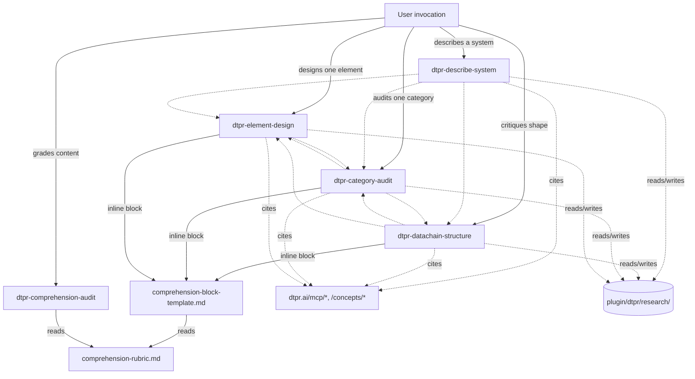

# DTPR authoring studio — five skills backed by a lazy research corpus

## Overview

Convert `plugin/dtpr/` from a two-skill pair into a five-skill authoring studio backed by a shared lazy research corpus and a single extracted comprehension rubric. The retired `dtpr-schema-brainstorm` splits into three focused schema-tier skills (structure, category-audit, element-design); `dtpr-describe-system` is expanded to accept 0+ artifacts (PDFs, URLs, verbal); and a new `dtpr-comprehension-audit` extracts the public-comprehension judgment that currently lives in scattered prose.

The plan makes the existing plugin usable for real authoring work — not just demo flows — by matching one skill per expert-judgment tier and letting a file-based corpus compound research across sessions.

## Problem Frame

Authoring DTPR content at scale is bottlenecked on a small set of expert judgment calls that today happen inside the user's head:

- *Structure* — does the datachain-type (11 categories, ~75 elements) make conceptual sense to a commuter reading a sign that renders it?
- *Per-category coherence* — within a category like `ai__risks_mitigation`, are the elements mutually exhaustive without overlap, and are obvious risk classes missing?
- *Per-element clarity* — does the `title + description + symbol` triple land for a non-technical reader?
- *Per-instance adaptation* — converting a 40-page AIA into a consistent datachain-instance requires dozens of judgment calls across the above dimensions.

The shipped plugin (`plugin/dtpr/`, commit `43b62b6`) has `dtpr-describe-system` and `dtpr-schema-brainstorm` — a reasonable day-one pair. But `dtpr-schema-brainstorm` is a generalist that conflates three mindsets (meta-structure, category, element), and `dtpr-describe-system` only takes verbal input, so pilot cities arriving with documents today have no clean on-ramp. Every real authoring session also repeats the same research (what does ISO 42001 say about risk categorization, what prior art exists for algorithmic-transparency notices, etc.) — there is no durable corpus.

## Requirements Trace

Carried forward from the origin brainstorm:

- **R1** — Authoring studio has one skill per expert-judgment tier (meta-structure, category, element, instance, comprehension). → **Units 3–7**
- **R2** — Schema-tier skills (structure, category-audit, element-design) produce a comprehension block in their output using a shared rubric. → **Units 1, 4, 5, 6**
- **R3** — `dtpr-describe-system` accepts 0+ artifacts (PDFs, URLs, verbal) and works across Claude Code, Claude Cowork, and Claude.ai. → **Unit 7**
- **R4** — Shared lazy research corpus (`plugin/dtpr/research/`) with `INDEX.md` manifest, date-prefixed entries, `recheck_after` freshness, `supersedes` chain, locked `authority_tier` enum. Zero pre-seeding. → **Unit 1**
- **R5** — Research miss dispatches a sub-agent via Task tool; invoking skill (not the sub-agent) writes the corpus entry and appends one line to `INDEX.md`. → **Units 1, 4–7**
- **R6** — `dtpr-comprehension-audit` is standalone-invokable against a version, category, element, or datachain-instance. → **Unit 3**
- **R7** — All MCP/domain reference material is cited via `dtpr.ai/*` URLs (Docus-powered docs-site). No plugin-local mirrors. → **Units 3–7**
- **R8** — `dtpr-schema-brainstorm` is hard-deleted on ship — no stub, no redirect. Its eval prompts and trigger phrases port to the three schema-tier replacements. → **Unit 8**
- **R9** — Each new skill ships ≥5 positive evals and ≥8 negatives, including ≥4 cross-sibling negatives. `verify.mjs` extends to enforce cross-sibling symmetry. → **Units 2, 10**
- **R10** — `verify.mjs` validates corpus entry frontmatter and INDEX.md append-only shape; remains Node-builtins-only so `plugin/dtpr/` stays outside the pnpm workspace. → **Unit 2**
- **R11** — Multi-host packaging: plugin ships `/plugin install dtpr` for Claude Code; parallel distribution for Claude Cowork and Claude.ai follows their respective upload paths. Tool-availability matrix documented in `plugin/dtpr/README.md`. → **Unit 9**

## Scope Boundaries

- Not modifying `api/src/mcp/` or `api/src/rest/`. The read-side API and the 9-tool MCP surface are complete.
- Not adding new MCP tools for schema proposal/write. Skills emit markdown/YAML/JSON; humans edit and PR.
- Not shipping a full shared rubric library — only the comprehension rubric is extracted. Other rubrics live in the owning skill until reuse is proven.
- Not pre-seeding the research corpus. Author seeds when first using the skills.
- Not shipping a plugin-local MCP tool cheatsheet. Skills cite `dtpr.ai/mcp/*` (Docus-powered).
- Not shipping a redirect/stub `SKILL.md` for `dtpr-schema-brainstorm`. Hard-delete.
- Not solving cross-session conflict merging on `INDEX.md` beyond append-only + PR-level resolution.

### Deferred to Separate Tasks

- **Public-polish pass on skill descriptions** — defer until one real schema revision has run through the studio (per brainstorm decision 3, internal-first posture).
- **Rubric-library extraction for non-comprehension rubrics** — defer until any second rubric proves a reuse need.
- **Dead-URL CI check for `dtpr.ai/*` citations in SKILL bodies** — separate small PR after the main landing.
- **Merge-back to a unified `dtpr-schema-work`** — contingency plan if skill-routing collisions prove real in practice (brainstorm decision 8). Not executed now; tracked as a risk with mitigation triggers.

## Context & Research

### Relevant Code and Patterns

- `plugin/dtpr/skills/dtpr-describe-system/SKILL.md` — source-of-truth for the expanded skill; its 5-phase structure (Understand → Load schema → Find elements → Construct → Validate) is preserved with a new Phase 0 prepended.
- `plugin/dtpr/skills/dtpr-schema-brainstorm/SKILL.md` — the retiring skill. Its proposal template (Scenario / Gaps / Proposed changes {Add/Edit/Retire} / Validation check / Next step) and the literal `pnpm --filter ./api schema:new <type> <YYYY-MM-DD>-beta` handoff port verbatim to the three schema-tier replacements. Its six trigger phrases ("does DTPR cover", "propose a new element", "brainstorm DTPR", "what's missing from the schema", "critique the taxonomy", "how should DTPR handle") split across the three replacements.
- `plugin/dtpr/evals/verify.mjs` — Node-builtins-only validator with three existing check classes (frontmatter, eval-set shape, MCP tool-name drift). Extension pattern is additive: new `verifyCorpusEntry()` / `verifyIndex()` / `verifyEvalSymmetry()` functions called from `main()`, failures collected then exit 1.
- `plugin/dtpr/evals/describe-system.evals.json` — current eval shape; `schema: skill, description, should_trigger[5], should_not_trigger[5]`, `description` ends `"Compatible with skill-creator's run_loop.py."`. Preserve the handshake string.
- `api/src/mcp/tools.ts` — 9-tool registry (`list_schema_versions`, `get_schema`, `list_categories`, `list_elements`, `get_element`, `get_elements`, `validate_datachain`, `render_datachain`, `get_icon_url`). Skills name tools in backticks so `verify.mjs` drift-checks them.
- `api/schemas/ai/2026-04-16-beta/` — canonical content: 11 category YAMLs (`ai__*.yaml`), 75 element YAMLs (`<id>.yaml`), 64 symbol SVGs; `meta.yaml` carries `content_hash` used for drift detection.
- `api/schema/datachain-instance.ts` — Zod shape for the JSON artifact `dtpr-describe-system` emits.
- `dtpr-ai/content/` — Docus docs-site served at `dtpr.ai`; numeric-prefix routing strips the prefix (`2.mcp/4.tools/7.validate-datachain.md` → `dtpr.ai/mcp/tools/validate-datachain`). Skills cite these URLs for tool parameter shapes, the envelope contract, and concept terms.
- `docs/plans/2026-04-17-001-feat-dtpr-drafting-skills-plan.md` — the plan this one evolves from. Its "Key Technical Decisions" (peer-skills, skill bodies name tools in prose, MCP owns tool descriptions, plugin is not a pnpm workspace package) remain in force.
- `.github/workflows/plugin-test.yaml` — CI wiring for `npm run test:plugin`. Path filter already covers `plugin/**`, so new files and script extensions run automatically.

### Institutional Learnings

- **`docs/solutions/` does not exist in this repo.** Institutional learnings live inline in prior plans. The only prior plans touching plugin authoring are `docs/plans/2026-04-17-001-feat-dtpr-drafting-skills-plan.md` and `docs/plans/2026-04-16-001-feat-dtpr-api-mcp-plan.md`.
- **"Skill bodies name MCP tools in prose; MCP server owns the tool descriptions"** (prior plan, Key Technical Decisions). Strengthened here to *"and no plugin-local mirrors of any dtpr.ai docs content"* — skills cite URLs, period.
- **Existing cross-sibling negative exists.** `schema-brainstorm.evals.json` already has a `describe-kiosk` entry under `should_not_trigger` that must route to the sibling; `describe-system.evals.json` has a symmetric `brainstorm-taxonomy` entry. The 5→13-prompt expansion is extension of a working pattern, not a new muscle.
- **Bulk content moves silently corrupt things.** Characterization tests against small fixtures caught locale-mapping bugs during the 75-element migration. Applies here to (a) porting eval prompts across skills without losing coverage, and (b) INDEX.md append-only discipline.
- **`content_hash` as invalidation primitive.** Already used across API responses (`meta.content_hash`). Adopt as optional frontmatter on corpus entries that cite schema content so drift detection is automatic, not purely date-based (beyond `recheck_after`).

### Flow Analysis (abbreviated — full report referenced below)

The `spec-flow-analyzer` surfaced six plan-level decisions requiring resolution before implementation:

1. Corpus distribution model (ship with plugin vs local-only vs hybrid).
2. Comprehension coupling mechanism (inline interpretation vs Task dispatch vs runtime fragment).
3. Multi-host tool-probe mechanism.
4. Applicability-tag matching algorithm.
5. Cross-sibling handoff routing matrix.
6. Eval-prompt port mapping from retired skill.

All six are resolved in **Key Technical Decisions** below.

### External References

No external research was dispatched. The brainstorm locked 9 architectural decisions with strong rationale and the repo research is comprehensive. Multi-host packaging (genuinely greenfield per the learnings-researcher) is handled via the "probe tools at Phase 0, degrade gracefully" posture the brainstorm already mandates — the correct defensive stance independent of any external guidance.

## Key Technical Decisions

### Decisions inherited from the brainstorm (locked)

1. Five peer skills, no router. Accept routing collision risk; mitigate via cross-sibling negatives in evals.
2. Lazy corpus, zero pre-seeding — author seeds when first using.
3. Internal-first posture — skills live in `plugin/dtpr/` on `main`; public-polish deferred.
4. Comprehension is inline + standalone. Schema-tier skills MUST produce a comprehension block.
5. `dtpr-describe-system` expanded to 0+ artifacts with Phase 0 tool probing.
6. Only the comprehension rubric is extracted to `references/`. No MCP tool cheatsheet.
7. Cite `dtpr.ai/*` docs-site URLs for MCP/domain material.
8. Five-peer skill-routing collision risk accepted; merge-back to `dtpr-schema-work` remains a contingency.
9. Hard-delete `dtpr-schema-brainstorm` on ship.

### Decisions resolved in planning

10. **Corpus distribution: Option A — ship with plugin.** Corpus entries in `plugin/dtpr/research/` are committed to git and ship in the `/plugin install dtpr` payload. *Rationale:* Internal-first posture means the author is sole user initially; by the time external users install, the corpus has seeded value. Option B (local-only) produces silent author effort that doesn't compound; Option C (hybrid) adds complexity without a present need. Author may `.gitignore` individual entries if privacy-sensitive (e.g., an un-scrubbed regulatory-draft citation) by prefixing the filename with `_` (documented convention in `research/README.md`).

11. **Comprehension coupling: inline-template pattern, not Task dispatch.** Schema-tier skills read `plugin/dtpr/references/comprehension-rubric.md` and `plugin/dtpr/references/comprehension-block-template.md` at runtime and produce a block following the template. `dtpr-comprehension-audit` uses the same pair when invoked standalone. *Rationale:* Task tool is not available on Claude.ai; inline-template works cross-host with no degradation. Duplication is across *data* (the rubric file both skills read), not across *code* (no interpretation logic lives in each skill).

12. **Multi-host tool-probe: trial-call-and-degrade.** Each skill that uses optional tools (`Read`, `WebFetch`, `Task`, `Write`) attempts the call and catches the error, then degrades to a documented fallback. No env-var introspection (not cross-host safe). Phase 0 of `dtpr-describe-system` runs an inventory at session start by describing the tools it needs and recording which are available before classifying artifacts.

13. **Applicability-tag matching: non-empty set intersection + tiebreak.** Tags are a closed controlled vocabulary (defined in Unit 1) plus an `other:<freeform>` escape hatch. A retrieval "hit" is any entry whose `applicability_tags` share ≥1 tag with the skill's current query tags. Tiebreak ordering: (a) higher `authority_tier` wins (enum order: `primary-source` > `peer-reviewed` > `standards-body` > `regulatory-text` > `industry-report` > `engineering-postmortem` > `secondary-commentary` > `speculative`), then (b) newer `date_accessed`. Multiple hits surface to the skill; skill cites the top entry and lists runner-ups in a "Related" line.

14. **Cross-sibling handoffs are explicit per-skill "Handoffs" sections.** Each of the five skills includes a "Handoffs" block listing 3–5 concrete next-skill cases. The full routing matrix is captured in the High-Level Technical Design below so reviewers can sanity-check coverage without reading five SKILL.md files.

15. **Eval-prompt port mapping is explicit and validates symmetry.** The 5 positive prompts on the retired skill map as: `llm-hallucination` → `dtpr-element-design`; `generative-output` → `dtpr-datachain-structure`; `accountable-deep-dive` → `dtpr-category-audit`; `third-party-processor` → `dtpr-element-design`; `retire-element` → `dtpr-element-design`. Each straddler (ambiguous routing) appears as a `should_not_trigger` on every sibling it could plausibly fire. `verify.mjs` extends with a symmetry check: every cross-sibling negative `P` on skill A must have a semantically-equivalent positive on some other skill (enforced by requiring the `id` to match a positive elsewhere).

16. **Corpus slug convention: `YYYY-MM-DDThhmm-<kebab-slug>.md`.** The time suffix eliminates same-day collision without requiring post-write renames. Supersedes the brainstorm's `YYYY-MM-DD-<slug>.md` form; the brainstorm's concurrency rationale (parallel sessions don't silently overwrite) is preserved and strengthened. `verify.mjs` enforces this shape.

17. **Corpus frontmatter schema.** Required: `source` (URL or citation string), `date_accessed` (ISO 8601), `authority_tier` (one of the 8 enum values), `applicability_tags` (non-empty array). Optional: `recheck_after` (ISO 8601 date), `supersedes` (slug), `superseded_by` (slug, auto-filled when superseded), `content_hash` (when the entry cites schema content — carries the schema's `meta.content_hash` for drift detection).

18. **INDEX.md is a flat markdown table.** Columns: `slug | title | applicability_tags | authority_tier | date_accessed | recheck_after`. Append-only is enforced by `verify.mjs` via `git diff HEAD~1 -- INDEX.md` containing only additions at EOF.

19. **Describe-system Phase 0 size bands:** ≤2k tokens inline raw; 2–10k tokens inline full; 10–20k tokens inline only the 2–3 most-relevant sections; >20k tokens reject with a structured pre-summarize ask. PDF page→token heuristic: 300 tokens/page.

20. **Consumer-side graceful degradation.** When `plugin/dtpr/research/INDEX.md` is missing or malformed (e.g., stale install, Claude.ai read-only quirks), retrieval treats it as an empty corpus and skills log a one-line warning in output. No skill hard-fails on corpus malformation.

## Open Questions

### Resolved During Planning

- **Skill names** — locked to the brainstorm table (`dtpr-datachain-structure`, `dtpr-category-audit`, `dtpr-element-design`, `dtpr-describe-system`, `dtpr-comprehension-audit`).
- **INDEX.md shape** — see Decision 18.
- **Comprehension block shape** — separate template file `plugin/dtpr/references/comprehension-block-template.md` with sections: Audience fit, Plain-language check, Ambiguity flags, Symbol legibility (when applicable), Overall rubric pass/fail/partial.
- **verify.mjs extensions** — Unit 2 adds: corpus-entry frontmatter validation (with closed `authority_tier` enum), INDEX.md append-only shape check, cross-sibling eval symmetry check, extended `knownNonTools` allowlist for corpus terms.
- **Research entry specifics** — `authority_tier` enum locked to the 8 brainstorm values. `applicability_tags` controlled vocabulary seed set in Unit 1 (`category:<id>`, `element:<id>`, `concept:<slug>`, `framework:<name>`, `standard:<name>`, `jurisdiction:<iso>`, `pattern:<slug>`, `other:<freeform>`). `recheck_after` default cadence: 365 days for `primary-source` / `peer-reviewed` / `standards-body` / `regulatory-text`; 180 days for others.
- **Eval-prompt port mapping** — see Decision 15.
- **Corpus distribution** — see Decision 10.
- **Comprehension coupling mechanism** — see Decision 11.
- **Multi-host tool-probe** — see Decision 12.
- **Cross-sibling handoff rules** — see Decision 14 and the High-Level Technical Design.
- **Applicability-tag algorithm** — see Decision 13.

### Deferred to Implementation

- **Exact wording of each skill's `description` frontmatter.** Trigger-phrase enumeration happens when each SKILL.md is drafted; the router collision check runs via evals.
- **The `other:<freeform>` applicability_tags that emerge from real use.** These promote to the controlled vocabulary only after appearing ≥3 times.
- **Whether `Read` supports in-place PDF extraction on Claude Cowork.** Phase 0 tool probing is the runtime detector; the README's capability matrix is refined after first real session.
- **Whether `get_icon_url` belongs in `dtpr-element-design`'s Tool reference.** Implementer decides during drafting based on whether symbol-preview actually helps the workflow.
- **Tuning of the 20k-token artifact budget.** Start at 20k; adjust based on eval loop results.
- **Exact shape of `dtpr-comprehension-audit`'s Phase 0 input dispatcher** (how it distinguishes a category-id vs element-id vs datachain-instance from a user message). Implement with structured clarification questions; refine after evals.
- **`verify.mjs` YAML parser upgrade.** Either stay with regex + stricter comma-separation for arrays, or vendor a minimal YAML parser (single-file public-domain) into `plugin/dtpr/evals/`. Decided during Unit 2 drafting based on actual frontmatter shape.

## Output Structure

New and modified files under `plugin/dtpr/`:

    plugin/dtpr/
    ├── .claude-plugin/plugin.json              # version bump 0.1.0 → 0.2.0
    ├── .mcp.json                               # unchanged
    ├── README.md                               # expanded — multi-host matrix, corpus section, skill list
    ├── CHANGELOG.md                            # NEW — 0.2.0 entry noting retired skill + replacements
    ├── evals/
    │   ├── verify.mjs                          # MODIFIED — corpus, INDEX, symmetry checks
    │   ├── describe-system.evals.json          # MODIFIED — ≥13 prompts, cross-sibling coverage
    │   ├── comprehension-audit.evals.json      # NEW
    │   ├── datachain-structure.evals.json      # NEW
    │   ├── category-audit.evals.json           # NEW
    │   ├── element-design.evals.json           # NEW
    │   └── schema-brainstorm.evals.json        # DELETED
    ├── references/
    │   ├── comprehension-rubric.md             # NEW — owned by dtpr-comprehension-audit
    │   └── comprehension-block-template.md     # NEW — shared inline block shape
    ├── research/
    │   ├── README.md                           # NEW — contract, conventions, privacy note
    │   └── INDEX.md                            # NEW — empty header, one line per entry
    └── skills/
        ├── dtpr-comprehension-audit/SKILL.md   # NEW
        ├── dtpr-datachain-structure/SKILL.md   # NEW
        ├── dtpr-category-audit/SKILL.md        # NEW
        ├── dtpr-element-design/SKILL.md        # NEW
        ├── dtpr-describe-system/SKILL.md       # MODIFIED — Phase 0 prepended, multi-host prose
        └── dtpr-schema-brainstorm/             # DELETED (directory)

This is a scope declaration; the implementer may adjust the layout if implementation reveals a better shape (e.g., splitting `comprehension-block-template.md` into per-artifact-type templates).

## High-Level Technical Design

> *This illustrates the intended approach and is directional guidance for review, not implementation specification. The implementing agent should treat it as context, not code to reproduce.*

### Skill interaction topology



Dashed arrows are handoffs (prose recommendations, not tool invocations). The three schema-tier skills (datachain-structure, category-audit, element-design) each emit a `pnpm --filter ./api schema:new <type> <YYYY-MM-DD>-beta` command-line handoff in their proposal output. `dtpr-describe-system` emits a validated `DatachainInstance` JSON and never modifies `api/schemas/`.

### Corpus read/write sequence (for any research-capable skill)

```
skill invoked
  └─ read plugin/dtpr/research/INDEX.md
       ├─ missing or malformed → log warning, treat as empty corpus
       └─ ok
            └─ compute query tags from user's request + skill context
                 └─ filter INDEX rows by tag intersection
                      ├─ 1+ hits → read top row's file; if recheck_after passed:
                      │              • mark as STALE in output
                      │              • on Claude Code, spawn async refresh sub-agent
                      │              • on Claude Cowork/Claude.ai, just cite stale + warn
                      │             → cite in skill output
                      └─ 0 hits → if Task tool available:
                                    • spawn best-practices-researcher or web-researcher
                                    • receive synthesis text
                                    • skill writes plugin/dtpr/research/YYYY-MM-DDThhmm-<slug>.md
                                      with required frontmatter
                                    • skill appends one row to INDEX.md
                                    • cite new entry
                                  else:
                                    • flag gap in output ("no corpus entry; research would help here")
                                    • continue without citing
```

### Cross-sibling handoff routing matrix

| From skill | Condition | Recommend next skill | Why |
|---|---|---|---|
| `dtpr-describe-system` | No element matches a concept in the source | `dtpr-element-design` | Element-level gap |
| `dtpr-describe-system` | Many elements in a category feel off | `dtpr-category-audit` | Category-level coherence |
| `dtpr-describe-system` | The datachain-type shape itself misses the system's nature | `dtpr-datachain-structure` | Meta-structure gap |
| `dtpr-element-design` | Proposed element exposes category overlap | `dtpr-category-audit` | Coherence sibling |
| `dtpr-element-design` | Category-level retirement implied | `dtpr-datachain-structure` | Meta-structure sibling |
| `dtpr-category-audit` | One missing element dominates the gap list | `dtpr-element-design` | Element drafting |
| `dtpr-category-audit` | Category should be retired or split | `dtpr-datachain-structure` | Meta-structure sibling |
| `dtpr-datachain-structure` | Proposed change implies new elements | `dtpr-element-design` | Element drafting |
| `dtpr-datachain-structure` | Proposed change implies category-level audit | `dtpr-category-audit` | Coherence validation |
| any schema-tier skill | Output needs comprehension grading beyond the inline block | `dtpr-comprehension-audit` | Standalone deep grading |

## Implementation Units

- [ ] **Unit 1: Shared substrate — rubric, corpus scaffold, vocabularies**

**Goal:** Create `plugin/dtpr/references/` and `plugin/dtpr/research/` with their contracts in place, so all five skills have something to read from on day one.

**Requirements:** R2, R4, R7

**Dependencies:** None

**Files:**
- Create: `plugin/dtpr/references/comprehension-rubric.md`
- Create: `plugin/dtpr/references/comprehension-block-template.md`
- Create: `plugin/dtpr/research/README.md`
- Create: `plugin/dtpr/research/INDEX.md`

**Approach:**
- `comprehension-rubric.md` captures the rubric used to grade DTPR content for public comprehension. Structured as a checklist with 5–8 items: audience fit (non-technical reader), plain-language (no jargon without gloss), symbol legibility at sign scale, ambiguity flags, locale coverage sanity, variable-substitution clarity. Each item has a short prose definition and pass/fail/partial signals. No scoring math — qualitative rubric.
- `comprehension-block-template.md` is the shape schema-tier skills inline. Heading "## Comprehension check" followed by a bullet list one-per-rubric-item with `- **<item>:** pass/fail/partial — <one-line reason>`, closing with "Rubric version: <date>". Schema-tier skills copy this template shape into their output verbatim.
- `research/README.md` documents: corpus contract (retrieval, write path, concurrency, freshness, supersession, authority tiers), slug convention (Decision 16), frontmatter schema (Decision 17), privacy handling (`_`-prefixed filenames are git-ignored for sensitive citations), and consumer-side degradation semantics (Decision 20).
- `research/INDEX.md` starts with a one-line header table row (columns per Decision 18) and nothing else. Author appends as they use.

**Patterns to follow:**
- Prose tone matches existing SKILL.md files (concrete, second-person imperative, no fluff).
- Repo-relative paths only; no absolute paths.

**Test scenarios:**
- Happy path: `node plugin/dtpr/evals/verify.mjs` passes with empty `research/` (header-only INDEX.md).
- Integration: A schema-tier skill fixture can successfully inline the comprehension block without reaching external state.
- Edge case: `research/INDEX.md` with only the header row is treated as empty corpus (not malformed) by Unit 2's validator.

**Verification:**
- Rubric file exists, is ≤150 lines, and has exactly one H2 section per rubric item.
- `INDEX.md` has a valid header row and no data rows.
- `research/README.md` documents the 8-value `authority_tier` enum verbatim.

- [ ] **Unit 2: Extend `verify.mjs` for corpus, INDEX, and eval symmetry**

**Goal:** Keep CI green as new skills, corpus entries, and eval files land. The validator stays Node-builtins-only so `plugin/dtpr/` remains outside the pnpm workspace.

**Requirements:** R9, R10

**Dependencies:** Unit 1

**Files:**
- Modify: `plugin/dtpr/evals/verify.mjs`

**Approach:**
- Add `verifyCorpusEntry(path)`: reads `plugin/dtpr/research/YYYY-MM-DDThhmm-<slug>.md` files, parses frontmatter, enforces Decision 17 schema (required fields, closed `authority_tier` enum, valid ISO dates, non-empty `applicability_tags`). Fails on unknown keys only when they look misspelled (e.g., `authority_teir`).
- Add `verifyIndex(path)`: opens `plugin/dtpr/research/INDEX.md`, asserts header row matches Decision 18, asserts every data row references an existing entry file, and asserts append-only shape. Diff base selection: when run against a PR in CI, compute the merge base via `git merge-base origin/main HEAD` and assert the diff of INDEX.md against that base contains only `+` lines (no `-`, no context rewrites); requires the workflow to set `fetch-depth: 0` on checkout (update `.github/workflows/plugin-test.yaml` accordingly). When git history is unavailable (fresh clone, install-only context), fall back to structural validation only (header shape, row count, every data row's slug has a matching file in `research/`) and log a warning that append-only integrity cannot be confirmed. This converts a silent skip into a visible signal without blocking non-git environments.
- Add `verifyEvalSymmetry(evalsDir)`: for every `should_not_trigger` entry in every eval file whose `id` carries the `cross-sibling:<sibling-slug>` marker, assert the matching sibling file has a `should_trigger` entry with the same `id` (minus the marker prefix) or that the prompt is semantically-equivalent (enforced structurally via `id` suffix match).
- Extend `knownNonTools` allowlist with corpus/domain terms that may appear as snake_case backtick tokens in SKILL.md bodies: `applicability_tags`, `authority_tier`, `recheck_after`, `date_accessed`, `supersedes`, `superseded_by`, `datachain_instance`, `datachain_type`, `rubric_version`. The `authority_tier` enum values themselves use kebab-case (Decision 13) so won't appear as snake_case tokens and don't need allowlist entries. Scope the tool-name-drift check to SKILL.md bodies only (skip `research/*.md` and `references/*.md`) so corpus prose can use snake_case terms freely without tripping drift detection.
- Decide YAML-parser posture: either keep the regex + restrict corpus frontmatter arrays to comma-separated bracketed strings (`[a, b, c]`), or vendor a tiny YAML library. Default to the regex-and-restrict posture to preserve Node-builtins-only.

**Patterns to follow:**
- Existing `failures[]`-collect-then-exit pattern in `verify.mjs` (lines 33–35, 204–211).
- All checks are additive functions called from `main()`.

**Test scenarios:**
- Happy path: current shipped plugin (plus Unit 1's scaffold) passes every check.
- Happy path: a valid corpus entry with all required frontmatter validates cleanly.
- Edge case: missing `authority_tier` in a corpus entry fails loudly with a line reference.
- Edge case: `INDEX.md` modified to rewrite an existing row (not an append) fails the append-only check when run in a git-history-available context.
- Edge case: a cross-sibling negative on skill A whose `id` does not match any positive on any sibling fails the symmetry check.
- Edge case: `research/README.md` (not an entry file) is not validated as a corpus entry (path filter excludes README).
- Error path: `verify.mjs` exits 1 on any failure and 0 when all checks pass. Exit codes are stable for CI wiring.
- Integration: `.github/workflows/plugin-test.yaml` picks up the extended checks without workflow edits (path filter already covers `plugin/**`).

**Verification:**
- `node plugin/dtpr/evals/verify.mjs` passes on the current state of the branch.
- Deliberately-broken fixture runs fail with a clear error message listing the offending file and field.

- [ ] **Unit 3: `dtpr-comprehension-audit` skill**

**Goal:** Ship the first new skill. Schema-tier skills depend on its rubric-application pattern, so this lands before them.

**Requirements:** R1, R6, R7

**Dependencies:** Unit 1

**Files:**
- Create: `plugin/dtpr/skills/dtpr-comprehension-audit/SKILL.md`
- Create: `plugin/dtpr/evals/comprehension-audit.evals.json`

**Approach:**
- Frontmatter: `name: dtpr-comprehension-audit`, `description:` enumerates triggers ("grade this element", "is this category clear to the public", "comprehension audit", "check this datachain for public understanding", "how readable is X"), names the output ("Markdown findings against the comprehension rubric"), explicitly routes non-matches to the other four skills.
- Body order: opening paragraph → When to use → sibling-routing paragraph (names all 4 others) → Workflow H2 with Phase 0 (input dispatcher: category-id vs element-id vs pasted YAML vs datachain-instance JSON vs arbitrary markdown) → Phase 1 (load target content via MCP as needed) → Phase 2 (read rubric from `references/comprehension-rubric.md`) → Phase 3 (apply rubric item-by-item) → Phase 4 (emit findings in the shared block template shape).
- Skill explicitly says: "This skill does not modify schema content; it grades."
- Output format: heading + bullet list per rubric item + `Rubric version: <date>` trailer + one-paragraph summary.
- Corpus interaction: light. Reads corpus for prior comprehension findings on same content (`applicability_tags: [category:<id>]` or `[element:<id>]`) to avoid duplicate work. Writes a corpus entry only if the audit uncovers a non-obvious insight worth compounding (author's judgment, not automatic).

**Patterns to follow:**
- `plugin/dtpr/skills/dtpr-describe-system/SKILL.md` body structure.
- `plugin/dtpr/skills/dtpr-schema-brainstorm/SKILL.md` fixed-template output pattern.
- All MCP tool names in backticks. Non-tool snake_case tokens added to `verify.mjs`'s `knownNonTools` in Unit 2.

**Test scenarios:**
- Happy path: `comprehension-audit.evals.json` has ≥5 `should_trigger` prompts that clearly belong (element-level, category-level, datachain-instance-level, arbitrary-markdown, mixed).
- Happy path: `should_not_trigger` has ≥8 prompts — ≥4 cross-sibling (one per other skill) + ≥4 non-DTPR or non-comprehension DTPR asks.
- Edge case: prompt "describe this AI system" routes to `dtpr-describe-system`, not comprehension-audit. Covered as cross-sibling negative with `id` matching a positive in `describe-system.evals.json`.
- Integration: `node plugin/dtpr/evals/verify.mjs` passes — frontmatter valid, eval JSON valid, cross-sibling symmetry check passes.

**Verification:**
- SKILL.md passes `verify.mjs` frontmatter + tool-name-drift checks.
- Eval file passes shape validation and symmetry check.
- A dry-run invocation ("grade element `accept_deny` for comprehension") produces a block matching the template shape.

- [ ] **Unit 4: `dtpr-datachain-structure` skill**

**Goal:** The meta-structure schema-tier skill. Critiques or designs the datachain-type itself.

**Requirements:** R1, R2, R4, R5, R7

**Dependencies:** Units 1, 3 (inlines the comprehension block shape)

**Files:**
- Create: `plugin/dtpr/skills/dtpr-datachain-structure/SKILL.md`
- Create: `plugin/dtpr/evals/datachain-structure.evals.json`

**Approach:**
- Frontmatter `description` inherits retired skill's "brainstorm DTPR" / "how should DTPR handle" / "critique the taxonomy" trigger phrases filtered to shape-level questions.
- Workflow: Phase 0 (classify input: scenario / change proposal / document) → Phase 1 (load current datachain-type via `get_schema(include:"full")`, capture `version` + `content_hash`) → Phase 2 (corpus lookup via INDEX.md, dispatch sub-agent on miss) → Phase 3 (draft structural critique/proposal using the retired skill's Scenario / Gaps / Proposed changes {Add/Edit/Retire} template) → Phase 4 (inline comprehension block) → Phase 5 (emit `pnpm --filter ./api schema:new <type> <YYYY-MM-DD>-beta` handoff) → Phase 6 (recommend a sibling handoff per Decision 14 / routing matrix).
- When the proposal retires a category, output MUST include an element-migration plan: list of affected elements with proposed new homes, explicit "elements with no migration path" flagged for user decision.
- Skill emphatically says: "This skill does not invoke `schema:new` or modify files under `api/schemas/`."

**Patterns to follow:**
- Retired `dtpr-schema-brainstorm` proposal template.
- `plugin/dtpr/skills/dtpr-describe-system/SKILL.md` schema-loading and provenance-capture pattern.
- Shared comprehension block shape from Unit 1.

**Test scenarios:**
- Happy path: eval positives include `generative-output` (ported from retired skill) plus 4 new shape-level prompts.
- Happy path: eval negatives include category-level and element-level prompts that should route to sibling skills.
- Integration: SKILL.md's Tool reference table cites the live MCP tools by backticked name; `verify.mjs` tool-name-drift check passes.
- Edge case: a category-retirement proposal fixture emits an element-migration plan section.

**Verification:**
- SKILL.md + eval file pass `verify.mjs`.
- Inline comprehension block matches the Unit 1 template shape.

- [ ] **Unit 5: `dtpr-category-audit` skill**

**Goal:** Audit one category's element collection for coherence, overlap, and gaps.

**Requirements:** R1, R2, R4, R5, R7

**Dependencies:** Units 1, 3

**Files:**
- Create: `plugin/dtpr/skills/dtpr-category-audit/SKILL.md`
- Create: `plugin/dtpr/evals/category-audit.evals.json`

**Approach:**
- Frontmatter inherits retired skill's category-shaped triggers ("does DTPR cover", "what's missing from the schema", "accountable deep-dive", "critique the taxonomy" when scoped to one category).
- Workflow: Phase 0 (input: category id — fuzzy-match against `list_categories` if typo) → Phase 1 (fetch category + its elements via `list_categories` + `list_elements(category_id=...)`) → Phase 2 (overlap detection via `list_elements(query=<element.title>, category_id=<same-category>)` similarity search — flag top-3 neighbors; treat the MCP's ranking as the similarity signal without claiming a specific algorithm) → Phase 3 (corpus lookup; sub-agent dispatch on miss; typical tags: `category:<id>`, `concept:<domain>`, `framework:*`) → Phase 4 (gap analysis against corpus and first-principles) → Phase 5 (emit audit: coverage map, overlap pairs, gap list, proposed additions using Retired-skill template) → Phase 6 (inline comprehension block) → Phase 7 (`schema:new` handoff + sibling handoffs).

**Patterns to follow:**
- `list_elements(query=...)` search — already used in shipped skills for relevance-ranked element lookup.
- Shared comprehension block template.

**Test scenarios:**
- Happy path: `accountable-deep-dive` (ported positive) + 4 new category-level prompts fire.
- Happy path: cross-sibling negatives include shape-level and element-level prompts with matching positives on siblings.
- Integration: overlap detection fixture: if category has two elements with substantially-overlapping descriptions, audit flags them as a candidate merge.
- Edge case: non-existent category id triggers fuzzy-match + user confirmation.

**Verification:**
- SKILL.md + eval file pass `verify.mjs`.
- Inline comprehension block matches template shape.

- [ ] **Unit 6: `dtpr-element-design` skill**

**Goal:** Brainstorm title, description, and symbol direction for one proposed element.

**Requirements:** R1, R2, R4, R5, R7

**Dependencies:** Units 1, 3

**Files:**
- Create: `plugin/dtpr/skills/dtpr-element-design/SKILL.md`
- Create: `plugin/dtpr/evals/element-design.evals.json`

**Approach:**
- Frontmatter inherits retired skill's element-level triggers ("propose a new element", "how would DTPR describe", "retire it and replace it").
- Workflow: Phase 0 (input: concept + target category, with ambiguity flagged if multiple categories could fit) → Phase 1 (collision check: `get_element(candidate_id)` and `list_elements(query=<candidate_title>)`) → Phase 2 (corpus lookup; sub-agent dispatch on miss) → Phase 3 (draft YAML fragment: `id`, `category_id`, localized `title`/`description` skeleton, `citation[]`, proposed `symbol_id`, `variables[]` if needed) → Phase 4 (symbol direction — prose description suitable for a designer; NOT an SVG) → Phase 5 (inline comprehension block) → Phase 6 (`schema:new` handoff + sibling handoffs).
- Skill explicitly says: symbol output is a *direction* (visual prose), not an SVG. Locale coverage for `title`/`description` is the skeleton only — six locales (en/es/fr/km/pt/tl) per current schema, but translation is out of scope.

**Patterns to follow:**
- `api/schemas/ai/2026-04-16-beta/elements/accept_deny.yaml` as the canonical element shape.
- Retired skill's Proposed changes {Add} template.

**Test scenarios:**
- Happy path: `llm-hallucination`, `third-party-processor`, `retire-element` (all ported from retired skill) fire.
- Happy path: new element prompt for a concept NOT in the current schema triggers corpus lookup + sub-agent dispatch (if Task available) or graceful flag (if not).
- Edge case: user proposes `model_transparency` when `transparency.yaml` already exists — skill flags collision and asks for disambiguation.
- Edge case: cross-sibling negatives include category-level and shape-level prompts with matching positives on siblings.

**Verification:**
- SKILL.md + eval file pass `verify.mjs`.
- YAML fragment in output is syntactically valid (parseable) — checked against a fixture.

- [ ] **Unit 7: Expand `dtpr-describe-system` — Phase 0, artifacts, multi-host**

**Goal:** Make the existing instance-tier skill accept 0+ artifacts and work across Claude Code, Cowork, and Claude.ai.

**Requirements:** R3

**Dependencies:** Unit 1 (corpus contract, references posture)

**Files:**
- Modify: `plugin/dtpr/skills/dtpr-describe-system/SKILL.md`
- Modify: `plugin/dtpr/evals/describe-system.evals.json` (add Phase 0 triggers, expand to ≥13 prompts with cross-sibling coverage)

**Approach:**
- Prepend new **Phase 0 — Inventory and classify**:
  - Enumerate host tools needed: `Read` (for PDFs), `WebFetch` (for URLs), `Task` (for corpus sub-agents), `Write` (for corpus writes).
  - Trial-call-and-degrade: try each tool once with a safe no-op-ish input, catch errors, record availability.
  - Classify provided artifacts: verbal (0 tokens), inline ≤2k, inline-full 2–10k, chunk-relevant 10–20k, reject >20k. PDF page→token heuristic: 300 tokens/page.
  - Budget reconciliation: sum token estimates. If >20k total, ask user to rank or pre-summarize using the Decision 19 template.
  - Artifact-vs-verbal conflict: explicitly ask which is authoritative when both disagree.
- Existing Phases 1–5 (now relabeled 1–5 after Phase 0) remain — schema loading, element search, construction, validation — with minor additions:
  - Phase 2 additionally captures `content_hash` into any corpus entry written during the session.
  - Corpus lookup inserted between Phase 2 (schema) and Phase 3 (element search) for research questions.
- Multi-host degradation prose: one paragraph per host explicitly documenting what's available. Refers to `plugin/dtpr/README.md` for the capability matrix.
- Mid-flow artifact drop handling: user drops a new artifact in Phase 3 → loop back to Phase 0 for just the new artifact, merge into budget, continue.
- Expanded eval set: ≥13 prompts total. Original 5 positives retained; add Phase-0-specific positives ("describe this from the attached PDF", "here's a URL to a company's AI policy — make a datachain", "I have a PDF and also want to describe a separate observation verbally"). Cross-sibling negatives added for each of the 4 siblings with `id`s matching positives.

**Patterns to follow:**
- Existing `describe-system` Phase structure (preserved).
- Retry-on-`ok:false` loop with 3-retry cap (preserved).
- Schema `version` + `content_hash` provenance capture (preserved and extended to corpus writes).

**Test scenarios:**
- Happy path: verbal-only input preserves current shipped behavior (backward-compatible).
- Happy path: single PDF ≤10 pages is fully inlined.
- Happy path: URL ≤2k tokens is inlined; URL 10–20k is chunked to 2–3 relevant sections.
- Edge case: all four optional tools unavailable → skill runs verbal-only and tells the user why.
- Edge case: 3-artifact budget overflow triggers the structured pre-summarize ask naming the specific artifact(s).
- Edge case: password-protected PDF → tool fails, skill reports "artifact inaccessible", asks user to paste excerpts.
- Edge case: URL returns 403 → same degradation as password-protected PDF.
- Edge case: user contradicts the artifact ("PDF says 30 days, I say 90") → skill asks which is authoritative; does not silently pick.
- Integration: Phase 0 probe decisions are captured in the output narrative so the user sees what was assumed.
- Integration: Mid-flow artifact drop triggers a re-probe only for the new artifact.

**Verification:**
- SKILL.md + eval file pass `verify.mjs`.
- `pnpm test:plugin` passes.
- A manual test session on Claude Code with a 7-page PDF produces a validated `DatachainInstance` without hallucinating element IDs.

- [ ] **Unit 8: Hard-delete `dtpr-schema-brainstorm`**

**Goal:** Remove the retired skill. No stub, no redirect.

**Requirements:** R8

**Dependencies:** Units 4, 5, 6 (replacements exist and tested), Unit 10 (evals ported)

**Files:**
- Delete: `plugin/dtpr/skills/dtpr-schema-brainstorm/` (directory)
- Delete: `plugin/dtpr/evals/schema-brainstorm.evals.json`
- Modify: `plugin/dtpr/.claude-plugin/plugin.json` (bump version `0.1.0 → 0.2.0`)
- Modify: `plugin/dtpr/.mcp.json` (sync User-Agent header `dtpr-claude-plugin/0.1.0 → dtpr-claude-plugin/0.2.0`)
- Create: `plugin/dtpr/CHANGELOG.md` (0.2.0 entry noting retired skill + three replacements + expanded `describe-system` + comprehension-audit + research corpus + rubric)
- Modify: `plugin/dtpr/README.md` (update skill list, reference CHANGELOG)

**Approach:**
- Retired skill's trigger phrases are already inherited by the three replacements (verified via Unit 10's symmetry check).
- `plugin.json` version bump signals to Claude Code plugin-update machinery that the shape has changed.
- CHANGELOG entry follows conventional-commit style per existing repo commit convention.
- README updates the "Skills" section to list five skills, removes `schema-brainstorm`, adds a short "Research corpus" and "References" subsection.

**Patterns to follow:**
- Existing `plugin/dtpr/README.md` skill-table shape.
- Repo commit conventions: `feat(plugin): …`.

**Test scenarios:**
- Happy path: `pnpm test:plugin` passes after delete + replacements. `verify.mjs` does not find the retired skill and does not complain about the missing eval file.
- Edge case: retired skill's `should_trigger` prompts, run against the five new skills' descriptions (manual offline check), collectively route somewhere — no prompt falls through to zero matches.

**Verification:**
- No references to `dtpr-schema-brainstorm` remain under `plugin/dtpr/` except in `CHANGELOG.md` historical entry.
- `plugin.json` `version` field reads `0.2.0`.

- [ ] **Unit 9: Multi-host packaging and capability matrix**

**Goal:** Document tool-availability matrix per host so users install into the right host and the Phase 0 degradation prose has a reference to point at.

**Requirements:** R11

**Dependencies:** Units 3–7 (skills exist to reference)

**Files:**
- Modify: `plugin/dtpr/README.md`

**Approach:**
- Add a "Hosts" section to README with a capability matrix table: columns = `Claude Code` / `Claude Cowork` / `Claude.ai`; rows = `Read (PDF)`, `WebFetch`, `Task (sub-agents)`, `Write (corpus)`, `MCP client`, `Recommended?`.
- Populate matrix with confirmed-by-probe values plus "unknown — confirm at first use" placeholders for Cowork where no prior verification exists.
- Add install/upload instructions per host: `/plugin install dtpr` for Claude Code; upload path for Claude Cowork; file-upload path for Claude.ai.
- Note that on Claude.ai the corpus is read-only and the `Task` tool is unavailable — lazy research degrades to "flag the gap in output" per Decision 20.
- README also covers: the "Research corpus" sub-section (what it is, privacy note about `_`-prefixed files) and the "References" sub-section (what `comprehension-rubric.md` + `comprehension-block-template.md` are for).

**Patterns to follow:**
- Existing README's troubleshoot-table shape.
- Prose tone matches the two shipped SKILL.md files.

**Test scenarios:**
- Integration: README renders correctly on GitHub (tables, anchors, no broken intra-repo links).
- Happy path: a reader who has never seen the plugin can install on the right host in <5 minutes after reading the README.
- Test expectation: none for the README content itself (docs) — matrix claims are verified by Unit 7's Phase 0 probe at runtime.

**Verification:**
- README links to `dtpr.ai/mcp/*` for MCP details (no plugin-local mirrors).
- Matrix has no table-format errors on `gh pr view --web` (or equivalent preview).

- [ ] **Unit 10: Eval expansion, cross-sibling symmetry, retired-skill port**

**Goal:** All five skills ship with ≥5 positives + ≥8 negatives (≥4 cross-sibling); symmetry is machine-checkable; retired skill's prompts have a documented home.

**Requirements:** R9

**Dependencies:** Units 3, 4, 5, 6, 7 (skills exist); Unit 2 (symmetry check in `verify.mjs`)

**Scope note:** The five eval files themselves are created in their owning skill units (Units 3, 4, 5, 6, 7). Unit 10 is the cross-cutting pass that adds retired-skill-port positives and cross-sibling negatives *to the already-created files* — the work that cannot be done until all five skills exist. No eval file is created for the first time here.

**Files:**
- Modify: `plugin/dtpr/evals/describe-system.evals.json` — add cross-sibling negatives referencing the four new skills
- Modify: `plugin/dtpr/evals/comprehension-audit.evals.json` — add cross-sibling negatives and any ported positives
- Modify: `plugin/dtpr/evals/datachain-structure.evals.json` — add cross-sibling negatives and port `generative-output` positive
- Modify: `plugin/dtpr/evals/category-audit.evals.json` — add cross-sibling negatives and port `accountable-deep-dive` positive
- Modify: `plugin/dtpr/evals/element-design.evals.json` — add cross-sibling negatives and port `llm-hallucination`, `third-party-processor`, `retire-element` positives

**Approach:**
- Preserve the `"Compatible with skill-creator's run_loop.py."` handshake string in every eval file's `description` field.
- Verify each file meets the floor: `should_trigger` has ≥5 positives; `should_not_trigger` has ≥8 negatives where ≥4 are cross-sibling (one per other in-studio skill) and ≥4 are non-DTPR or out-of-scope-within-DTPR (e.g., "write a Python script for X", "commit this PR"). If a skill unit under-specified, top up here.
- Retired-skill port mapping per Decision 15 is executed here. Each retired positive lands as a positive on its primary target skill and as a cross-sibling negative (with matching `id` suffix) on every sibling it could plausibly straddle. Example: `llm-hallucination` → positive on `dtpr-element-design`; cross-sibling negative on `dtpr-category-audit` (since it arguably belongs in `ai__risks_mitigation` audit) and on `dtpr-datachain-structure` (since hallucination could be argued to need a new category entirely).
- Cross-sibling `id` convention: `cross-sibling:<target-slug>:<matching-positive-id>` for negatives. The `<matching-positive-id>` portion must match a `should_trigger` id on the named sibling skill; `verify.mjs`'s symmetry check (Unit 2) enforces this pair relationship, not just any positive on the target.
- Eval prompts are natural-language user turns, not JSON blobs. Preserve one-sentence/one-paragraph shape.

**Patterns to follow:**
- `plugin/dtpr/evals/describe-system.evals.json` existing shape.
- Retired `plugin/dtpr/evals/schema-brainstorm.evals.json` existing prompts as ported positives.

**Test scenarios:**
- Happy path: `pnpm test:plugin` passes. Every eval file validates shape, every cross-sibling negative has a symmetry match.
- Happy path: `skill-creator`'s `run_loop.py` run (manual, offline) against the 5 eval files reports no routing anomalies beyond accepted collision risk.
- Edge case: a cross-sibling negative without a matching positive somewhere in the studio fails the symmetry check and blocks CI.
- Edge case: retired skill's `describe-kiosk` cross-sibling negative is preserved in `describe-system.evals.json` but its target now refers to the three schema-tier replacements — updated to the closest new target (probably `dtpr-category-audit` for a kiosk's accountable category).
- Test expectation: coverage is measured by the eval file shapes themselves; there is no separate test file for eval JSON.

**Verification:**
- ≥65 total prompts across five eval files (5×13 minimum) — count is a sanity floor, not a ceiling.
- `verify.mjs` exits 0.
- Retired skill's 5 positive prompts + 5 negative prompts all have documented homes (no silent drops).

## System-Wide Impact

- **Interaction graph:** The five skills form a peer mesh with explicit prose handoffs (no runtime dispatch). Schema-tier skills and `dtpr-comprehension-audit` share the comprehension-rubric + block-template as a read-only data dependency. All skills share the `research/` corpus as a read/write data dependency.
- **Error propagation:** `validate_datachain` soft-failure (`ok:false` + `errors[].fix_hint`) — retry loop capped at 3 (preserved from shipped `dtpr-describe-system`). Corpus-malformation or INDEX.md-missing degrades to empty-corpus + warning — never hard-fails a skill.
- **State lifecycle risks:** INDEX.md append-only is enforced in CI but consumers without git history can't check it; they must tolerate a locally-rewritten INDEX.md (treated as read-only data). Sub-agent dispatched for a corpus write can fail partway (synthesis but no file write) — skill must recover gracefully by retrying write or flagging the research miss in output.
- **API surface parity:** Skills cite the 9-tool MCP registry by backticked name. `verify.mjs`'s tool-name-drift check catches skills that reference unknown tools. Prior plan Unit 4's "MCP-first documentation" principle is preserved — tool parameter shapes live on `dtpr.ai/mcp/tools/*` and in the MCP server's Zod schemas, not duplicated in SKILL.md bodies.
- **Integration coverage:** `pnpm test:plugin` runs all of verify.mjs's checks in CI. Live eval-loop invocation via `skill-creator`'s `run_loop.py` remains manual. Multi-host behavior (Cowork, Claude.ai) is verified by first-real-use, not automated tests.
- **Unchanged invariants:**
  - MCP tool registry (`api/src/mcp/tools.ts`) — unchanged.
  - Read-side REST/MCP surface — unchanged.
  - `api/schemas/` content — unchanged (plan emits proposals; humans edit).
  - Plugin posture as non-pnpm-workspace — unchanged.
  - `verify.mjs` Node-builtins-only — unchanged.
  - Existing `dtpr-describe-system` output shape (validated JSON + narrative) — preserved as a superset; verbal-only input still works identically.

## Risks & Dependencies

| Risk | Likelihood | Impact | Mitigation |
|---|---|---|---|
| Skill-routing collisions among five peer descriptions | Medium | Medium | Cross-sibling negatives in evals; symmetry check in `verify.mjs`; merge-back to `dtpr-schema-work` if collisions prove real (brainstorm decision 8). |
| Corpus concurrency corruption on parallel writes | Low | Medium | Timestamp-suffixed slugs (Decision 16); INDEX.md append-only check; PR-level conflict resolution. |
| Claude.ai read-only corpus + no Task tool breaks research loop | High | Low | Graceful degradation (Decision 20): flag gap in output, continue. Documented in README (Unit 9). |
| Retired skill's trigger phrases fall through to zero matches | Low | High (user confusion) | Unit 10 explicitly maps each retired prompt to a new home + verified via symmetry check. Manual offline run of retired positives against new descriptions before merge. |
| Comprehension rubric evolves and invalidates prior outputs | Medium | Low | `rubric_version` trailer (rendered as "Rubric version: &lt;date&gt;" per Unit 1's template) in every inline block makes drift visible; re-grading is a standalone skill invocation. |
| 20k-token artifact budget is wrong | Medium | Low | Tune via real-use feedback (brainstorm decision 5); not a ship blocker. |
| Phase 0 tool probing mechanism (trial-call-and-catch) produces false negatives | Low | Medium | Each skill documents the probe's failure modes in prose; user can override by explicitly re-asserting tool availability. |
| Plugin-format schema changes in Claude Code break `.claude-plugin/plugin.json` | Low | High | Prior plan already flagged this; preserved here. `plugin.json` `$schema` URL validated in CI (existing). |

## Alternative Approaches Considered

- **Unified schema-tier skill (`dtpr-schema-work`)** — Merge meta-structure, category-audit, and element-design into one skill, accepting a "mode" parameter or prose-level disambiguation. *Rejected now* because the three tiers involve genuinely different mental models (the user knows which tier their question is at), and splitting gives cleaner evals. *Retained as contingency* if routing collisions prove real (brainstorm decision 8).
- **Comprehension-audit as a sub-agent dispatched via Task** — Schema-tier skills `Task`-spawn comprehension-audit and receive structured output. *Rejected* because Task tool isn't available on Claude.ai, creating multi-host fragility for a required output block. Inline-template (Decision 11) sidesteps the dependency.
- **Local-only corpus (`.gitignore`'d)** — Corpus stays on author's clone; nothing ships with the plugin. *Rejected* because compounding is the point of a corpus; a private notebook doesn't compound across users. Author can still `.gitignore` individual sensitive entries (Decision 10's `_`-prefix convention).
- **Hybrid corpus (shared subset + local subset)** — Ship a curated subset; rest stays local with a flag. *Rejected* because it adds complexity (two directories, promote step, dual retrieval) without a present need. Revisit if `_`-prefix privacy-escape proves insufficient.
- **MCP-side corpus storage** — Corpus lives server-side at `api.dtpr.io/research/*`, accessed via a new MCP tool. *Rejected* because the brainstorm's Scope Boundaries explicitly exclude new MCP tools, and server-side corpus means no offline use. File-based corpus is right-sized for the internal-first posture.
- **Redirect stub for `dtpr-schema-brainstorm`** — Keep the skill as a thin redirect to the three replacements. *Rejected per brainstorm decision 9* — hard-delete. Stubs rot, evals double-route, and the symmetry of three new skills is cleaner.

## Phased Delivery

Single landing is feasible given the plan size (10 units) but a phased approach reduces risk. Recommended phasing:

### Phase A — Substrate (Units 1, 2)
Land rubric, templates, research scaffold, extended verify.mjs. No user-visible skill changes yet. Mergeable alone.

### Phase B — New skills (Units 3, 4, 5, 6)
Land all four new skills in parallel (they share Unit 1's dependency; can land in one PR or stacked). `dtpr-schema-brainstorm` still exists and still works — no user disruption.

### Phase C — Describe-system expansion (Unit 7)
Land the Phase 0 prepend. Backward-compatible; verbal-only users see no change.

### Phase D — Hard-delete + evals + README (Units 8, 9, 10)
The cutover. Retired skill disappears; README announces five-skill topology; evals land as a coherent set. `plugin.json` version bump to `0.2.0`.

Phases A/B/C can run concurrently once A ships. Phase D is strictly last.

## Documentation / Operational Notes

- **Plugin CHANGELOG entry (Unit 8)** — first release of the plugin CHANGELOG. Records v0.1.0 retro-entry (two shipped skills) and v0.2.0 authoring studio.
- **No external documentation changes** required in `dtpr-ai/content/` — the Docus docs-site is unaffected (skills cite existing pages; no new tools or concepts added to the MCP surface).
- **No rollout/monitoring hooks** — plugin is client-side; nothing to deploy to `api.dtpr.io`.
- **Release path** — ship one PR per phase (4 PRs) or bundle Phases A+B (2 PRs). Reviewer preference drives.
- **First real authoring session** after merge is the acceptance test: author uses `dtpr-describe-system` on a real AIA PDF and one schema-tier skill to propose a change, then runs `schema:new` from the emitted handoff. If that flow works end-to-end without touching this plan's files for fixes, the studio is validated.

## Sources & References

- **Origin document:** [docs/brainstorms/2026-04-20-dtpr-authoring-studio-brainstorm.md](../brainstorms/2026-04-20-dtpr-authoring-studio-brainstorm.md)
- **Prior plan this evolves from:** [docs/plans/2026-04-17-001-feat-dtpr-drafting-skills-plan.md](2026-04-17-001-feat-dtpr-drafting-skills-plan.md)
- **Grandparent plan:** [docs/plans/2026-04-16-001-feat-dtpr-api-mcp-plan.md](2026-04-16-001-feat-dtpr-api-mcp-plan.md)
- **Shipped plugin:** `plugin/dtpr/` (commit `43b62b6` and successors)
- **DTPR schema:** `api/schemas/ai/2026-04-16-beta/` — 11 categories, 75 elements, 64 symbols
- **MCP tool registry:** `api/src/mcp/tools.ts` — 9 tools
- **DTPR instance Zod shape:** `api/schema/datachain-instance.ts`
- **Docs-site:** `dtpr-ai/content/` — `2.mcp/`, `3.rest/`, `6.concepts/`; served at `dtpr.ai`
- **CI wiring:** `.github/workflows/plugin-test.yaml`
- **Flow analysis report:** `spec-flow-analyzer` output (inline in planning session, 2026-04-20)
