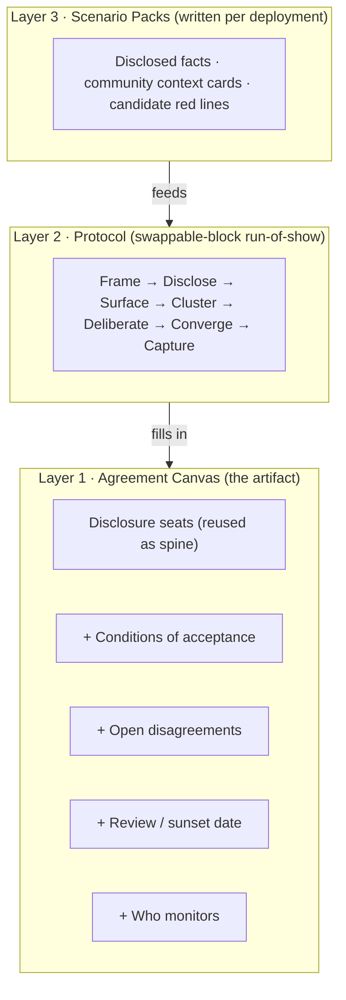

# DTPR Consensus Facilitation Kit - Plan

## Goal Capsule

- **Objective:** Design a modular facilitation kit that helps a specific neighborhood and a city/deployer reach — and document — a shared position on whether a proposed AI deployment (face tracking, sound sensing, etc.) is acceptable, and under what conditions. The output is a filled-in "Agreement Canvas," a negotiated cousin of the existing DTPR disclosure canvas.
- **Product authority:** Jonathan (DTPR). This is a prototyping exercise — the plan is a brief to build and playtest the next prototypes from, not a production spec.
- **Open blockers:** None blocking prototype work. Two facilitation-credibility assumptions (independent facilitator, honest representation) are recorded below and should be validated in the first real workshop, not before building.

## Product Contract

### Summary

A three-layer kit — an **Agreement Canvas** (fill-in mat), a **Protocol** (swappable-block run-of-show), and per-deployment **Scenario Packs** — that runs an in-person workshop of small mixed groups (community members + city staff) toward a documented outcome. Participants disclose the system seat by seat, register their support as *gradients* rather than a yes/no vote, surface disagreement as a first-class result, and land on an explicit outcomes ladder that includes a legitimate "no." The physical table is captured (photo/form) and a human later renders it as a published, canvas-style accountability record.

### Problem Frame

DTPR already has two artifacts that do adjacent jobs, and a gap between them. The board game (`prototypes/power-flow/boardgame-v2.html`) is a negotiation engine: it splits information between a Deployer's mostly-face-down system cards and a Community's hidden context cards, and runs the Bovens accountability loop toward one of four honest endings. It's powerful because it takes people out of their normal context and grounds later discussion in the constraints and incentives of each actor. But it's a *general* empathy machine — it doesn't produce a neighborhood-specific, documented agreement about a *real* deployment.

The disclosure canvas (`prototypes/power-flow/canvas-affected-v5.html`) is the opposite: a fixed, read-only board describing a system that has *already* been decided — the "as-built" state suitable for an AI register. It records; it doesn't negotiate.

Nothing bridges them: no facilitated process that seats a real community and a real deployer together and turns their deliberation into a filled-in canvas. That bridge is what this kit is.

### Key Decisions

- **Kit-level modular deliverable, not a single fixed workshop** (session-settled: user-directed — chosen over specifying the canvas artifact, the protocol, or the digital output alone: the team is building interchangeable building blocks for different scenarios). The kit mirrors the game's own core/pattern/scenario layering.
- **Gradients of agreement as the decision rule** (session-settled: user-directed — chosen over unanimous consensus, sociocratic consent, and advisory-only: records *degree* of support per seat instead of a binary, which is both more honest about a city–community gap and more reachable).
- **A negotiated-agreement canvas, distinct from the disclosure canvas, where disagreement is first-class** (session-settled: user-directed — the existing canvas stays as the static register "as-built" state; showing where parties *couldn't* agree is a feature, not an error state).
- **Outcomes ladder with a legitimate "no"** (session-settled: user-directed — the workshop can honestly conclude "not this" or "not yet"; a process that can only produce "yes with conditions" reads as managed consent).
- **Power counterweight offered as swappable blocks** (session-settled: user-directed — caucus-and-convene is preferred, but the team is realistic that a workshop cannot neutralize the city's structural power; caucus-round / community pre-work / in-table moves are interchangeable blocks the facilitator picks by stakes and time).
- **Small mixed groups of community members and city staff at one table** (session-settled: user-directed — chosen over an open town-hall or a sortition mini-public).
- **The game is an optional role-reversal warm-up block** (session-settled: user-directed — a near-but-fictional scenario with residents seated as the Deployer, plugged into the protocol's Frame phase, not the whole workshop).
- **Physical materials plus a lightweight capture step; a human renders the digital canvas** (session-settled: user-directed — chosen over physical-only, digital-first, or hybrid live-render: the in-person table is captured by photo/form and turned into the published record afterward, echoing the game's own "photograph the table" instinct).
- **Flip-to-disclose and gradient tokens as the two core table mechanics** (session-settled: user-approved — proposed and accepted without changes; both are ported from the game and make the abstract decisions physical).
- **No living-register layer in v1** (session-settled: user-directed — chosen over publishing the result as an "as-agreed" layer on the system's DTPR register with a scheduled re-convening: the output stays a standalone published canvas for now; the register layer is deferred).
- **Print-and-play form factor** (session-settled: user-directed — the whole kit prints on A4/Letter and is cut up into cards and mats; no special materials, no die-cutting, so any facilitator can produce it from a PDF).
- **Divergence before convergence; the gradient fires once, late, on deliberated tension points** (session-settled: user-directed — chosen over placing a gradient on every DTPR category. A category is a disclosed fact, not a proposition, so per-category voting is a category error; it also anchors positions before deliberation and flattens the signal across twelve seats when real disagreement clusters on three or four. The room surfaces concerns, clusters them into 3-5 named tension points, deliberates redesigns into candidate conditions, and only then registers gradients on those conditions).
- **Wall + mat hybrid physical model** (session-settled: user-directed — wall sheets, one per disclosed seat, host the divergence work (disclose → surface → cluster); a large mat hosts convergence and capture. The mat is the photographed record; the wall is the working memory that produced it).
- **The deployer's proposal is the fixed premise** (session-settled: user-directed — the session is triggered by and anchored to a concrete ask ("[Deployer] would like to deploy [system] here"), stated face-up in Frame like the game's Pitch. This scopes the kit as a respond-to-a-proposal instrument, not co-design-from-scratch, and makes every outcomes-ladder rung a verdict on that proposal — "No" means the proposal is withdrawn or paused).
- **A provocation deck prompts reflection and stress-tests conditions** (session-settled: user-directed — each group randomly draws ~2 strong "what if" cards; families are deployer events, vendor events, community context, and a few upside cards for balance. Used generatively in Surface ("what worries you now?") and as a durability test in Deliberate ("does your condition survive this?"). A safeguard that collapses under a plausible card isn't a real safeguard).
- **Redesign cards turn a negotiated fix into the candidate condition** (session-settled: user-directed — pre-printed pattern cards (on-device, purge sooner, opt-out lane, human-in-the-loop, warrant gate, publish error rates) plus blank write-your-own cards; a redesign played on a tension point becomes its candidate condition on the mat. This is the game's Redesign deck ported in).
- **Role-colored tokens make the split visible** (session-settled: user-directed — each participant places one token colored by role (community vs. city) into the mat's level-zone of their choice. The zone carries the level, the token carries who, so "the community blocks, the city endorses" reads directly and is never averaged into a single anonymous spread).

### The kit at a glance

### Requirements

**The Agreement Canvas**

- R1. Reuse the disclosure canvas's seats (Run by → The system → Data flow → Risks → Used on → You can) as the canvas spine, so the negotiated artifact is legibly a sibling of the "as-built" one.
- R2. Add four negotiation seats the disclosure canvas lacks: **Conditions of acceptance**, **Open disagreements**, **Review / sunset date**, and **Who monitors**.
- R3. Register support as gradients (endorse → agree-with-reservations → stand-aside → block) on the deliberated tension points and their candidate conditions — placed after deliberation, not on the raw DTPR categories. Each participant places one token colored by role (community vs. city) into the level-zone of their choice; the mat's zones carry the level, the token carries who, so a role split stays visible.
- R4. Make disagreement a first-class rendered state: an unresolved tension point — a block, or a wide token spread — is recorded in the Open disagreements seat rather than averaged away.
- R5. Support red-line cards — a block a participant lays on a tension point that must be resolved by a redesign/condition or is documented as a "no."

**The Protocol**

- R6. Fix a seven-phase spine that separates divergence from convergence: **Frame → Disclose → Surface → Cluster → Deliberate → Converge → Capture**. Blocks plug into phases; the spine is stable across scenarios. Do not let voting happen during a divergence phase.
- R7. Make the power-balance block swappable within Frame: caucus-round (split by role, then recombine), community pre-work (prep/short prior session), or in-table facilitation moves (stay mixed, community-speaks-first rounds). The facilitator selects by scenario stakes and time.
- R8. Offer the role-reversal game as an optional Frame warm-up block on a near-but-fictional scenario.
- R9. Enforce flip-to-disclose in the Disclose phase, and keep it to comprehension: the room asks questions only, no positions; what the deployer won't or can't reveal is recorded as a finding.
- R10. In Surface, elicit concerns with silent-write-first (participants write before speaking) so the loudest or highest-status voices don't set the frame before others form a position.
- R11. In Cluster, group surfaced concerns into 3-5 named tension points; these — not the DTPR categories — are the units of judgment carried into Deliberate and Converge.
- R12. Produce a Converge outcome on an explicit ladder, read as a verdict on the proposal: full agreement / conditional agreement / time-boxed pilot with mandatory review / no-agreement (the proposal is withdrawn, paused, or escalated).
- R13. Attach a review / sunset date to every outcome that isn't an outright "no" — the "yes" always expires.

**Scenario Packs**

- R14. Each pack carries the real deployment's disclosed system facts, the community's context cards, and candidate red lines for that system.
- R15. Follow the game's three-tier carry model: some pieces travel verbatim (core), some recur with reflavored text (pattern), some are written fresh per deployment (scenario).
- R16. Context cards are written *with* the affected community, not about it — this is the deck where the writing effort concentrates.
- R17. The kit prints on standard A4/Letter and is cut up into cards and mats — no special materials or die-cutting, producible from a PDF.

**Provocation & redesign decks**

- R21. Frame opens with The Proposal stated face-up — the deployer's ask, purpose, and place — as the premise the whole session responds to (mirrors the game's Pitch; everything else starts face-down).
- R22. A provocation deck of strong "what if" cards in four families (deployer events, vendor events, community context, upside): each group randomly draws ~2, used generatively in Surface and as a condition stress-test in Deliberate. Cards are tiered by the carry model — core travels verbatim (breach, budget cut, leadership change, FOIA), pattern reflavors per vendor/system (new functionality, acquisition, lock-in, scope-creep, model update), scenario is written with the community (lived context and system-specific upside).
- R23. Redesign cards — pre-printed pattern cards plus blank write-your-own — that the room plays on a tension point; the played redesign becomes that tension point's candidate condition on the mat.

**Capture & Output**

- R18. Capture the physical table state with a lightweight step (photo and/or a short structured form) at the end of the session.
- R19. A human renders the captured state into a published, canvas-style accountability record after the workshop.
- R20. The published record shows the gradients, open disagreements, conditions, and review date — it is a texture of where the room landed, not a clean consensus poster.

### Acceptance Examples

- AE1. **Covers R9.** **Given** the deployer has not yet revealed a seat, **when** the room reaches it in Disclose, **then** the interaction is questions-for-comprehension only and non-disclosure is recorded as a finding — no gradient is placed during Disclose.
- AE2. **Covers R3, R4, R11.** **Given** a tension point where three participants endorse and four place blocks after deliberation, **when** it is recorded, **then** the mat keeps the split and populates the Open disagreements seat — it does not collapse the spread into a single "disagree."
- AE3. **Covers R5, R12.** **Given** a participant lays a red-line card on the "warrantless police access" tension point and no redesign resolves it, **when** the room reaches Converge, **then** the available outcomes are constrained to conditional / pilot-with-review / no-agreement, and the unresolved red line is documented.
- AE4. **Covers R12, R13.** **Given** the room reaches conditional agreement, **when** the outcome is recorded, **then** it carries a named review/sunset date and the Conditions of acceptance seat is non-empty.
- AE5. **Covers R22, R23.** **Given** a candidate condition of "purge at 24h" and a drawn provocation "a breach dumps the templates on day one," **when** the room stress-tests in Deliberate, **then** the condition either survives (kept) or is revised via a new redesign card before it goes to the gradient vote.

### Scope Boundaries

**Deferred for later**

- Living-register layer: publishing the result as an "as-agreed" layer beside the system's "as-built" register entry, with the review date as a scheduled re-convening.
- Digital live-drive: a facilitator-driven on-screen canvas filled in during the session (current choice is physical + later render).

**Outside this product's identity**

- Not a binding legal instrument. The kit produces a documented, legitimate community position and conditions — it does not replace statutory consultation, procurement rules, or council authority.
- Not a neutrality guarantee. The kit can enforce information parity (flip-to-disclose) but cannot neutralize the city's budget, legal authority, or vendor relationship; it should not claim to.

### Dependencies / Assumptions

- **Independent facilitation (assumption).** If the city both funds and facilitates, the output reads as managed consent. The kit assumes a neutral third-party facilitator and a funding path that isn't a straight line from the deployer. Validate in the first real workshop.
- **Honest representation (assumption).** Mixed small groups are the chosen format; the kit assumes the community participants are a credible stand-in for the neighborhood (or are paired with an open comment channel). Not a sortition mini-public.
- **Power-asymmetry realism (assumption).** Caucus-and-convene is offered but the team accepts it cannot fully counterweight structural power; flip-to-disclose is the concrete, defensible parity mechanism the kit does guarantee.
- **Prototypes as source material.** Builds on `prototypes/power-flow/boardgame-v2.html` (mechanics: split hands, face-down disclosure, Bovens loop, four endings) and `prototypes/power-flow/canvas-affected-v5.html` (canvas seats and visual language).

### Outstanding Questions

**Resolve before planning**

- None — token mechanics (one role-colored token per participant, placed in the mat's level-zones) and print form factor were settled during prototyping; see Key Decisions.

**Deferred to planning / playtest**

- Session length and how many swappable blocks realistically fit one sitting.
- Whether Capture is a structured form, a guided photo protocol, or both.
- How red lines from one small group aggregate when a workshop runs several tables in parallel.

### Sources / Research

- `prototypes/power-flow/boardgame-v2.html` — the negotiation game: split information, flip-to-disclose, Bovens loop, four honest endings, core/pattern/scenario carry model.
- `prototypes/power-flow/canvas-affected-v5.html` — the disclosure canvas: fixed seats, DTPR icon language, the `affected` category and `relationship` discriminator.
- DTPR research entry `relational-accountability-graph-model` (referenced by both prototypes) — the `accountable_to` edge that Forum/rights cards make physical.
- Facilitation methods underpinning the decisions (established practice, not repo-specific): Kaner's *gradients of agreement*, sociocratic *consent*, sortition / mini-publics, interest-based & caucus mediation, ICA's Consensus Workshop Method.
