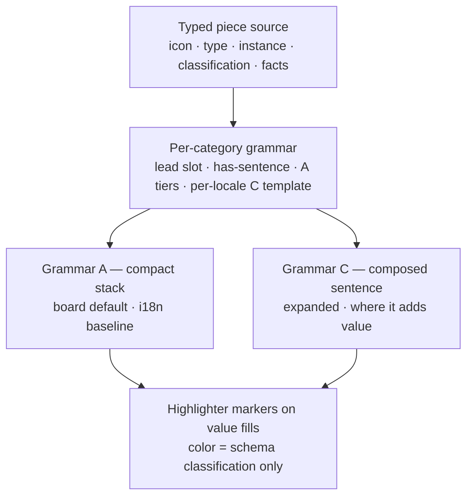
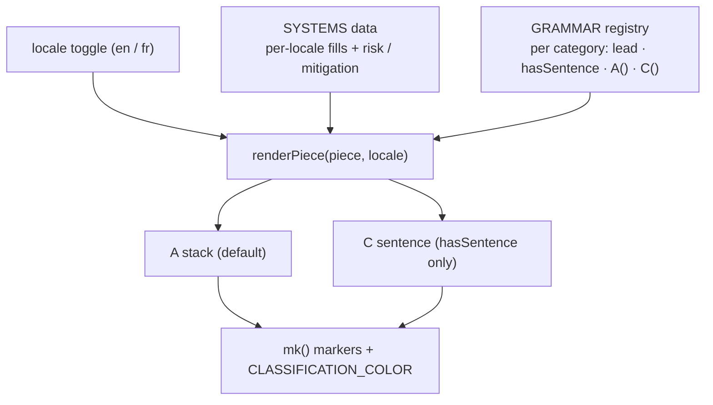

# Board Piece Composition Grammar - Plan

## Goal Capsule

- **Objective:** Replace the disclosure board's three uncohering value treatments (title / instance description / qualifier tags) with one generative composition model that renders every piece consistently, at two densities, and survives localization.
- **Product authority:** Jonathan Pichot.
- **Open blockers:** None. The one instance-schema question (risk's narrative/mitigation shape) is resolved in KD7; remaining schema and render work is additive.

---

## Product Contract

### Summary

Compose every board piece from one typed source (`icon`, `type`, `instance`, `classification`, `facts`) through a per-category grammar, and render that source at up to two densities: a compact stack (**A**, the board default) and, where it adds value, a composed sentence (**C**, expanded). Deployment-specific value fills render as highlighter **markers**; marker color is spent only on schema classifications. The model is the analog of the existing "The System" sentence — per-mode `verb` plus per-autonomy `template` — generalized to the whole board.

### Problem Frame

Today each information-bearing piece juxtaposes three visual treatments — a bold schema title, a grey instance description ("~2.3M people a day", "match / no-match"), and one or more look-alike tags ("Identifiable", "Decided About"). Seeing all three together reads as muddled, and three structural cracks explain why:

1. **Titles aren't one grammatical type.** Some are bare nouns ("Biometric"), some are clauses ("A decision about you"). A fixed `title — description — tag` slot can't read consistently across both.
2. **Tags aren't one axis.** `Identifiable` is a property of the *data*; `Decided About` is a *relationship* of people; retention/storage are *lifecycle* facts — all rendered as identical pills, so the eye can't tell one dimension from another.
3. **The icon already says the title.** The element icon encodes the type, so the schema title partly duplicates it while the genuinely-specific line is demoted to small grey text.

The fix is grammatical-type consistency across the taxonomy: give each slot a fixed role and let a grammar bind them, exactly as a sentence assigns subject/verb/object.

### Key Decisions

- KD1. **One generative model, two renderers.** A single typed source per piece; A and C are projections of it, never hand-authored per instance. *(session-settled: user-approved — chosen over separate ad-hoc treatments per seat: A and C are the same data at two densities, so author once.)*
- KD2. **Grammar seam is per-category, not per-element.** Each category (`accountable`/org, `data`, `people`, `risk`, plus the system sentence) declares which slot leads, whether a C projection exists, its A tier mapping, and its per-locale C template. *(session-settled: user-directed — chosen over per-element grammar: lighter to author, accepts that a category shares one sentence shape.)*
- KD3. **Marker for value fills; color only for schema classification.** One mark type (a highlighter swipe) wraps every deployment value; color is spent only on published classifications (PII, autonomy). The autonomy underline is retired so nothing competes. *(session-settled: user-directed — chosen over dots/tinted chips and over the prior scattered accent colors: keeps the DTPR palette recognizable without re-muddling.)*
- KD4. **Classification is a set-off label, never a fused adjective.** Drop the `acceptsAdj` prepend path. *(session-settled: user-approved — chosen over "identifiable biometric data" prose: the schema already stores PII as a full phrase and says color carries it, and the fused adjective is the single most i18n-hostile construct.)*
- KD5. **Risk is its own grammar.** AIAAIC harm type leads, the narrative is the descriptor, the mitigation is a distinct paired response, a missing mitigation is an alarm, and the seat is A-only. Label it "Mitigation", not "safeguard". *(session-settled: user-directed — chosen over instance-first + inline mitigation + a C sentence: the harm category is what a reader scans for, and the authored narrative makes a composed sentence add nothing.)*
- KD6. **A is the i18n baseline; C is per-locale templated; the renderer never inflects.** *(session-settled: user-directed — chosen over one shared template with swapped strings: concatenation can't handle French word order, agreement, or articles.)*
- KD7. **Risk stores two instance variables: required `risk`, optional `mitigation`.** The harm-type element keeps its generic definition and example mitigations as guidance; the deployment authors a required risk narrative and an optional mitigation, and an absent mitigation drives the alarm. *(session-settled: user-directed — chosen over the single combined required `mitigation` variable: a truthful absence-alarm needs mitigation split out and optional; costs a beta-schema migration of the combined field into `risk`.)*

### Requirements

**The piece model**

- R1. Every board piece is generated from one typed source with universal slots: `icon`, `type` (localized element noun phrase), `instance` (localized deployment referent), `classification` (the value on the category's primary axis, or none), and `facts` (localized qualifier list). No piece is hand-authored per instance.
- R2. Grammar is declared per category, not per element. A category declares which slot leads, whether a C projection exists, its A tier mapping, and its per-locale C template. Adding an element within a category needs data only; adding a category needs one grammar.
- R3. `classification` is null for categories without a primary axis; the renderer omits it cleanly (a processing step shows type + instance only).

**Grammar A — compact stack (default)**

- R4. A renders three role tiers: a headline (the category's lead slot), a descriptor line (`type · classification`), and a dim meta line (facts joined by `·`). A tier is absent when its slot is empty.
- R5. A is the default board rendering and the localization baseline: every tier is an independently-localized fragment joined by separators, with no grammar spanning fragments.
- R6. Data, people, and org lead with the specific (instance / name); risk leads with the type (harm category). The lead slot is a per-category declaration, not a global rule.

**Grammar C — composed sentence (expanded)**

- R7. C renders a piece as one clause only for categories that declare a C projection. A category may opt out (risk is A-only) when composition adds nothing over an authored narrative. In the prototype, C renders directly beneath A in a set-off block (lighter background, small "C" caption) for `hasSentence` categories; A-only pieces show no C block.
- R8. The instance sits in parentheses as a concrete example; the classification is set off by an em-dash; the facts trail as a clause joined via `Intl.ListFormat` for the locale ("and" / "et"). Em-dashes are not used around the parenthesized instance.
- R9. C is driven by a per-locale template string (word order, connectors, articles, joiners). The renderer orders pre-authored, pre-inflected fragments and performs no runtime inflection.

**Markers and color**

- R10. Every deployment-specific value fill renders as a highlighter marker; schema language (type nouns, connectors) is unmarked. In A, markers appear only where color is carried (the classification); in C, all fills are marked.
- R11. Marker color is spent only on schema classifications drawn from the published palette (PII, autonomy); ordinary fills are neutral grey. No dots, chips, tints, or other scattered accent color.
- R12. `classification` always renders as a set-off marker label, never a prepended, agreeing adjective.

**Risk grammar**

- R13. Risk is its own category grammar: the AIAAIC harm type (the element) leads, the required `risk` narrative is the descriptor, and the optional `mitigation` is a distinct paired response. These are two instance variables — required `risk`, optional `mitigation` — replacing today's single combined `mitigation` variable.
- R14. A missing `mitigation` renders as an alarm — the board's one earned warning; a present `mitigation` renders calm. The response is labelled "Mitigation" (localized), not "safeguard". The absent-mitigation alarm reads "No mitigation provided" / "Aucune atténuation" and carries the v5 alarm icon.
- R15. The risk seat is list-shaped: it renders zero or more harm-plus-mitigation pairs. When a system discloses no risks, the seat is omitted rather than showing an empty line.

**Internationalization**

- R16. All localizable content resolves per active locale: element titles, classification phrases, UI labels ("Mitigation" → "Atténuation"), instance fills, and fact clauses. Numbers, dates, and list conjunctions format via `Intl` with the locale (2.3M → 2,3 M; "and" → "et").
- R17. Fills and fact clauses are authored pre-agreed per locale; the renderer never performs grammatical agreement or inflection.

### Acceptance Examples

- AE1. Classification with no schema color. **Given** a people piece (relationship) or a risk piece (harm type), **when** rendered, **then** the classification is a neutral label, never a colored marker. **Covers R11, R12.**
- AE2. Piece with no classification. **Given** a processing step (no primary axis), **when** rendered in A, **then** only headline + type show — no descriptor classification and no color. **Covers R3, R4.**
- AE3. A-only category. **Given** risk (C opted out), **when** an expanded view is requested, **then** no C sentence is produced and the authored narrative stands. **Covers R7.**
- AE4. Mitigation presence. **Given** a risk with no mitigation, **when** rendered, **then** the response is an alarm; **given** a present mitigation, the response renders calm. **Covers R14.**
- AE5. French data piece. **Given** locale `fr`, **when** a data input renders in C, **then** it reads "Biométrie (votre visage) — données identifiables — conservées 24 h et sur le cloud d'un fournisseur": the classification is the set-off localized phrase (not a prepended adjective), fills are pre-inflected, the facts join via `Intl.ListFormat` ("et"), and no runtime agreement occurs. **Covers R9, R12, R16, R17.**

### Scope Boundaries

- The **rights** seat stays a separate action-list surface (email / form / phone / link affordances); it is not part of the composition grammar.
- The DTPR palette's low-contrast values (identifiable yellow on white, even as a marker) are not reworked here — the standard palette is kept as-is.

**Deferred to Follow-Up Work**

- **Productionizing into `@dtpr/ui`.** This plan builds the design in the canvas prototype only. Porting the grammar into the real piece renderers — new density components over `ElementDisplay` in `packages/ui/src/vue/`, the marker treatment restyling the existing `interpolateSegments()` highlight spans, the per-category grammar config, and wiring into `dtpr-ai/app/components/DatachainVisualizerRender.vue` plus the SSR twin `packages/ui/src/html/document.ts` — is a separate plan, taken up once the canvas design is settled.
- **Wider locale set (es / km / pt / tl).** The schema type-allows only en + fr today (`api/src/schema/locale.ts` is a two-value enum); the prototype validates en/fr. Additional locales follow when the schema adds them.
- **Instance migration** of existing `risks_mitigation` data (combined `mitigation` → the new required `risk`) lands with the `@dtpr/ui` / API work, not the prototype.

### Dependencies / Assumptions

- The composition needs schema-declared grammar metadata per element and category — a noun form, fact templates, per-category lead / has-sentence flags, and per-locale C templates — analogous to the already-proposed per-mode `verb` and per-autonomy `sentence_template`. Exact schema encoding is planning's job.
- Instance-level data (fills, fact values, the risk narrative, the mitigation) is assumed authored per locale in the datachain instance; the renderer consumes localized strings and never generates them.
- The marker/color language coexists with the schema's published classification palette (PII, autonomy). Categories without a primary axis carry no color.

### Outstanding Questions

**Deferred to the `@dtpr/ui` follow-up** (the prototype resolves each for design purposes; the production home is decided at port time)

- Whether the per-category grammar lives as `@dtpr/ui` config or schema fields — the prototype uses an in-page registry.
- The production C-surfacing interaction — the prototype shows A and C together for comparison.
- Migration of existing `risks_mitigation` instances into the new `risk` / `mitigation` fields.

### Sources / Research

- **AIAAIC harm taxonomy** — Abercrombie et al. (2024), *"A Collaborative, Human-Centred Taxonomy of AI, Algorithmic, and Automation Harms"*, arXiv:2407.01294 (CC BY-SA 4.0). Source of the `risks_mitigation` category's 9 harm types.
- **DTPR schema `ai@2026-05-06-beta`** (deployed): `risks_mitigation` is an octagon category with a single required `mitigation` variable and no per-instance context discriminator; `input_dataset` / `output_dataset` carry a `pii` context whose values are full localized noun phrases ("Identifiable data" / "Données identifiables") with the color, not the noun, carrying identifiability; `functional_modes` carries the autonomy values.
- **Prototype** — `prototypes/power-flow/canvas-affected-v5.html`: the current board, and the "The System" sentence system (per-mode `verb` + per-autonomy `sentence_template`) that seeded this model.
- **Real render pipeline (validated, for the deferred port)** — `packages/ui` (`@dtpr/ui`): `core/element-display.ts` (`deriveElementDisplay` → `ElementDisplay` with `title`/`icon`, `variables[]`, `contextValue`), `core/interpolate.ts` (`interpolateSegments()` — the marker primitive), `core/locale.ts` (`extract()` fallback chain), `vue/DtprElementDetail.vue` (segment highlight spans + `Intl` number/date), `html/document.ts` (SSR twin). Consumed by `dtpr-ai/app` via `DatachainVisualizerRender.vue`. An element's localized `description` with `{{variable}}` slots already functions as the per-locale C template.

---

## Planning Contract

**Product Contract preservation:** unchanged — no R-IDs modified. This plan targets the canvas prototype as a design-validation surface; productionizing into `@dtpr/ui` is deferred follow-up work (see Scope Boundaries).

**Target:** `prototypes/power-flow/canvas-affected-v6.html`, forked from `canvas-affected-v5.html`. Self-contained HTML/CSS/JS; element icons load live from `api.dtpr.io`; four example systems hardcoded, re-authored to the new taxonomy. Not wired into `@dtpr/ui`.

### Key Technical Decisions

- KTD1. **Build in the canvas prototype; defer `@dtpr/ui`.** A new `canvas-affected-v6.html`; the real pipeline is a later plan once the design is settled. *(session-settled: user-directed — chosen over evolving `@dtpr/ui` now: taxonomy → canvas design → productionize is the intended sequence.)*
- KTD2. **Per-category grammar as an in-page registry**, mirroring v5's `TEMPLATES` / `VERBS`: a `GRAMMAR` object keyed by category, each entry declaring `lead`, `hasSentence`, an `A(piece)` tier function, and a `C(piece, locale)` template function. Adding a category is one registry entry.
- KTD3. **Markers and color as shared primitives.** A `mk(text, key)` helper wraps a fill in a highlighter span; `key` selects a color from a `CLASSIFICATION_COLOR` map or falls back to neutral grey. Classification renders *through* `mk` as a set-off label, never fused (R12). The map carries all six schema classification values (from v5's `CTX`): `identifiable #FFD700`, `de_identified #4A90D9`, `pseudonymous #9575CD`, `autonomous #E76F51`, `human_decides #2A9D8F`, `human_executes #6A1B7A`. The three autonomy values keep their distinct schema colors; the set-off label disambiguates regardless.
- KTD4. **Locale is an in-page toggle, not a framework.** A `locale` state ('en' | 'fr') drives per-locale data selection and `Intl.ListFormat` / `Intl.NumberFormat` with the active locale. The prototype hardcodes en/fr strings; the production `extract()` / `@nuxtjs/i18n` chain is out of scope.
- KTD5. **Risk consumes the split fields.** Each risk piece carries `harm` (AIAAIC type), `risk` (required narrative), and optional `mitigation`; the grammar is A-only, harm-type-led, with the paired-response / alarm treatment driven by `mitigation` presence.

**Port fidelity (validated in research):** v6's slots mirror what `@dtpr/ui` already exposes, so the later port is mechanical — `type` ↔ element `title` + icon, `classification` ↔ `contextValue` (PII/autonomy tag carrying `color`), fills/`facts` ↔ element `variables`, and C's per-locale template ↔ the element `description` with `{{variable}}` slots rendered by `interpolateSegments()`. The prototype exists to settle the *design* of these before the port.

### High-Level Technical Design

### Assumptions

- The four example systems are re-authored to the new taxonomy (risk split, autonomy / PII contexts) in both en and fr; French fills are authored pre-agreed — no runtime inflection (R17).
- Icons keep loading from `api.dtpr.io` (deployed `ai@2026-05-06-beta` icons; the people/affected icon composed in-page as in v5).
- Both A and C render on the board for design comparison; a per-piece density presentation is the prototype's resolution of the C-surfacing question (production surfacing stays deferred).

### Sequencing

`U1 → U2 → U3 → U4 → U5 → U6`. U2 (markers/color) is shared by U3 (A) and U4 (C). U5 (risk) depends on U1–U3. U6 (locale) touches every renderer and the data.

---

## Implementation Units

### U1. Scaffold v6 and the piece model + grammar registry

- **Goal:** Fork v5 → v6 and replace per-seat ad-hoc rendering with a model-driven pipeline: a typed piece source (the universal slots) and a `GRAMMAR` registry keyed by category. Prove the skeleton by rendering one category (data) end-to-end from the registry.
- **Requirements:** R1, R2.
- **Dependencies:** none.
- **Files:** `prototypes/power-flow/canvas-affected-v6.html` (new, forked from `canvas-affected-v5.html`).
- **Approach:** Add `pieceFromSystem()` adapters that map existing per-seat data into `{ cat, icon, type, instance, classification, facts }`. Define `GRAMMAR = { data: { lead, hasSentence, A, C }, ... }` and `renderPiece(piece, locale)` dispatching on `piece.cat`. Keep v5's board shell and CSS; swap only the seat-body rendering. Other seats may fall back to v5 markup until their grammar lands in later units.
- **Patterns to follow:** v5's `TEMPLATES` / `VERBS` + `sentence()`; reuse `ic()`, `peopleIc()`, and the `board()` scaffold.
- **Test expectation:** none — standalone design-exploration prototype with no test runner; verified visually in-browser.
- **Verification:** v6 opens with no console errors; the data-flow seat renders via `GRAMMAR.data`, not hardcoded markup.

### U2. Marker and color primitives

- **Goal:** Shared `mk(text, key)` highlighter helper, a `CLASSIFICATION_COLOR` palette map, and CSS. Classification renders as a set-off marker; plain fills are neutral grey; color comes only from the palette.
- **Requirements:** R10, R11, R12.
- **Dependencies:** U1.
- **Files:** `prototypes/power-flow/canvas-affected-v6.html`.
- **Approach:** `mk` wraps text in a span with a linear-gradient highlighter background; `key` ∈ PII/autonomy values → palette color, else neutral. `CLASSIFICATION_COLOR = { identifiable, de_identified, pseudonymous, autonomous, human_decides, human_executes }` (concrete values in KTD3). `clsMarker(classification)` colors when a palette key exists, neutral otherwise. Also retire v5's autonomy underline in `sentence()` and render the autonomy phrase through `clsMarker`, bringing the system sentence into the color system (KD3).
- **Patterns to follow:** v5's `CTX` color map; v5's `sentence()` (the autonomy `border-bottom` this replaces); the marker CSS from the brainstorm sketches.
- **Test expectation:** none — prototype; verified visually.
- **Verification:** identifiable → yellow marker, de-identified → blue, relationship/harm → neutral; plain fills grey; no bordered chips, dots, or tints remain; the system sentence's autonomy phrase renders as a colored marker, not a `border-bottom` underline.

### U3. A-stack renderer (default density)

- **Goal:** `A(piece)` per category → the three-tier stack (headline = lead slot, descriptor = `type · classification`, meta = facts). Marker only on the classification in A; absent tiers dropped.
- **Requirements:** R3, R4, R5, R6.
- **Dependencies:** U1, U2.
- **Files:** `prototypes/power-flow/canvas-affected-v6.html`.
- **Approach:** `A.data` / `A.people` / `A.org` return `{ l1, l2, l3 }`; `l2` runs the classification through `clsMarker`; lead slot is per-category (data/people/org lead with instance/name; risk's lead is handled in U5).
- **Patterns to follow:** the A-stack from the brainstorm sketches.
- **Test expectation:** none — prototype; verified visually.
- **Verification:** each seat renders instance-led; a processing piece (no classification) shows headline + type only (AE2); org leads with its name.

### U4. C-sentence renderer (per-category, per-locale templates)

- **Goal:** `C(piece, locale)` for `hasSentence` categories → one clause; instance in parentheses; facts trailing as a single comma clause; markers on all fills; no em-dash separators; A-only categories skip C.
- **Requirements:** R7, R8, R9.
- **Dependencies:** U1, U2.
- **Files:** `prototypes/power-flow/canvas-affected-v6.html`.
- **Approach:** `C.data` / `C.people` / `C.org` author per-locale templates that order pre-inflected fragments; classification set off by an em-dash via `clsMarker`; `Intl.ListFormat(locale)` joins fact clauses. Render C directly beneath A in a set-off block per piece, for `hasSentence` categories only (R7).
- **Patterns to follow:** the generative C renderer from the brainstorm sketches.
- **Test expectation:** none — prototype; verified visually.
- **Verification:** data C reads "Biometric (your face) — identifiable — kept for 24 h and on a vendor cloud" (en); risk produces no C (AE3).

### U5. Risk grammar (harm-type-led, paired mitigation, alarm, A-only)

- **Goal:** The risk category grammar: harm type leads, the required `risk` narrative is the descriptor, the optional `mitigation` is a distinct paired response, a missing mitigation is an alarm, labelled "Mitigation"; A-only; renders a list of pairs.
- **Requirements:** R13, R14, R15.
- **Dependencies:** U1, U2, U3.
- **Files:** `prototypes/power-flow/canvas-affected-v6.html`.
- **Approach:** risk pieces carry `{ harm, risk, mitigation? }`; `A.risk` → `l1` = harm type, `l2` = risk narrative, response = mitigation (calm) or the alarm block when absent. `hasSentence: false`. Render zero or more pairs.
- **Patterns to follow:** the risk sketch (screen 009); v5's `.alarm` treatment for the missing-mitigation warning.
- **Test expectation:** none — prototype; verified visually.
- **Verification:** a mitigated risk shows the calm "Mitigation …" response; an unmitigated one shows the alarm (AE4); harm type leads; octagon icon renders.

### U6. EN/FR toggle, localized data, and Intl formatting

- **Goal:** A locale toggle; the four systems re-authored with en/fr titles, fills, C templates, and risk/mitigation; `Intl.ListFormat` / `Intl.NumberFormat` with the active locale; re-render on toggle.
- **Requirements:** R16, R17.
- **Dependencies:** U1, U2, U3, U4, U5.
- **Files:** `prototypes/power-flow/canvas-affected-v6.html`.
- **Approach:** a `locale` state + switcher (reuse v5's chip styling); `SYSTEMS` data holds per-locale strings; renderers pull the active-locale fragment; numbers and lists format via `Intl` with the locale. No runtime inflection — French fills are authored pre-agreed.
- **Patterns to follow:** the EN/FR sketch (screen 010); v5 chip styling for the switcher.
- **Test expectation:** none — prototype; verified visually.
- **Verification:** toggling to fr re-renders; the French data C matches AE5 ("Biométrie (votre visage) — données identifiables — conservées 24 h et sur le cloud d'un fournisseur"); the risk response label reads "Atténuation".

---

## Verification Contract

No test runner exists for the standalone prototype; verification is visual/behavioral, run in-browser.

| Gate | How | Covers |
|---|---|---|
| Renders clean | Open `canvas-affected-v6.html`; all four systems render with no console errors | all units |
| Marker/color policy | identifiable = yellow, de-identified = blue, relationship/harm = neutral, plain fills = grey; no dots/chips/tints | R10–R12, AE1 |
| Autonomy in system sentence | the autonomy phrase renders as a colored marker, not a `border-bottom` underline | R11, KD3 |
| A degrades cleanly | The processing piece shows headline + type only | R3, R4, AE2 |
| Risk A-only + alarm | Risk shows no C sentence; missing mitigation → alarm, present → calm | R7, R13–R15, AE3, AE4 |
| EN/FR composition | Toggle re-renders; French data C matches AE5; labels localize ("Mitigation" → "Atténuation") | R9, R16, R17, AE5 |

---

## Definition of Done

- v6 renders all four example systems in A by default, with C shown for `hasSentence` categories, driven by the `GRAMMAR` registry — no data/people/org/risk seat retains hardcoded per-instance markup (rights, purpose, and the system sentence keep v5 rendering per Scope Boundaries).
- The marker/color policy holds (AE1); A degrades for no-classification pieces (AE2); risk is A-only with the earned alarm (AE3, AE4).
- The EN/FR toggle produces correct localized composition (AE5) with no runtime inflection.
- `canvas-affected-v5.html` is left intact; v6 is the new file.
- The rendered design is legible enough to make the `@dtpr/ui` port decisions that are this plan's downstream step.
