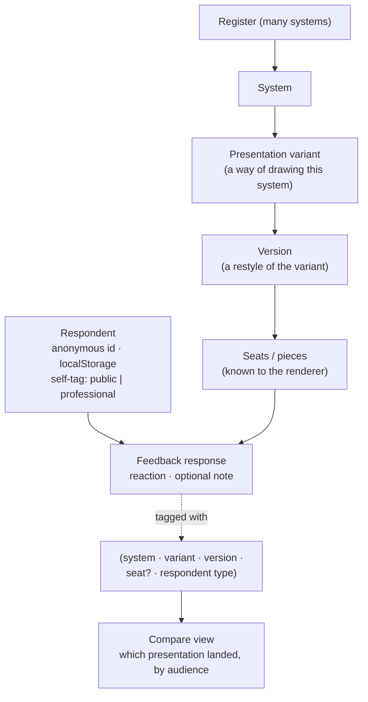
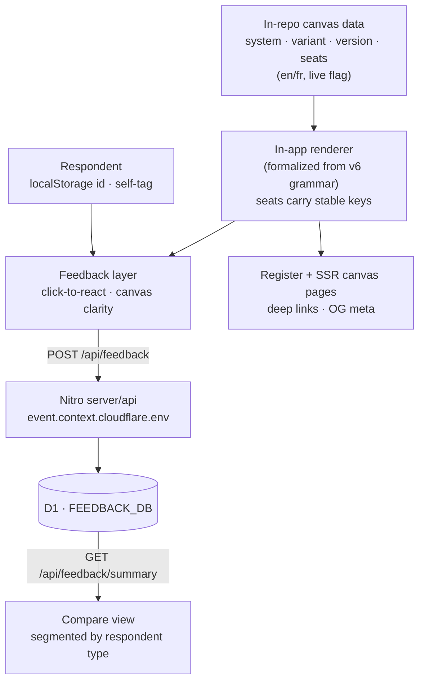
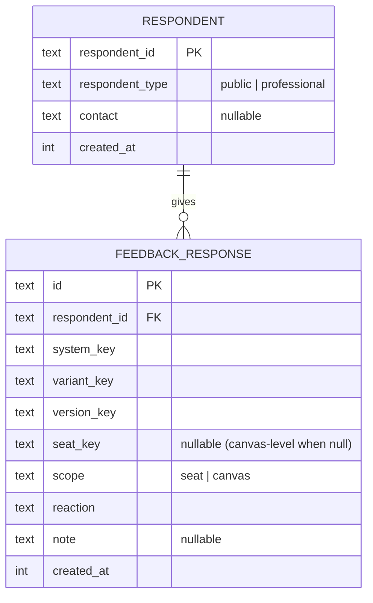

# DTPR Canvas Register & Feedback - Plan

## Goal Capsule

- **Objective:** Ship a DTPR AI register — a browsable, shareable collection of AI-system canvases — with a low-friction feedback layer that tells the team which *presentation* of a system actually lands, so the canvas can be iterated fast as feedback arrives.
- **Product authority:** Jonathan Pichot.
- **Open blockers:** None. The canvas renderer is formalized from the existing v6 prototype; all v1 work is additive and does not depend on the deferred `@dtpr/ui` port.

---

## Product Contract

### Summary

A web app whose whole purpose is showing DTPR canvases and collecting interactive feedback on them. Canvases are drawn by an in-app renderer formalized from the v6 prototype (its typed pieces + per-category grammar), kept intentionally fluid so the team can restyle often. v1 ships a browsable register, always-available click-to-react feedback (anonymous, `localStorage`-persisted identity), and a compare view that reads audience-segmented feedback tagged to `(system, presentation variant, version, respondent type)` to answer "which presentation landed best."

### Problem Frame

The team is actively reworking how DTPR discloses AI systems — the v6 canvas (`prototypes/power-flow/canvas-affected-v6.html`) is one of many presentation experiments, and the design and structure will keep changing. Today those experiments live as one-off standalone HTML files with no way to put them in front of people and learn whether they land. Sharing to LinkedIn, social, and the newsletter produces reactions the team never captures in a usable, comparable form, and there is no way to tell whether a change made a presentation clearer or just different. Self-reported "looks good" from peers also doesn't answer the mission question — whether a non-expert actually understands what a system does to them. The cost is iterating the canvas partly blind: shipping presentation changes without evidence about which ones improved comprehension, for which audience.

### Key Decisions

- KD1. **Feedback is the primary job; presentation is co-important but secondary.** The app is a feedback instrument first, and must still be beautiful and showcase-quality. *(session-settled: user-directed — chosen over a public-gallery-primary, a team-only iteration cockpit, or a fully two-sided framing: the point is learning which presentations land.)*
- KD2. **Structured-enough, in-app renderer — not a `@dtpr/ui` port.** Canvases are rendered from structured data by an in-app renderer formalized from v6's typed-piece + per-category-grammar model, so the app knows each canvas's seats. The production `@dtpr/ui` port stays deferred. *(session-settled: user-directed — chosen over free-form HTML embeds, a hybrid feedback-anchor contract, and pulling the `@dtpr/ui` port forward: per-seat feedback needs structure, but the canvas form is still moving and must stay a fast in-app prototype.)*
- KD3. **Presentation variant is first-class.** A system can be shown in one or more presentation variants, each evolving through versions; feedback is tagged to `(system, variant, version, respondent type)` so the app can compare which presentation landed. *(session-settled: user-directed — chosen over one-presentation-at-a-time and occasional-compare: directly serves the protected metric.)*
- KD4. **Both audiences, never blurred.** Feedback is segmented by respondent type (member of the public vs practitioner/peer) everywhere it is shown. *(session-settled: user-directed — chosen over peer-only or public-only: lay-clarity and peer-credibility signals answer different questions.)*
- KD5. **Anonymous, `localStorage`-persisted identity — no accounts.** A client-generated respondent id persists locally so return visits aggregate and the self-tag isn't re-asked; contact info is optional; PII is minimal and respondent-controlled. *(session-settled: user-directed — chosen over accountless-with-no-persistence and a peer-sign-in two-track: low barrier and privacy-by-default, on-brand for DTPR.)*
- KD6. **v1 = thin UI + complete data model + compare view; guided tour deferred.** Ship the register, ambient click-to-react, and the compare view now, with the full `(system + variant + version + respondent)` tag baked in; the guided walkthrough tour lands in iteration 2. *(session-settled: user-directed — chosen over a thinner slice without variant tagging and a full MVP that also includes the tour: the tag is cheap now and expensive to retrofit, and the compare view is where decision-grade insight lives.)*

### Actors

- A1. **Member of the public** — a non-expert / commuter, the audience DTPR ultimately serves. Judges raw clarity ("do I understand what this does to me?").
- A2. **Practitioner / peer** — policy, privacy, or design people reached via LinkedIn and the newsletter. Judge whether the approach is credible, novel, and useful.
- A3. **DTPR team** — publishes canvases and variants, reads the compare view, and decides how to present DTPR.

### Requirements

**Register and canvas rendering**

- R1. The app presents a browsable register of AI-system canvases; each entry is one system, rendered as a canvas.
- R2. Canvases are drawn by an in-app renderer formalized from the v6 prototype's typed-piece model (`icon`, `type`, `instance`, `classification`, `facts`) and per-category grammar, structured enough that the app knows each canvas's seats/pieces. This renderer is the app's own, not the production `@dtpr/ui`.
- R3. Restyling a canvas is cheap and expected to happen often; a restyle must never invalidate or orphan previously collected feedback.

**Presentation variants and versioning**

- R4. Presentation variant is first-class: a system can be shown in one or more variants, and a variant evolves through versions as it is restyled.
- R5. Every notable restyle registers as a new variant and/or version, so feedback stays attached to the look it was given on and remains comparable across looks.
- R6. Compare view (v1): for a system, the app shows its variants/versions with their feedback, segmented by respondent type, answering "which presentation landed best" and where confusion clusters.

**Feedback capture**

- R7. Ambient click-to-react is always available on any canvas: a user selects any piece (seat) and leaves a quick reaction (e.g. clear / confusing / unsure) plus an optional short note.
- R8. Canvas-level feedback is also available (overall clarity + optional note), independent of any specific seat.
- R9. Each response is recorded against `(system, presentation variant, version, seat where applicable, respondent type, timestamp)`.
- R10. Giving feedback is low-ceremony: a user can drop as many or as few reactions as they like and leave at any point; nothing forces completion.

**Respondent identity and privacy**

- R11. No accounts and no login. A respondent is anonymous, identified by a client-generated id persisted in `localStorage` so return visits aggregate and the self-tag is not re-asked.
- R12. On first feedback, the respondent self-tags as public vs professional/practitioner (a coarse role); this segments all their feedback, and public vs peer reactions are never merged in any view.
- R13. A respondent may optionally leave contact info (name / email); it is never required to give feedback.
- R14. PII is minimal and respondent-controlled; nothing identifying is required to participate.

**Sharing (outbound)**

- R15. Every canvas — and a specific variant/version — is shareable via a stable deep link suited to LinkedIn, the newsletter, and social, landing directly on that canvas with feedback available.

**Sampling for decision-grade insight**

- R16. To keep per-variant samples large enough to compare, v1 concentrates exposure to a small number of live variants at a time rather than splitting responses across many.

### Key Flows

- F1. **Ambient react**
  - **Trigger:** A1 or A2 opens a shared canvas.
  - **Steps:** First-time respondent self-tags public/professional (once) and gets a persistent anonymous id; selects a piece; picks a reaction + optional note; may also leave a canvas-level clarity rating; repeats freely; leaves whenever.
  - **Outcome:** Responses stored per R9, aggregating under the respondent's `localStorage` id.
  - **Covers:** R7, R8, R9, R10, R11, R12.
- F2. **Compare**
  - **Trigger:** A3 opens a system in the compare view.
  - **Steps:** Sees the system's variants/versions side by side with aggregated feedback, segmented by respondent type; reads which presentation landed and where confusion clusters.
  - **Outcome:** A presentation decision grounded in audience-segmented evidence.
  - **Covers:** R4, R5, R6, R9, R12.
- F3. **Share (outbound)**
  - **Trigger:** A3 shares a canvas/variant deep link to LinkedIn or the newsletter.
  - **Steps:** Recipient lands on that exact canvas with feedback available; participates via F1.
  - **Outcome:** Inbound feedback flows from outbound distribution.
  - **Covers:** R15.

### Acceptance Examples

- AE1. First-time vs returning respondent. **Given** a respondent with no `localStorage` id, **when** they give feedback, **then** they self-tag once and a persistent anonymous id is created; **given** a returning respondent, **then** the tag is not re-asked and new feedback aggregates under the same id. **Covers R11, R12.**
- AE2. Restyle preserves comparability. **Given** a canvas restyled after feedback exists, **when** the restyle is published as a new version/variant, **then** prior feedback stays attached to the old version and both remain visible in compare. **Covers R3, R5, R6.**
- AE3. Segmentation never blurs. **Given** feedback from both public and peers on a variant, **when** it is viewed in compare, **then** public and peer reactions are shown distinctly and never merged into a single number. **Covers R9, R12.**
- AE4. Per-piece vs canvas-level. **Given** a user reacts to a specific seat, **then** the response records that seat; **given** a canvas-level clarity rating, **then** it records at canvas scope with no seat. **Covers R7, R8, R9.**

### Success Criteria

- Primary — **decision-grade insight:** for any presentation change, the compare view lets the team say "this version landed better" or "this exact seat confuses people," segmented by audience, with enough responses per live variant to act on.
- Secondary — **reach and volume:** a steady flow of responses from LinkedIn and the newsletter; the register becomes a public artifact people share and revisit.
- Secondary — **comprehension proof:** evidence of whether the public understands DTPR disclosures, usable in talks, papers, funding, and standards work (data export itself is deferred).

### Scope Boundaries

**Deferred for later**

- Guided walkthrough tour (seat-by-seat, one question at a time) — iteration 2, reading data v1 already collects.
- Comprehension-first checks (hide the labels, ask what the user thinks, then reveal the gap) — a future layer inside the guided tour.
- External register import (e.g. `clarable.ai/register`) as a data source for canvases.
- In-app canvas authoring — canvas/system content is authored or seeded outside the app for v1.
- Porting the canvas into production `@dtpr/ui` — the canvas stays a fast-moving in-app prototype until its form settles.
- Open / exportable feedback dataset — a future payoff for the comprehension-proof goal.

**Outside this product's identity**

- Not an account-based community or annotation platform; anonymity and low friction are the identity.
- Not a general-purpose survey tool; the questions are DTPR-canvas-specific.

### Dependencies / Assumptions

- The in-app renderer is formalized from `prototypes/power-flow/canvas-affected-v6.html` (typed pieces + per-category `GRAMMAR`, EN/FR content, hover tooltips). That prototype is the design source, and its final form is still moving.
- Canvas/system content behind each canvas is authored or seeded by the team for v1 (as the four v6 systems are today), not imported.
- Canvases may carry v6's EN/FR localization; whether the feedback UI reaches EN/FR parity is open (see Outstanding Questions).
- Stack and hosting are planning's call; the repo's Nuxt + Cloudflare conventions and the `pichot-quickstart` defaults are the likely home. This is not a product requirement.

### Outstanding Questions

**Deferred to planning**

- Feedback storage/backend, and how anonymous ids and segmentation persist beyond `localStorage` (server-side aggregation, deduplication across devices).
- The reaction vocabulary (clear / confusing / unsure vs something richer) and whether per-seat questions are auto-generated from the grammar or lightly curated per system.
- How "concentrate exposure to a few live variants" (R16) is operationalized — a manual live/paused toggle vs routing respondents to under-sampled variants.
- Compare-view aggregation: what statistics and threshold constitute "landed better," and how thin-sample variants are flagged as not-yet-decidable.
- Feedback-UI localization (EN/FR parity with the canvases).

### Sources / Research

- `prototypes/power-flow/canvas-affected-v6.html` — the canvas prototype this app formalizes; source of the typed-piece + per-category-grammar renderer, EN/FR content, and hover tooltips.
- `docs/plans/2026-07-20-002-feat-piece-composition-grammar-plan.md` — the v6 composition-grammar plan; its deferred `@dtpr/ui` port is explicitly *not* pulled forward here.
- `packages/ui` (`@dtpr/ui`) — the eventual production renderer home (deferred).
- `clarable.ai/register` — example of an external AI register; a future import target (user-provided).

---

## Planning Contract

**Product Contract preservation:** unchanged — no R/A/F/AE IDs modified. This plan enriches the requirements-only contract above with the HOW; all product scope is carried forward as-is.

**Target directory:** the app is a new root-level workspace at `canvas/`. All paths below are repo-relative.

### Key Technical Decisions

- KTD1. **New root-level Nuxt 4 workspace at `canvas/`, deployed to Cloudflare.** Production Nitro preset `cloudflare-module` under a `$production` block, deployed via Cloudflare Workers Builds git integration (no CI job), mirroring `dtpr-ai/` and `docs-site/`. Registered in `pnpm-workspace.yaml` with root `dev:canvas` / `build:canvas` / `deploy:canvas` scripts. *(grounded in `dtpr-ai/nuxt.config.ts`, `docs-site/wrangler.toml`.)*
- KTD2. **Feedback persists in Cloudflare D1 (SQLite), binding `FEEDBACK_DB`.** This establishes the repo's first app-data D1 schema and wrangler D1 migrations — no existing pattern to mirror (Cloudflare R2 backs API content; `@nuxt/content` claims the `DB` binding, hence the distinct name). *(session-settled: user-approved — chosen over KV / Nitro storage: the compare view needs relational aggregation and respondent segmentation.)*
- KTD3. **Canvas content lives as versioned in-repo typed data modules**, team-authored, not a DB-backed CMS and not in-app authoring. Each canvas is keyed by `(system, variant, version)`; a restyle is a new variant/version committed to the repo, and D1 feedback references those stable keys. *(session-settled: user-approved — chosen over DB-backed content: restyle = commit keeps prior feedback comparable.)* Realizes R3, R4, R5.
- KTD4. **The canvas renderer is an in-app Vue module formalized from v6's typed-piece + per-category grammar** (`prototypes/power-flow/canvas-affected-v6.html`), not `@dtpr/ui`. Each seat renders with a stable seat key so feedback anchors per-piece. *(session-settled: user-directed — chosen over consuming `@dtpr/ui`: the canvas form is still moving and must stay a fast in-app prototype.)* Inherits Product Contract KD2.
- KTD5. **Anonymous respondent identity via `localStorage`** — a client-generated `respondent_id` plus a one-time self-tag (`public` | `professional`) and optional contact; the server stores id, type, and optional contact on first submit. No accounts. *(session-settled: user-directed.)* Inherits KD5.
- KTD6. **Feedback flows through Nitro `server/api` handlers** reaching `FEEDBACK_DB` via `event.context.cloudflare.env`, mirroring `app/server/api/subscribe.post.ts`: `POST /api/feedback` (validate + persist) and `GET /api/feedback/summary` (aggregate for compare). *(grounded.)*
- KTD7. **A `live` flag on variants concentrates exposure** — the register surfaces only live variants; the compare view sees all. Realizes R16.
- KTD8. **Canvas pages are SSR with share meta** (Open Graph / Twitter tags via `useHead`) so deep links render previews on LinkedIn, the newsletter, and social. Realizes R15.

### High-Level Technical Design

Content authored in-repo flows through the renderer to the feedback UI; responses land in D1 and feed the compare view. The respondent's anonymous identity is client-side (`localStorage`) and travels with each submission.

The D1 store is two tables — a respondent and a response row keyed to the canvas coordinates; canvas content itself is not in D1 (it lives in the repo).

### Assumptions

- The v6 renderer logic is portable to Vue with equivalent output; U3 characterizes v6's A-stack + marker output before restyling.
- Canvas content is seeded from the four v6 systems; broader content and external register import are out of scope (Product Contract).
- Feedback-UI localization (EN/FR parity with canvases) is desirable but its scope is an open question, not a v1 gate.
- Cloudflare `account_id` and a custom domain follow the `dtpr-ai`/`docs-site` setup; exact domain is a deploy-time detail.

### Sequencing

`U1 → U2 → U3`, with `U4` and `U5` runnable in parallel after `U1`. `U6` depends on `U3 + U4 + U5`; `U7` on `U3 + U2` (and `U6` for on-canvas feedback); `U8` on `U2 + U3 + U4` (it reads the summary and renders variant/version columns via the renderer over canvas data). The renderer (U3) and the feedback store (U4) are the two load-bearing seams.

---

## Implementation Units

### U1. Scaffold the `canvas/` app (Nuxt 4 · Cloudflare · Tailwind · i18n)

- **Goal:** A greenfield workspace app that boots in dev and builds for Cloudflare, wired into the monorepo.
- **Requirements:** foundation for R1–R16.
- **Dependencies:** none.
- **Files:** `canvas/package.json`, `canvas/nuxt.config.ts`, `canvas/wrangler.jsonc`, `canvas/app/app.vue`, `canvas/i18n.config.ts`, `canvas/locales/en.json`, `canvas/locales/fr.json`, `pnpm-workspace.yaml` (modify), `package.json` (modify — root scripts).
- **Approach:** Mirror `dtpr-ai/nuxt.config.ts` — `$production.nitro.preset: 'cloudflare-module'`, a `compatibilityDate`, and `NODE_OPTIONS=--max-old-space-size=4096 nuxt build`. `wrangler.jsonc` modeled on `dtpr-ai/wrangler.jsonc`: `main: ".output/server/index.mjs"`, `compatibility_flags: ["nodejs_compat"]`, `[assets].directory`, a custom-domain route, and the `FEEDBACK_DB` D1 binding (distinct from `DB`). `@nuxtjs/i18n` with en/fr; Tailwind (or `@nuxt/ui`). Add `'canvas'` to `pnpm-workspace.yaml` and root `dev:canvas` / `build:canvas` / `deploy:canvas` scripts delegating via `pnpm --filter ./canvas`.
- **Patterns to follow:** `dtpr-ai/nuxt.config.ts`, `dtpr-ai/wrangler.jsonc`, `docs-site/wrangler.toml`, root `package.json` script naming.
- **Test expectation:** none — scaffolding; verified by dev-boot and build smoke.
- **Verification:** `pnpm dev:canvas` serves a page with no errors; `pnpm build:canvas` emits `.output` and the app is discoverable via the workspace.

### U2. Canvas data model + seed the four v6 systems

- **Goal:** A typed canvas data shape and the four v6 systems ported into it as versioned, bilingual seed data.
- **Requirements:** R1, R2, R4, R5.
- **Dependencies:** U1.
- **Files:** `canvas/app/canvas-data/types.ts`, `canvas/app/canvas-data/systems/*.ts`, `canvas/app/canvas-data/index.ts`.
- **Approach:** Lift v6's `SYSTEMS` / `PII` / `REL` data into typed modules. Each canvas is identified by `(system_key, variant_key, version_key)` with a `live` flag on the variant; every seat carries a stable key (e.g. `run-by`, `built-by`, `data-input`, `processing`, `data-output`, `risk-<n>`, `used-on`). Pieces keep the v6 slot shape `{ icon, type, instance, classification, facts }`, bilingual `{ en, fr }`.
- **Patterns to follow:** `prototypes/power-flow/canvas-affected-v6.html` (`SYSTEMS`, `PII`, `REL`, `GRAMMAR`).
- **Test scenarios:** the registry exposes all four systems, each with ≥1 live variant; every canvas has unique `(system, variant, version)` keys; every seat has a non-empty stable key; en and fr are present for localized slots.
- **Verification:** registry lists four systems; typecheck passes.

### U3. In-app canvas renderer (formalized from v6)

- **Goal:** Vue components that render a canvas from the data model via the per-category grammar, each seat tagged with its stable key.
- **Requirements:** R2, R3.
- **Dependencies:** U1, U2.
- **Files:** `canvas/app/components/canvas/CanvasBoard.vue`, `canvas/app/components/canvas/PieceStack.vue`, `canvas/app/components/canvas/Marker.vue`, `canvas/app/canvas-data/grammar.ts`, `canvas/app/components/canvas/canvas.css`.
- **Approach:** Port v6's `renderPiece` / `GRAMMAR` / `mk` / `clsMarker` into a `grammar.ts` module plus Vue components. Render each seat wrapper with `data-seat="<key>"` for feedback anchoring. Keep v6's A-stack + marker CSS and the hover tooltip. This renderer is expected to change often — keep it self-contained.
- **Execution note:** This ports working v6 logic — characterize v6's A-stack + marker output and match it before any restyle.
- **Patterns to follow:** v6 `GRAMMAR`, `renderPiece`, `mk`, `clsMarker`, `board()`.
- **Test scenarios:** grammar `A()` for data/people/org/risk returns the expected tiers (headline / `type · classification` / facts); `mk` colors identifiable = yellow, de-identified = blue, autonomy values by palette; relationship and harm classifications render neutral (no color); a processing piece with no classification degrades to headline + type. **Enforces the R11/R12 marker/color policy** (respondent-identity AE1 is owned by U5).
- **Verification:** a seeded canvas renders with the v6 marker/color policy intact; seats expose `data-seat` keys.

### U4. Feedback store + API (D1)

- **Goal:** The D1 schema and the two feedback endpoints — persist a response, and aggregate segmented feedback for a system.
- **Requirements:** R9; feeds R6.
- **Dependencies:** U1.
- **Files:** `canvas/server/api/feedback.post.ts`, `canvas/server/api/feedback/summary.get.ts`, `canvas/server/utils/db.ts`, `canvas/migrations/0001_init.sql`.
- **Approach:** Two D1 tables per the ER sketch (`respondent`, `feedback_response`), with an index on `(system_key, variant_key, version_key)`. `POST /api/feedback` validates `{ system, variant, version, seat?, scope, reaction, note?, respondent{ id, type, contact? } }`, upserts the respondent, inserts the response. `GET /api/feedback/summary?system=` returns counts grouped by `(variant, version, seat, reaction, respondent_type)`. Bindings reached via `event.context.cloudflare.env.FEEDBACK_DB`.
- **Patterns to follow:** `app/server/api/subscribe.post.ts` (validate-then-act on a POST body); wrangler D1 migrations.
- **Test scenarios:** a valid payload persists a row; a missing required field returns 400; `scope: 'seat'` records the seat key and `scope: 'canvas'` records none (**Covers AE4**); the summary returns public and professional counts as separate buckets, never merged (**Covers AE3**); an unknown `reaction` is rejected.
- **Verification:** against local D1 (`wrangler dev` / miniflare), a post writes a row and the summary returns segmented counts.

### U5. Anonymous respondent identity + self-tag (localStorage)

- **Goal:** A client identity utility with a one-time self-tag and optional contact, attached to every submission.
- **Requirements:** R11, R12, R13, R14.
- **Dependencies:** U1.
- **Files:** `canvas/app/composables/useRespondent.ts`, `canvas/app/components/feedback/SelfTag.vue`, `canvas/test/respondent.test.ts`.
- **Approach:** Generate a `respondent_id` (`crypto.randomUUID`) persisted in `localStorage`; store `respondent_type` after the one-time self-tag; keep contact optional. Expose the respondent for submissions; never require contact to participate.
- **Patterns to follow:** `dtpr-ai/test/setup.ts` (in-memory `localStorage` shim), `dtpr-ai/vitest.config.ts`.
- **Test scenarios:** first visit generates and persists an id, and the self-tag is asked once (**Covers AE1**); a returning visit reuses the id and does not re-ask the tag (**Covers AE1**); self-tag sets the type; contact can be omitted and feedback still submits.
- **Verification:** the id survives reloads; the tag is asked exactly once.

### U6. Ambient click-to-react feedback UI

- **Goal:** Per-seat reactions and a canvas-level clarity control, low-friction, posting the full tag.
- **Requirements:** R7, R8, R10.
- **Dependencies:** U3, U4, U5.
- **Files:** `canvas/app/components/feedback/SeatReact.vue`, `canvas/app/components/feedback/CanvasFeedbackLayer.vue`, `canvas/app/components/feedback/ClarityRating.vue`.
- **Approach:** Clicking a seat (`data-seat`) opens a small react popover (clear / confusing / unsure + optional note); a canvas-level clarity control covers R8. Each submit posts `(system, variant, version, seat?, scope, reaction, note?, respondent)`; a user may drop any number of reactions and leave anytime; the first submit triggers `SelfTag` when untagged.
- **Patterns to follow:** v6's delegated hover-tooltip pattern; the brainstorm's point-and-react sketch.
- **Test scenarios:** a seat reaction posts with the seat key and `scope: 'seat'`; a canvas clarity rating posts `scope: 'canvas'` with no seat (**Covers AE4**); an untagged first submit prompts the self-tag; multiple reactions from one respondent are all accepted.
- **Verification:** reacting on a live canvas writes rows that appear in the summary.

### U7. Register + canvas pages + deep-linked SSR sharing

- **Goal:** The register index, SSR canvas pages for a specific `(system, variant, version)` with feedback active, and share meta for deep links.
- **Requirements:** R1, R15, R16.
- **Dependencies:** U2, U3, U6.
- **Files:** `canvas/app/pages/index.vue`, `canvas/app/pages/s/[system]/[[variant]]/[[version]].vue`, `canvas/app/utils/share-meta.ts`.
- **Approach:** The index lists systems with their live variant(s) only (R16). The canvas page resolves keys to a canvas and renders `CanvasBoard` + the feedback layer. `useHead` emits Open Graph / Twitter meta per canvas so LinkedIn/newsletter deep links preview; URLs are stable and shareable, defaulting to the live variant/version when the optional segments are absent.
- **Patterns to follow:** Nuxt pages + `useHead`; SSR canvas rendering.
- **Test scenarios:** `share-meta` builds the correct OG title/description/url for a canvas (pure); a request for unknown keys returns 404; omitting the variant/version segments resolves to the live default.
- **Verification:** `/s/<system>` renders the live variant with feedback; view-source shows OG tags; a deep link to a specific variant/version resolves.

### U8. Compare view

- **Goal:** Per-system side-by-side of variants/versions with segmented feedback, confusion per seat, and thin-sample flagging.
- **Requirements:** R6, R12.
- **Dependencies:** U2, U3, U4.
- **Files:** `canvas/app/pages/compare/[system].vue`, `canvas/app/components/compare/VariantColumn.vue`, `canvas/app/components/compare/SeatConfusion.vue`.
- **Approach:** Fetch `/api/feedback/summary?system=`; render each variant/version as a column with segmented (public / professional) clarity and a per-seat confusion read; mark any variant below a response threshold as "not enough responses yet"; never merge public and peer.
- **Patterns to follow:** the brainstorm's compare framing; the U4 summary shape.
- **Test scenarios:** aggregation renders public and professional distinctly and never as one number (**Covers AE3**); a variant below the response threshold is flagged not-yet-decidable; a restyle appears as a new column while the prior version's column and its feedback persist (**Covers AE2**).
- **Verification:** the compare page for a system shows every variant/version segmented, with per-seat confusion and thin-sample flags.

---

## Verification Contract

No end-to-end runner in v1; verification is framework-light `vitest` (jsdom, mirroring `dtpr-ai`) plus local Cloudflare (`wrangler dev` / miniflare) for the D1 routes, plus a production build.

| Gate | How | Covers |
|---|---|---|
| App boots + builds | `pnpm dev:canvas` serves; `pnpm build:canvas` emits `.output` with `wrangler.jsonc` | U1 |
| Renderer parity | `pnpm --filter ./canvas test` grammar suite passes; a seeded canvas holds the v6 marker/color policy | U2, U3, AE1 lineage |
| Feedback roundtrip | Local D1: `POST /api/feedback` writes a row; `GET /api/feedback/summary` returns segmented counts | U4, U6, AE3, AE4 |
| Respondent identity | `vitest` jsdom: id persists across reloads, self-tag asked once | U5, AE1 |
| Deep-link SSR | `/s/<system>` renders live variant; OG tags present in SSR HTML; specific variant/version resolves | U7, R15, R16 |
| Compare segmentation | Compare page shows public/professional distinctly, thin-sample flagged, prior versions preserved | U8, AE2, AE3 |

---

## Definition of Done

- The `canvas/` app boots in dev and builds for Cloudflare (`cloudflare-module`), registered in `pnpm-workspace.yaml` with root `dev:canvas` / `build:canvas` / `deploy:canvas` scripts.
- The four v6 systems render through the in-app renderer from versioned in-repo data; every seat carries a stable key and the v6 marker/color policy holds.
- Ambient click-to-react and canvas-level clarity persist to D1 tagged with `(system, variant, version, seat?, respondent type)`; identity is anonymous via `localStorage` with a one-time self-tag and optional contact.
- The register surfaces only live variants; canvas pages are SSR-shareable with OG meta; deep links to a specific variant/version resolve.
- The compare view shows variants/versions segmented by respondent type, flags thin samples, and preserves prior versions across a restyle.
- The `vitest` suite (grammar, aggregation, respondent, API validation) passes.
- Guided tour, comprehension checks, external register import, in-app authoring, and the `@dtpr/ui` port remain out of scope.
