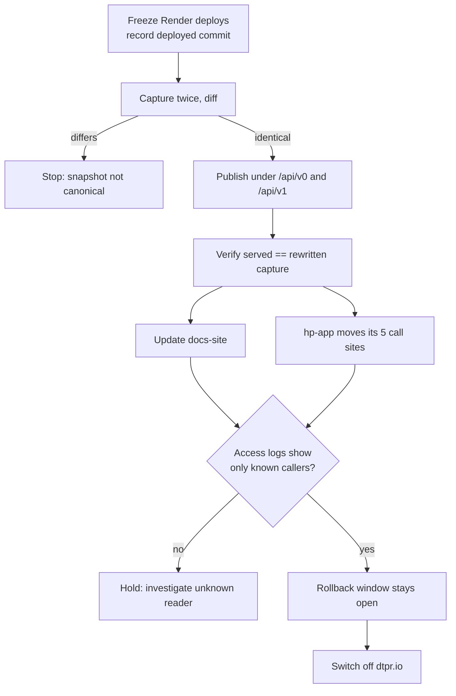
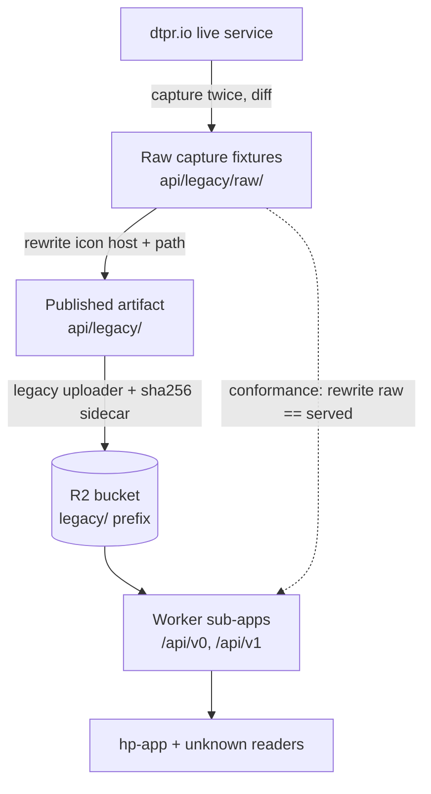
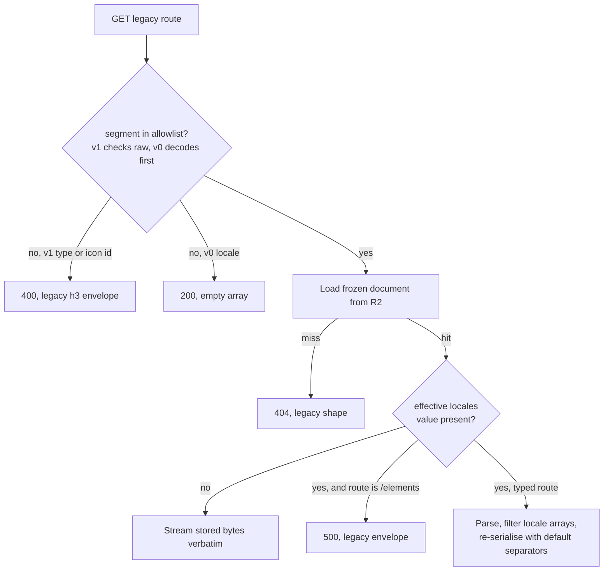

# Legacy DTPR API Rehosting - Plan

## Goal Capsule

- **Objective:** The DTPR device taxonomy stays publicly retrievable after `dtpr.io` is switched off, returning what it returns today.
- **Means:** Capture the eleven live v0/v1 responses and their icons byte-for-byte, and serve the frozen snapshot from the existing `api.dtpr.io` Worker under `/api/v0` and `/api/v1`.
- **Product authority:** The legacy API surface and its icons only. Everything else `dtpr.io` hosts is out of scope, and hp-app's own call sites are coordinated here but changed in that repo.
- **Execution profile:** Fidelity-first. Every behavioural claim in this plan was pinned by probing the live service; the capture fixtures, not this document, are the authority on bytes.
- **Stop conditions:** Stop and escalate if a capture cannot be taken while `dtpr.io` is serving (R9 becomes unsatisfiable), or if two captures taken minutes apart differ (the snapshot is not canonical).
- **Open blockers:** None.

---

## Product Contract

**Product Contract preservation:** changed — R3 narrowed; R10 expanded to five probed defects; R14 and R15 corrected after review found each stated a rule that does not hold uniformly; Success Criteria rewritten (two were unsatisfiable as stated); R14–R21 added for behaviours the brainstorm did not reach. R1–R2, R4–R9, R11–R13 unchanged in meaning. No Key Decision was altered.

### Summary

Freeze today's eleven v0 and v1 responses along with their icons, and serve them from `api.dtpr.io` under `/api/v0` and `/api/v1`, byte-identical apart from rewritten icon URLs. The device taxonomy stops being generated content and becomes a preserved artifact.

### Problem Frame

The Nuxt application on Render that serves `dtpr.io` is being switched off. Going with it are `/api/dtpr/v0`, `/api/dtpr/v1`, and the flat icon files under `/dtpr-icons/`.

That surface is the only published source of the DTPR device taxonomy. The newer API at `api.dtpr.io` publishes only `ai@…` schema versions — a request for a `device@…` version returns 404. Nothing else in the ecosystem carries this content.

Five runtime call sites depend on it, all in the hp-app repo: three fetch v0 JSON (`apps/guide-app/app/composables/useDtpr.ts`, `apps/admin/stores/dtpr.store.ts`, `apps/api/app/services/datachain_elements_csv_export.rb`) and two build flat-icon URLs for signage generation (`apps/api/app/services/signage/device_data_extractor.rb`, `apps/api/app/services/signage/themes/poster.rb`). No consumer of the v1 endpoints was found anywhere.

The content behind these responses was frozen in April 2026 and is not expected to change again. Earlier work assumed the endpoints would keep serving indefinitely — `docs/brainstorms/2026-04-16-dtpr-schema-api-mcp-brainstorm.md` scoped their retirement out on the grounds that they "have real consumers and must keep serving," and `docs/plans/2026-04-16-001-feat-dtpr-api-mcp-plan.md` recorded `device` as staying on the legacy surface indefinitely. The shutdown removes that option.

### Key Decisions

- **Preserve the device taxonomy read-only rather than promoting it to a `device@` v2 schema.** The content is finished, so versioning, composition, and validation machinery would carry cost without a payer. (session-settled: user-directed — chosen over modelling `device@…` as a first-class v2 schema: no new device elements are planned.) Governs R1, R8.
- **Freeze the captured bytes rather than regenerating the responses from source.** Regeneration only pays off if the content changes, and it would silently alter output that consumers already parse. (session-settled: user-directed — chosen over porting the markdown to YAML and re-deriving the same structure: keeps the change small and the output identical.) Governs R2, R9, R10.
- **Route the legacy surface under `/api/v0` and `/api/v1`, following the api app's own convention.** Consistency with `/api/v2` beats literal path parity with `dtpr.io`. (session-settled: user-directed — chosen over reproducing the `/api/dtpr/v0` path shape: matches the surrounding convention, at the cost that consumers edit a path rather than only a hostname.) Governs R1.
- **Give each legacy version its own icon namespace.** v0 can be dropped later without touching v1. (session-settled: user-directed — chosen over one shared icon namespace: isolation over 123 fewer stored objects.) Governs R6, R7, R16.
- **Carry the icon URLs inside the response bodies rather than asking consumers to configure an icon host.** Consumers that follow the URLs they are given need no second change. Governs R7.
- **Hold the Render service up until the replacement is live and verified rather than working to a fixed shutdown date.** The ordering constraint then enforces itself instead of becoming a deadline. (session-settled: user-directed — chosen over scheduling the shutdown independently: keeps the byte-exact capture window open.) Governs R9, R12, R19.
- **Leave the v0/v1 markdown source in git history rather than carrying it into `api/`.** (session-settled: user-directed — chosen over keeping it as archived, non-building source alongside the snapshot: the repo already remembers it.)
- **Let the `dtpr.io` URLs break rather than redirecting them.** The apex is going away entirely, so no redirect target survives. (session-settled: user-directed — chosen over holding the apex on Cloudflare and routing `/api/dtpr/*` to the Worker.)
- **Carry v1 across despite no identified consumer.** Static bytes cost little and an unknown external reader is possible. (session-settled: user-approved — chosen over retiring v1 outright rather than re-homing it.) Governs R1.

### Requirements

**Preserved responses**

- R1. `api.dtpr.io` serves the eleven canonical legacy responses: `/api/v0/{locale}` for `en`, `fr`, `es`, `pt`, `tl`, `km`, plus `/api/v1/elements`, `/api/v1/elements/{datachain_type}`, and `/api/v1/categories/{datachain_type}` for `ai` and `device`.
- R2. Each response body is byte-identical to what `dtpr.io` served at capture time, apart from the one-time icon-URL rewrite baked into the published artifact and the per-request departures R21 enumerates.
- R3. On the four v1 endpoints that accept it — `/api/v1/elements/{ai,device}` and `/api/v1/categories/{ai,device}` — the `locales` query parameter filters locale entries out of an already-assembled response and never changes which records appear. Its parsing quirks are reproduced exactly (KTD2). `/api/v0/{locale}` ignores the parameter.
- R4. Status codes, content types, and error bodies match today's: an invalid `datachain_type` returns 400 carrying the legacy h3 envelope and its existing message; an unrecognised v0 locale returns an empty array with 200; JSON is served as `application/json` and icons as `image/svg+xml`, both without a charset parameter.
- R5. Responses remain readable from any origin, and the legacy prefixes accept at least the request headers the Nuxt surface accepted (R18).

**Icons**

- R6. Each legacy version serves its own icon set — v0's 123 icons under `/api/v0/icons/`, v1's 148 under `/api/v1/icons/` — with no cross-version references.
- R7. Icon URLs embedded in a response point at that version's own icon path, so a consumer following the URLs in the JSON needs no separate configuration.
- R8. Legacy icons are served as the original flat files, with no variants and no composition from shapes and symbols.
- R16. An unknown icon id returns 404, including a v1-only id requested under `/api/v0/icons/`. The 25 icons that exist only in v1's set are not reachable through the v0 namespace.

**Fidelity and freeze**

- R9. The snapshot is captured from the live `dtpr.io` service while it is still serving, and the captured bytes become the system of record for the device taxonomy.
- R10. Defects in the live output are preserved rather than corrected. Five are known and each is pinned by an acceptance example: v0 omits `headline` entirely; v0 emits records with `title` and `description` keys absent where a locale lacks the field, because the intended English fallback never matches; v0 record counts differ per locale (136 `en`, 135 `fr`, 135 `es`, 134 `tl`, 134 `km`, 133 `pt`); `/api/v1/elements` with any effective `locales` value returns 500; and both typed element endpoints emit `category_ids` naming categories of the *other* datachain type for the 50 shared elements, which the matching categories endpoint does not publish.
- R11. A conformance check asserts that the served bytes equal the rewrite rule applied to the raw pre-rewrite capture, which is committed as a fixture. The check compares three artifacts, not two (KTD9).
- R14. Where a legacy error body embeds the request path, the served response re-derives it from the incoming request rather than replaying the captured `dtpr.io` value. The 404 envelope carries it in four fields (`url`, `statusMessage`, `message`, and `data.path`), not one.
- R21. The deliberate departures from what `dtpr.io` served are enumerated and closed. Four exist beyond the one-time icon-URL rewrite baked into the published artifact by R2: the per-request path re-derivation in R14; the R16 404 on a v1-only icon id under the v0 namespace, which the single flat legacy directory serves at 200; non-GET methods, which the legacy handlers answer at 200 with the full body and the frozen surface does not; and a percent-encoded icon id, which the flat legacy file host resolves at 200 and the raw-segment traversal guard of KTD7 rejects at 400.
- R15. Request-shape handling matches the legacy service, which is not uniform across the two versions. Trailing slashes resolve to the same response as the unslashed path on both. Percent-encoded segments diverge: v1 does not decode before matching, so `/api/v1/elements/%61i` returns 400, while v0 does decode, so `/api/v0/%65s` returns the full `es` body.

**Operational posture**

- R17. The legacy prefixes carry a wall-clock budget and a read rate limit equivalent to the ones `/api/v2` carries. Neither is inherited by default. This one requirement protects the shared Worker's availability rather than preserving a probed legacy behaviour — the legacy service had no such limits.
- R18. The legacy prefixes accept the request headers a browser consumer sends today. The Worker's existing allow-list is narrower than the Nuxt surface's, so preflight behaviour is checked rather than assumed.

**Cutover and documentation**

- R12. The frozen surface is live on `api.dtpr.io` before `dtpr.io` is switched off, so consumers can migrate against a running target rather than a dark one.
- R13. `docs-site` publishes the new base URLs, marks v0 and v1 as frozen, and documents the v2 Worker. Its API section currently documents the legacy base as the only DTPR API, never mentions the v2 Worker, and recommends a call that returns 500 (R10).
- R19. `dtpr.io` keeps serving for a defined window after the frozen surface goes live, so a failed verification is recoverable. The byte-exact capture path cannot be re-entered once Render is off.
- R20. Before `dtpr.io` is switched off, Render access logs for `/api/dtpr/*` and `/dtpr-icons/*` are reviewed and the remaining callers are all accounted for.

### Key Flows

- F1. Cutover
  - **Trigger:** Work begins on the frozen surface, with the Render service still serving.
  - **Steps:** Freeze Render deploys and record the deployed commit; capture twice minutes apart and diff to prove determinism; publish under `/api/v0` and `/api/v1` with icon URLs rewritten; verify served bytes against the rewritten capture; update `docs-site`; notify hp-app so its five call sites can move; review access logs; hold the window open; switch off `dtpr.io`.
  - **Outcome:** No consumer reads from `dtpr.io` at shutdown, and the frozen surface answers identically to what it replaced.
  - **Covered by:** R9, R11, R12, R13, R19, R20

The ordering is load-bearing in one direction, per R9 and R12: capture must precede shutdown. Switching off Render first forecloses the byte-exact path and leaves regeneration from markdown as the only option — which the freeze decision rejects, and which would not reproduce today's bytes anyway. R19 keeps the window open past verification so a late failure is still recoverable.

### Acceptance Examples

- AE1. **Covers R3.** Given a request for v1 categories filtered to a single locale, when the response is compared against the same request on `dtpr.io` at capture time, then the two are byte-equal.
- AE2. **Covers R3.** Given `?locales=` set to a locale the content does not carry, when the response is returned, then every record is present with empty locale arrays and the status is 200.
- AE3. **Covers R4.** Given a request for a `datachain_type` that is neither `ai` nor `device`, when the response is returned, then it carries 400 and the legacy h3 envelope with the same `statusMessage`.
- AE4. **Covers R4.** Given a request for a v0 locale outside the six published ones, when the response is returned, then it is an empty array with status 200.
- AE5. **Covers R7.** Given any element in a v0 response, when its icon URL is fetched, then it resolves under `/api/v0/icons/` and returns the same SVG bytes the legacy host served.
- AE6. **Covers R10.** Given any of the six v0 responses, when its records are inspected, then no `headline` key is present on any record.
- AE7. **Covers R10.** Given the v0 `pt` response, when its records are counted, then there are 133, and at least one record has neither a `title` nor a `description` key.
- AE8. **Covers R10.** Given `GET /api/v1/elements?locales=en`, when the response is returned, then it is 500 with the legacy error envelope — not a filtered body.
- AE9. **Covers R3.** Given `?locales=,,,`, when the response is returned, then every locale array is empty; given `?locales=en,%20fr`, then `fr` is absent; given `?locales=en&locales=fr`, then both are present.
- AE10. **Covers R15.** Given a trailing slash on any legacy route — `/api/v1/elements/ai/` or `/api/v0/en/` — when the response is returned, then it matches the unslashed response; given `/api/v1/elements/%61i`, then the response is 400.
- AE11. **Covers R16, R21.** Given a v1-only icon id requested under `/api/v0/icons/`, when the response is returned, then it is 404 — a departure from the single flat legacy directory, which serves it at 200.
- AE12. **Covers R10.** Given the typed element endpoints, when the `category_ids` of the 50 shared elements are checked against the matching categories endpoint, then each cites at least one category that endpoint does not publish.
- AE13. **Covers R15.** Given `/api/v0/%65s`, when the response is returned, then it is the full `es` body, not an empty array.
- AE15. **Covers R21.** Given a percent-encoded icon id, when the response is returned, then it is 400 — a departure from the legacy file host, which resolves it at 200.
- AE14. **Covers R14.** Given a request that produces a legacy error body, when the response is inspected, then every path-derived field reflects the incoming request rather than the captured `dtpr.io` value.

### Success Criteria

- Every one of the eleven responses is byte-equal to the rewrite rule applied to its capture.
- No **fetchable** URL in a served response or icon resolves to `dtpr.io`. The `schema.namespace` strings (`https://dtpr.io/schemas/…`) are identifiers, not locators, and are preserved verbatim under R2.
- Each of hp-app's three JSON call sites works after changing only a base URL. The two signage call sites additionally choose an icon namespace, because they build icon URLs by hand rather than following the JSON.
- Two captures taken minutes apart are identical.
- Every difference between a served response and its capture falls into R21's enumerated departure list. A difference outside that list is a defect.

### Scope Boundaries

- Promoting the device taxonomy to a `device@` v2 schema, and composed icons for device elements.
- Regenerating the responses from markdown or YAML source.
- Preserving the `dtpr.io` URLs by redirect or proxy.
- Everything else `dtpr.io` hosts — the website, taxonomy pages, and hosted documents.
- Editing hp-app's call sites; this plan coordinates the cutover but the changes land in that repo.
- Carrying `app/content/dtpr.v0/` and `app/content/dtpr.v1/` forward as archived source.
- The `shapes/` and `symbols/` subdirectories under `app/public/dtpr-icons/`. Nothing in the v0 or v1 handlers references them; they belong to the v2 composed-icon system.

#### Deferred to Follow-Up Work

- Removing the `app/` workspace, its `pnpm-workspace.yaml` entry, and the `test.yaml` CI job that boots it. This cannot land until R19's window closes, and mixing a large deletion into the cutover PR would obscure the fidelity diff.
- Decommissioning the Render service itself.

### Dependencies / Assumptions

- The Render service is held up until the replacement is live and verified, which keeps the capture window open (R9, R12, R19).
- Render deploys are frozen for the capture window. v0 responses are prerendered at build time (`app/nuxt.config.ts`), so a redeploy mid-capture would silently change the artifact.
- `api/` provides the R2 binding and the Cache API wrapper this needs. It does **not** provide a usable publish script — `api/scripts/r2-upload.ts` is version- and manifest-shaped and cannot carry a version-less namespace (KTD6).
- No consumer outside hp-app has been identified. `docs-site` has published the legacy URLs as the recommended integration path, so an unknown reader is possible; R20 converts that assumption into evidence before shutdown.
- The device taxonomy content will not change again.
- hp-app's two signage call sites move to `/api/v1/icons/`, the superset. Pointing them at `/api/v0/icons/` would 404 only on the 25 v1-only icons — a partial failure a spot check would miss.

### Outstanding Questions

Nothing blocks implementation.

**Deferred to Implementation**

- Whether the parse-and-filter path stays inside the 500 ms CPU budget for the largest filtered response (`/api/v1/elements/device`, 302 KB). Measure during U4; the unfiltered path streams bytes and is unaffected.
- Whether `RL_READ` is the right bucket for the legacy prefixes or they warrant their own namespace id (R17).

### Sources / Research

- Legacy handlers: `app/server/api/dtpr/v0/[locale].ts`, `app/server/api/dtpr/v1/elements/index.ts`, `app/server/api/dtpr/v1/elements/[datachain_type].ts`, `app/server/api/dtpr/v1/categories/[datachain_type].ts`, with shared filtering in `app/server/api/dtpr/v1/utils.ts`. The `label` filter at `elements/index.ts` is what makes R10's 500 fire — that handler emits variables with no `label` key.
- Prerendered v0 locales and the open CORS rules: `app/nuxt.config.ts`.
- Existing response-shape checks: `app/test/api/schemas.ts`. Their snapshots are structural fingerprints that `app/test/api/helpers.ts` documents as ignoring icon URLs and all text, so they would not catch a botched rewrite; the CI job that boots a live server to run them is `.github/workflows/test.yaml`.
- Worker routing, middleware mounting rationale, and the per-route timeout comment: `api/src/app.ts`. Sub-app pattern and `.svg` suffix handling: `api/src/rest/routes.ts`. Error envelope: `api/src/middleware/error-handler.ts`, `api/src/middleware/errors.ts`. Cache headers: `api/src/rest/responses.ts`.
- R2 key layout, loaders, and the version-keyed cache caveat: `api/src/store/keys.ts`, `r2-loader.ts`, `cache-wrapper.ts`.
- Publish pipeline that does not fit: `api/scripts/r2-upload.ts`. Prune script that is safe: `api/scripts/r2-prune.ts`.
- Test idioms to mirror: `api/test/api/seed.ts`, `api/test/api/icons.test.ts`, `api/test/api/harness-parity.test.ts`.
- CI: `.github/workflows/api-deploy.yaml`, `api-test.yaml`, `api-preview-deploy.yaml`.
- Published legacy documentation that needs rewriting: `docs-site/content/4.api/`, plus `docs-site/content/5.concepts/2.localization.md` and `docs-site/content/7.changelog/0.index.md`.
- Prior scoping that assumed these endpoints would keep serving: `docs/brainstorms/2026-04-16-dtpr-schema-api-mcp-brainstorm.md`, `docs/plans/2026-04-16-001-feat-dtpr-api-mcp-plan.md`.

---

## Planning Contract

### Key Technical Decisions

- KTD1. **Serve frozen bytes with an explicit body and Content-Type; never `c.json()`.** `c.json()` re-serialises its argument, which destroys byte-identity for documents held as frozen text. (An earlier draft justified this by a charset difference in the emitted content type; the vendored Hono emits bare `application/json` from both paths, so re-serialisation is the whole reason.) Governs R2, R4.
- KTD2. **Port the legacy locale parser verbatim; do not reuse `parseLocalesParam` from `api/src/rest/responses.ts`.** The house helper trims whitespace and collapses an all-empty list to "no filter"; the legacy parser does neither, and it re-splits only when the value arrives as a single string. Reading repeated parameters requires the all-values accessor, not the first-value one. One subtlety the wording must not blur: an absent or empty value is falsy and means "no filter" (the full body returns), while a non-empty value that splits to nothing — `,,,` — passes the emptiness check and filters every locale array away. Both were probed. Governs R3.
- KTD3. **Register both the slashed and unslashed form of every legacy route inside each sub-app.** Hono discards a sub-app's non-strict routing option at mount time, so setting it there has no effect, and flipping the root app to non-strict would change `/api/v2` matching too. Verified against the vendored Hono: a non-strict sub-app mounted under the strict root still 404s the trailing-slash form, while registering both forms answers each at 200. Governs R15.
- KTD4. **Return legacy error envelopes directly from handlers, and catch every other legacy error path inside the sub-app.** The Worker's global error handler emits the v2 `{ok:false,errors:[…]}` shape for every 400, 404, and 500, so throwing the house error factory would change all of them. Three seams need covering, and one of them cannot use the obvious mechanism: a sub-app's not-found handler is discarded at mount time, so the legacy 404 must be a catch-all route declared last inside the sub-app. Verified against the vendored Hono — the catch-all survives the mount and the not-found handler does not. The third seam is middleware: the rate-limit and timeout middleware throw the house error type, so each sub-app also needs its own error handler to render 429 and 504 in the legacy envelope. Governs R4, R14, R17.
- KTD5. **Store the snapshot under `api/legacy/`, never under `api/schemas/`.** The deploy workflow enumerates every two-deep directory beneath `api/schemas/` as a schema version and runs `schema:build` on it, which hard-fails on non-YAML content. `api/scripts/r2-prune.ts` reads the same tree.
- KTD6. **Ship a separate legacy uploader rather than generalising `api/scripts/r2-upload.ts`.** That script requires a per-version `manifest.json`, enforces stable-version immutability against a content hash, and finishes by rewriting `schemas/index.json`. None of those apply. The legacy uploader writes a sha256 sidecar so repeat deploys become no-ops instead of re-uploading 1.3 MB and 271 SVGs on every push.
- KTD7. **Read the raw path from the request URL, and apply the no-decode rule to v1 only.** Hono decodes at routing time, so both the route param and the request path are already decoded inside the handler; only the raw request URL preserves the original encoding. v1 must validate that raw segment, because the legacy v1 router does not decode and `%61i` is a 400 there. v0 must decode first, because its responses are prerendered static assets whose lookup does decode — `/api/dtpr/v0/%65s` serves the full `es` body today. Both versions keep the raw-segment traversal guard on their icon routes. Governs R15, R16.
- KTD8. **Reuse the manifest-less form of the existing icon cache helper, but set the content type without a charset.** Called with no manifest it emits an immutable one-year cache header, which is the correct semantic for frozen content; its sibling handlers set `image/svg+xml; charset=utf-8`, which the legacy service does not. Governs R4, R8.
- KTD9. **Cross-check the rewrite against the live service while it is still serving, not only against the capture.** Committing the raw capture separately is necessary but not sufficient: `rewrite(raw) == served` uses the same rewrite function that produced the artifact, so the identity holds however wrong that function is. The independent term has to come from outside — a diff proving every changed byte range is an icon URL and nothing else, and a live fetch of each rewritten icon's legacy counterpart compared against the stored object. Both are only possible before shutdown. Governs R11.
- KTD10. **Store eleven whole documents and filter at request time; do not pre-expand per locale combination.** The three v1 element endpoints are not views of one dataset: all 50 elements shared between `ai` and `device` carry different `variables` in each, and the untyped `/elements` endpoint additionally hardcodes a stale `version` where the typed endpoints compute one. Pre-expansion is unbounded in key space rather than result space — only 64 distinct bodies exist per document, but the parser's whitespace and repeated-parameter quirks make the set of keys that map onto them open-ended. Governs R3.

- KTD11. **Load capture fixtures into the test runtime through an eager bundler glob, and declare the JSON raw-import type.** The worker test pool has no filesystem, and the repo's only precedent is a handful of single-file raw SVG imports whose ambient declaration covers `.svg` alone. An undeclared JSON raw import fails the typecheck gate before any test runs, so the declaration and the glob ship together as one helper all three consuming units import.
- KTD12. **Register the legacy CORS mount before the global one.** The global CORS middleware is mounted on every path and answers preflight without calling the next handler, so a legacy-scoped mount added after it never runs. This is the same mount-order rule the app already documents for its route-specific rate-limit buckets. Governs R5, R18.

### High-Level Technical Design

Capture and publish are one-time; serving is the steady state. The rewrite rule is the only transform, and it is applied once at capture time, not per request.

Request handling forks on one condition only — whether an effective `locales` value is present — and that fork decides whether bytes are streamed or re-serialised.

Byte-equality on the filtered path is not an aspiration — it was verified before planning. Re-implementing the filter over the stored document and serialising with default separators reproduces the live `?locales=en`, `?locales=en,fr`, and `?locales=zz` bodies exactly.

### Assumptions

These are planning bets, not user decisions. Each is cheap to revisit if implementation contradicts it.

- The eleven canonical documents plus 271 icon objects are small enough to serve from R2 with the existing cache wrapper, without an inline-bundle path. The repo has no working text-module bundling for the Worker, so R2 is the only route that needs no new build machinery.
- A 24-hour edge cache on version-less legacy keys is acceptable because the content is immutable. The existing cache-key scheme relies on a version segment for invalidation, so a bad byte would be sticky for that window; the mitigation is verifying before publishing, not a new invalidation lever.
- `X-Request-Id` on every response and `X-Robots-Tag` on preview are acceptable additions. The conformance check asserts specific headers, not header-set equality.

### Sequencing

U1 gates every unit except U8 — no other unit can be verified without the capture. U2 unblocks U3 and U4, which are independent of each other. U5 needs both sub-apps to exist. U6 and U7 need U5. U8 is independent and can land any time. U9 comes last and gates the shutdown that follows this plan.

---

## Implementation Units

### U1. Capture the frozen snapshot

- **Goal:** Produce the raw capture fixtures and the published artifact, with provenance, while `dtpr.io` is still serving.
- **Requirements:** R2, R9, R10, R11
- **Dependencies:** none
- **Files:** `api/legacy/raw/` (canonical captures), `api/legacy/raw/variants/` (filtered captures), `api/legacy/raw/errors/` (error-body captures), `api/legacy/` (published artifact), `api/scripts/capture-legacy.ts`, `api/test/cli/capture-legacy.test.ts`
- **Approach:**
  1. Fetch the eleven canonical URLs plus both icon sets, writing raw bytes untouched to `api/legacy/raw/`. Request with cache-defeating and identity-encoding headers so the stored bytes are the origin's rather than an edge or transformed copy.
  1a. Capture the filtered variants the acceptance examples depend on, for each of the four typed v1 endpoints: `?locales=en`, `en,fr`, `zz`, empty, bare, `,,,`, `en,%20fr`, repeated, and uppercase. These are U4's specification and U7's fixtures; without them the filter has nothing to be verified against and the window has closed.
  1b. Capture the error bodies: the 400 from an invalid `datachain_type` on both typed routes, the 500 from the all-elements route under a filter, and the 404 from an unknown icon id. R4 promises error-body fidelity and nothing else in the plan preserves the evidence for it. They are pretty-printed with two-space indentation, a fixed key order, and no trailing newline.
  2. Record provenance alongside: capture timestamp, the Render deploy commit if obtainable, and a sha256 per document.
  3. Run the fetch twice and diff. A difference means the snapshot is not canonical — stop, per the Goal Capsule stop condition.
  4. Emit the published artifact by applying the rewrite rule to the raw capture: replace the icon-URL prefix with the per-version legacy icon path. The source prefix is uniform across all six v0 locales and v1 — probe confirmed a single host — but derive it from the capture rather than hard-coding it.
  5. Leave `schema.namespace` strings untouched. They are identifiers, not locators. A host-level string replace would corrupt them, so the rewrite must target the icon-URL field specifically.
  6. Cross-check the rewrite against the live service before it goes away (KTD9): diff each raw capture against its published counterpart and fail unless every changed byte range is an icon URL, then fetch each rewritten icon's legacy counterpart from the live host and byte-compare it against the stored object. Record the outcome as capture provenance.
- **Execution note:** This unit is irreversible once Render is off. Verify the diff-twice step passes before writing the published artifact.
- **Patterns to follow:** `api/cli/lib/content-hash.ts` for the sha256 helper and its `sha256-<hex>` format.
- **Test scenarios:**
  - Given two capture runs over the same fixtures, the emitted documents are byte-identical.
  - Given a raw capture containing the legacy icon host, the rewrite produces the version-appropriate legacy icon path for every element.
  - Given a raw v1 document, the rewrite leaves every `schema.namespace` string unchanged.
  - Given a v0 document, the rewrite maps icon URLs to the v0 namespace, not the v1 one.
  - Covers R10. Given the captured v0 `pt` document, it contains 133 records and at least one record has neither `title` nor `description`.
  - Given the diff of a raw capture against its published counterpart, every changed byte range is an icon URL and no `schema.namespace` string changed.
  - Given a rewritten icon URL, the object it now points at is byte-equal to what the live legacy host served at that icon's original URL.
- **Verification:** the canonical, variant, and error captures all exist with per-document hashes recorded; the two capture runs agreed; and the live cross-check passed.

### U2. Legacy store keys and loaders

- **Goal:** Give the Worker a way to read version-less frozen assets from R2.
- **Requirements:** R1, R6
- **Dependencies:** U1
- **Files:** `api/src/store/keys.ts`, `api/src/store/r2-loader.ts`, `api/src/store/index.ts`, `api/test/api/legacy-fixtures.ts`, `api/test/raw.d.ts`, `api/tsconfig.json`, `api/test/unit/legacy-loader.test.ts`
- **Approach:**
  1. Add version-free key builders for legacy documents and legacy icons, namespaced per major version. These are the first key helpers not parameterised by a parsed version — widen the module's doc comment to say so.
  2. Add a JSON-text loader and an SVG loader that return the stored bytes rather than parsed objects, so the unfiltered path can stream them (KTD1).
  3. Cache with the existing wrapper at the stable TTL. Record the version-less invalidation caveat in a comment next to the key builders.
  4. Add the fixture-loading helper the test units share (KTD11): an eager bundler glob over the capture directories, the raw-import type declaration for JSON alongside the existing SVG one, and whatever tsconfig type entry that declaration needs. U3, U4 and U7 all import this one helper rather than each inventing a path.
- **Patterns to follow:** the existing symbol-SVG loader for the SVG shape and the schema-JSON loader for the JSON shape; export through the store barrel, as routes never import the R2 loader directly.
- **Test scenarios:**
  - Given a seeded legacy document key, the loader returns its exact bytes.
  - Given a missing key, the loader returns null rather than throwing.
  - Given an R2 failure that is not a miss, the error surfaces as the upstream-error type that maps to 502.
  - Given the same key twice within a request, the second read is served from cache.
  - Given a captured document round-tripped through the text loader, the bytes are unchanged — byte-identity depends on every capture being valid UTF-8.
  - Given the fixture helper, a test can read a captured document and a captured icon without filesystem access, and the typecheck gate passes.
- **Verification:** unit tests pass, the loaders are reachable from the store barrel, and the fixture helper typechecks.

### U3. v0 sub-app

- **Goal:** Serve the six frozen v0 locale documents and the 123 v0 icons.
- **Requirements:** R1, R4, R6, R7, R8, R15, R16
- **Dependencies:** U2
- **Files:** `api/src/rest/legacy-v0.ts`, `api/test/api/legacy-v0.test.ts`
- **Approach:**
  1. Build a sub-app registering both the slashed and unslashed form of the locale route and the icon route (KTD3).
  2. Percent-decode the locale segment, then validate it against an allowlist before any key lookup (KTD7) — v0 decodes, unlike v1. An unrecognised locale is not an error: it returns an empty array with 200. Keep the raw-segment traversal guard on the icon route.
  3. Stream stored bytes with an explicit content type (KTD1). Ignore `locales` entirely.
  4. Serve icons with the manifest-less cache helper and a charset-free content type (KTD8).
  5. Register a not-found handler that answers in the legacy shape (KTD4).
- **Test scenarios:**
  - Covers AE4. Given a locale outside the six, the response is `[]` with 200.
  - Covers AE6. Given each of the six locales, no record carries a `headline` key.
  - Covers AE5. Given an icon id from a v0 record, the response is the captured SVG bytes with `image/svg+xml` and an immutable cache header.
  - Covers AE10. Given `/en/` with a trailing slash, the response matches `/en`.
  - Covers AE13. Given `/%65s`, the response is the full `es` body, not an empty array.
  - Covers AE11. Given a v1-only icon id, the response is 404.
  - Given a traversal attempt in the icon id, the response is a 400 and no key lookup occurs.
  - Given `?locales=en` on a v0 route, the response is unchanged from the unparameterised one.
- **Verification:** the six locale responses are byte-equal to the published artifact and all 123 icons resolve.

### U4. v1 sub-app and the locale filter

- **Goal:** Serve the five frozen v1 documents, the 148 v1 icons, and reproduce the legacy locale-filter semantics exactly.
- **Requirements:** R1, R3, R4, R6, R7, R8, R10, R14, R15, R16, R21
- **Dependencies:** U2
- **Files:** `api/src/rest/legacy-v1.ts`, `api/src/rest/legacy-locales.ts`, `api/test/api/legacy-v1.test.ts`, `api/test/unit/legacy-locales.test.ts`
- **Approach:**
  1. Port the legacy locale parser verbatim into its own module (KTD2), reading all repeated parameter values rather than the first.
  2. When no effective value is present, stream stored bytes (KTD1). When one is present on a typed route, parse the stored document, filter the locale arrays, and re-serialise with default separators.
  3. On the all-elements route, reproduce the 500 when an effective value is present (R10). Do not filter it and do not repair it.
  4. Validate `datachain_type` against the raw segment before decoding (KTD7); an invalid value returns the legacy 400 envelope directly (KTD4), with the `url` field echoing the incoming request (R14).
  5. Register both slash forms of every route (KTD3), as U3 does.
  6. Icons and the catch-all legacy 404 mirror U3.
- **Execution note:** Write the filter against the committed capture fixtures first — the filtered variants are the specification, and byte-equality is the assertion.
- **Test scenarios:**
  - Covers AE1. Given each filtered variant captured in U1, the served bytes are byte-equal.
  - Covers AE9. Given `?locales=,,,` every locale array empties; given `?locales=en,%20fr` the space-prefixed locale is dropped; given repeated `locales` parameters both values apply; given `?locales=` or a bare `locales` the full body returns; given `?locales=EN` every locale array empties.
  - Covers AE8. Given `/elements?locales=en`, the response is 500 in the legacy envelope.
  - Covers AE3. Given an invalid `datachain_type`, the response is 400 with the legacy `statusMessage`.
  - Covers AE10. Given `/elements/%61i`, the response is 400, not a decoded match; given `/elements/ai/` with a trailing slash, the response matches the unslashed one.
  - Covers AE14. Given an invalid `datachain_type`, the error envelope's path-derived fields reflect the incoming request, not the captured `dtpr.io` value.
  - Covers AE2. Given a locale the content lacks, records remain with empty locale arrays at 200.
  - Given the largest filtered response, the request completes within the route's wall-clock budget.
- **Verification:** all five v1 responses and every captured filtered variant are byte-equal to expectation; all 148 icons resolve.

### U5. Mount the legacy prefixes

- **Goal:** Wire both sub-apps into the Worker with the same middleware posture `/api/v2` has.
- **Requirements:** R1, R5, R17, R18
- **Dependencies:** U3, U4
- **Files:** `api/src/app.ts`, `api/src/middleware/cors.ts`, `api/test/api/legacy-mounting.test.ts`
- **Approach:**
  1. Mount both sub-apps alongside the existing v2 route.
  2. Add a wall-clock budget mount per legacy route pattern, mirroring each pattern exactly. The module's own comment explains why these are per-route rather than wildcard; drifting a mount pattern from its route silently disables the budget.
  3. Add read rate-limit mounts for both prefixes, placed so they do not shadow the route-specific v2 buckets.
  4. Check preflight behaviour for the request headers a browser consumer sends today (R18). Widen the allow-list for the legacy prefixes if it is narrower, or record the narrowing as accepted. A legacy-scoped CORS mount must be registered *before* the global one or it never runs (KTD12).
  5. Give each sub-app its own error handler so middleware-thrown rate-limit and timeout errors render in the legacy envelope rather than the v2 one (KTD4).
- **Test scenarios:**
  - Given a request to each legacy route, a wall-clock budget applies.
  - Given a preflight with the request headers the Nuxt surface accepted, the response permits them.
  - Given a cross-origin GET, the response carries a permissive allow-origin header.
  - Given a rate-limited or timed-out legacy request, the error body is the legacy envelope with a charset-free content type.
  - Given a trailing-slash and a legacy-404 request issued through the mounted app rather than the standalone sub-app, both still behave as U3 and U4 specify.
  - Given a legacy route, the v2 routes still answer unchanged.
- **Verification:** every legacy route pattern has a matching budget mount, and the rate-limit mounts do not shadow the v2 buckets.

### U6. Publish pipeline and CI

- **Goal:** Get the frozen artifact into R2 on deploy, idempotently.
- **Requirements:** R1, R11, R12
- **Dependencies:** U5
- **Files:** `api/scripts/r2-upload-legacy.ts`, `.github/workflows/api-deploy.yaml`, `.github/workflows/api-preview-deploy.yaml`, `api/test/cli/r2-upload-legacy.test.ts`
- **Approach:**
  1. Write a legacy uploader that walks `api/legacy/` and writes to the `legacy/` R2 prefix (KTD6). There is no index to flip, so a partial upload is directly visible — upload documents before icons and log progress.
  2. Write a sha256 sidecar and skip the upload when it matches, so repeat deploys are no-ops. Write it only after every object's put has resolved, so an interrupted run does not mark itself complete.
  3. Add an upload step to the production deploy workflow after the existing per-version upload, reusing the same credential block. Mirror it in the preview workflow.
  4. Extend the post-deploy smoke tests to cover the whole inventory, not a spot check: fetch all eleven documents and every icon id in both namespaces from the deployed host and compare each against the per-document hashes U1 recorded. A four-object sample would leave a partial upload invisible, and the sidecar would then make the next deploy a no-op so the gap never heals. Assert the immutable cache header, and extend the existing public-bucket-access check to the legacy prefix.
  5. Note the first-deploy ordering: the workflow deploys the Worker before uploading, so legacy routes exist and 404 until the upload step finishes. The smoke tests are what catch a run that stops in between.
- **Test scenarios:**
  - Given an unchanged artifact, a second upload run performs no writes.
  - Given a changed document, the sidecar mismatch triggers a re-upload of that key.
  - Given a `.json` and a `.svg` key, each is written with the content type the serving contract requires.
  - Given an upload interrupted before the last object, no sidecar is written and the next run re-uploads.
  - Test expectation for the workflow edits: none — verified by the smoke tests they add.
- **Verification:** a preview deploy publishes the artifact and the extended smoke tests pass against `api-preview.dtpr.io`.

### U7. Conformance suite

- **Goal:** Prove the served surface matches the capture, and keep proving it.
- **Requirements:** R2, R10, R11, R21
- **Dependencies:** U5
- **Files:** `api/test/api/legacy-conformance.test.ts`, `api/test/api/legacy-schemas.ts`
- **Approach:**
  1. Assert `rewrite(raw_capture) == served` for all eleven documents and every captured filtered variant (KTD9).
  2. Add a Zod mirror of the v0 and v1 wire shapes, maintained separately from `api/src/schema/` as the repo's existing parity test does deliberately.
  3. Assert all five R10 defects positively, so a future well-meaning fix fails the build.
  3a. Byte-compare the served error envelopes against the captured ones under the R14 path substitution, and assert every R21 departure is present and no undeclared difference exists.
  4. Assert specific headers — content type and cache control — never header-set equality.
- **Patterns to follow:** the existing harness-parity test for the Zod-mirror idiom; the icon test for byte-equality and traversal assertions.
- **Test scenarios:**
  - Given each of the eleven documents, served bytes equal the rewritten capture.
  - Given each captured filtered variant, served bytes equal it.
  - Covers AE6, AE7, AE8, AE12. Each known defect is asserted present.
  - Covers AE14. Given each captured error body, the served envelope matches it except in the path-derived fields, which reflect the incoming request.
  - Given every icon id in both namespaces, the served bytes equal the captured file.
  - Given a served response, its content type carries no charset parameter.
- **Verification:** the suite fails if any byte, any defect, or either content type changes.

### U8. Documentation

- **Goal:** Stop publishing dead URLs and a call that returns 500.
- **Requirements:** R13
- **Dependencies:** none
- **Files:** `docs-site/content/4.api/`, `docs-site/content/5.concepts/2.localization.md`, `docs-site/content/7.changelog/0.index.md`
- **Approach:**
  1. Replace both legacy hosts throughout — the API base and the separate Render icon host that appears in two response samples — and mark v0 and v1 as frozen.
  2. Remove the `?locales=` example on the all-elements endpoint — it documents a call that returns 500 (R10).
  3. Note that the v0-to-v1 migration advice is now moot, since both are frozen.
  4. Add the v2 Worker to the API section. It is currently absent entirely.
- **Test scenarios:** Test expectation: none — content-only changes, verified by review and by the absence of legacy hostnames in the built site.
- **Verification:** neither the legacy API base nor the Render icon host remains anywhere in `docs-site/content/`.

### U9. Pre-shutdown gate

- **Goal:** Make the hold-open window and the traffic review enforced steps rather than diagram annotations.
- **Requirements:** R19, R20
- **Dependencies:** U6, U7
- **Files:** `docs/plans/2026-08-24-1325-refactor-legacy-dtpr-api-rehosting-plan.md` (record the outcome), `api/legacy/raw/` (provenance record)
- **Approach:**
  1. Fix the hold-open window as a date, counted from the day the frozen surface passes its post-deploy verification, and record it with the capture provenance.
  2. Pull Render access logs for the legacy API paths and the flat icon paths across that window. Account for every remaining caller.
  3. Record the outcome. An unrecognised caller holds the shutdown rather than deferring to the assumption that only hp-app reads this.
  4. Confirm hp-app's five call sites are merged and deployed before the window closes.
- **Execution note:** Owner-executed, not agent-executed. It needs Render access logs and a judgment call on any unrecognised caller, neither of which an implementing agent can supply. It is also the only thing standing between a recoverable mistake and an unrecoverable one, so treat a missing log review as a blocker rather than a formality.
- **Test scenarios:** Test expectation: none — this unit produces evidence and a decision, not code. Its verification is the recorded outcome.
- **Verification:** the window is recorded with a date, the access-log review names every remaining caller, and hp-app's call sites are confirmed migrated.

---

## Verification Contract

Run from the repo root. `build:schema` and the UI build are prerequisites for typecheck — the api package consumes their dist subpath exports.

| Gate | Command | Applies to |
|---|---|---|
| Install | `pnpm install --frozen-lockfile` | all |
| Schema build | `pnpm --filter ./api build:schema` | before typecheck |
| UI build | `pnpm --filter @dtpr/ui build` | before typecheck |
| Typecheck | `pnpm --filter ./api typecheck` | all units |
| Tests | `pnpm --filter ./api test` | all units |
| Worker bundle | `pnpm --filter ./api build` | U5, U6 |
| Preview deploy | preview workflow, label-gated | U6 |

The repo has no linter or formatter — do not add a lint gate.

Fidelity is proven by U7, not by the type checker. A green typecheck with a changed byte is a failure.

---

## Definition of Done

Global:

- All eleven documents and both icon sets are served from `api.dtpr.io` and byte-equal to the rewritten capture.
- All five R10 defects are asserted present, not repaired, and every R21 departure is asserted while no undeclared difference exists.
- Both legacy prefixes carry a wall-clock budget and a rate limit.
- `docs-site` publishes no `dtpr.io/api/dtpr` URL and no call that returns 500.
- The raw capture fixtures are committed with provenance.
- `dtpr.io` is still serving, and U9 has recorded the hold-open window and the access-log review. Switching it off is the follow-up those gate, not part of this work.
- Abandoned experimental code is removed. In particular, no partially-generalised variant of the existing version-shaped upload script is left in the diff.

Per unit: the Verification line on each U-ID above.
